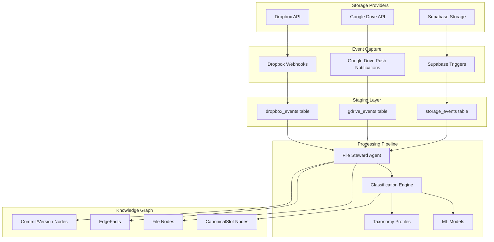

# Data Ingestion & Normalization Architecture

## Overview

The Data Ingestion layer transforms raw file storage events into canonical graph representations. It operates as an event-driven pipeline that captures, normalizes, and classifies files from multiple storage providers into a unified knowledge graph.

## Architecture Diagram



## Core Components

### 1. Event Capture Layer

#### Dropbox Integration (Implemented)
- **Webhook Handler**: Receives Dropbox webhook notifications
- **Delta API**: Uses `/files/list_folder/continue` for efficient change detection
- **Event Storage**: Persists events in `dropbox_events` table
- **Cursor Management**: Maintains sync cursors for incremental updates

**Implementation Details:**
```python
# Dropbox Event Handler
class DropboxEventHandler:
    def process_webhook(self, webhook_data):
        # Validate webhook signature
        # Fetch delta changes using cursor
        # Store events in dropbox_events table
        # Trigger processing pipeline
```

#### Google Drive Integration (Planned - GAP)
- **Push Notifications**: Use Drive's change watch API
- **Change Detection**: Monitor file/folder modifications
- **Event Storage**: Store in `gdrive_events` table
- **Token Management**: Handle OAuth refresh tokens

#### Supabase Storage Integration
- **Database Triggers**: Capture file table changes
- **Real-time Events**: Use Supabase Realtime for instant updates
- **Direct Integration**: Native integration with application storage

### 2. Staging Layer

#### Event Tables Schema
```sql
-- Dropbox Events (Implemented)
CREATE TABLE dropbox_events (
    id UUID PRIMARY KEY DEFAULT gen_random_uuid(),
    org_id UUID NOT NULL,
    source_id UUID NOT NULL,
    event_type VARCHAR(50) NOT NULL, -- 'file_created', 'file_updated', 'file_deleted'
    file_id VARCHAR(255),
    file_name VARCHAR(500),
    file_path TEXT,
    file_size BIGINT,
    modified_at TIMESTAMPTZ,
    metadata JSONB,
    processed BOOLEAN DEFAULT FALSE,
    created_at TIMESTAMPTZ DEFAULT NOW()
);

-- Google Drive Events (GAP - To Implement)
CREATE TABLE gdrive_events (
    id UUID PRIMARY KEY DEFAULT gen_random_uuid(),
    org_id UUID NOT NULL,
    source_id UUID NOT NULL,
    event_type VARCHAR(50) NOT NULL,
    file_id VARCHAR(255),
    file_name VARCHAR(500),
    file_path TEXT,
    file_size BIGINT,
    modified_at TIMESTAMPTZ,
    metadata JSONB,
    processed BOOLEAN DEFAULT FALSE,
    created_at TIMESTAMPTZ DEFAULT NOW()
);
```

### 3. File Steward Agent

The File Steward is the core processing agent that transforms raw events into graph updates.

#### Processing Pipeline
1. **Event Consumption**: Read unprocessed events from staging tables
2. **File Resolution**: Create or update File nodes in Neo4j
3. **Classification**: Determine CanonicalSlot assignments
4. **Relationship Management**: Create/update folder hierarchies
5. **Provenance Tracking**: Record commits and actions
6. **Idempotency**: Ensure duplicate events don't create inconsistencies

#### Implementation Pattern
```python
class FileSteward:
    def process_file_event(self, event):
        with neo4j_transaction() as tx:
            # 1. Upsert File node
            file_node = self.upsert_file_node(tx, event)
            
            # 2. Classify file
            slot_assignments = self.classify_file(file_node)
            
            # 3. Update relationships
            self.update_folder_hierarchy(tx, file_node)
            
            # 4. Create EdgeFacts for temporal relationships
            self.create_edge_facts(tx, file_node, slot_assignments)
            
            # 5. Record provenance
            commit = self.create_commit(tx, event)
            self.create_actions(tx, commit, file_node)
            
            # 6. Mark event as processed
            self.mark_processed(event.id)
```

### 4. Classification Engine

#### Taxonomy Profiles (Planned - GAP)
- **Rule-Based Classification**: Pattern matching on filenames/paths
- **ML-Based Classification**: Content analysis and prediction
- **Organization-Specific**: Custom rules per tenant
- **Extensible**: Support for new document types

#### CanonicalSlots
Standard categories for file classification:
- `SCRIPT_PRIMARY` - Main shooting script
- `SCRIPT_DRAFT` - Script drafts and revisions
- `BUDGET_MASTER` - Master budget document
- `CALLSHEET_FINAL` - Final call sheets
- `SCHEDULE_SHOOTING` - Shooting schedules
- `BREAKDOWN_SCENE` - Scene breakdown sheets
- `CONTACT_SHEET` - Cast/crew contact information
- `LOCATION_RELEASE` - Location permits and releases
- `STORYBOARD` - Visual storyboards
- `LOOKBOOK` - Visual reference materials

#### Classification Logic
```cypher
// Example classification rule
MATCH (f:File)
WHERE f.name =~ '(?i).*script.*' 
  AND f.mime_type = 'application/pdf'
  AND f.path CONTAINS '/scripts/'
WITH f
MERGE (cs:CanonicalSlot {key: 'SCRIPT_PRIMARY'})
CREATE (ef:EdgeFact {
    id: randomUUID(),
    type: 'CLASSIFIED_AS',
    from_id: f.id,
    to_id: cs.key,
    valid_from: datetime(),
    valid_to: null,
    confidence: 0.85,
    method: 'rule_based'
})
```

## Implementation Steps

### Phase 1: Foundation (Current Status)
1. ✅ **Dropbox Integration**: Webhook handler and event processing
2. ✅ **File Nodes**: Basic File ontology in Neo4j
3. ✅ **Staging Tables**: `dropbox_events` table implemented
4. ✅ **File Steward**: Basic file processing pipeline

### Phase 2: Enhanced Classification
1. **Taxonomy Profiles**: Implement rule-based classification system
2. **CanonicalSlots**: Define and create standard slot categories
3. **ML Classification**: Train models for content-based classification
4. **Confidence Scoring**: Add classification confidence metrics

### Phase 3: Multi-Provider Support
1. **Google Drive**: Implement Drive API integration and webhooks
2. **Additional Providers**: Support for OneDrive, Box, etc.
3. **Unified Processing**: Common interface for all providers
4. **Provider-Specific Logic**: Handle unique features per provider

### Phase 4: Advanced Features
1. **Content Extraction**: OCR and NLP for document analysis
2. **Duplicate Detection**: Content-based deduplication
3. **Batch Processing**: Efficient bulk ingestion
4. **Error Recovery**: Robust error handling and retry logic

## Technology Stack

### Core Technologies
- **Python 3.9+**: Main processing language
- **FastAPI**: Web framework for webhooks
- **Neo4j Python Driver**: Graph database connectivity
- **Supabase Python Client**: Database operations
- **Celery**: Async task processing (planned)

### Storage Provider SDKs
- **Dropbox API v2**: File operations and webhooks
- **Google Drive API v3**: File operations and push notifications
- **Supabase Storage**: Direct integration

### ML/AI Stack
- **scikit-learn**: Classification models
- **spaCy**: Natural language processing
- **Tesseract**: OCR for document text extraction
- **Transformers**: Advanced NLP models

## Configuration & Deployment

### Environment Variables
```bash
# Database
NEO4J_URI=bolt://localhost:7687
NEO4J_USER=neo4j
NEO4J_PASSWORD=password
SUPABASE_URL=https://your-project.supabase.co
SUPABASE_KEY=your-anon-key

# Storage Providers
DROPBOX_APP_KEY=your-app-key
DROPBOX_APP_SECRET=your-app-secret
GOOGLE_DRIVE_CLIENT_ID=your-client-id
GOOGLE_DRIVE_CLIENT_SECRET=your-client-secret

# Processing
CLASSIFICATION_MODEL_PATH=/models/file_classifier.pkl
TAXONOMY_PROFILES_PATH=/config/taxonomy_profiles.json
```

### Docker Configuration
```dockerfile
FROM python:3.9-slim

WORKDIR /app
COPY requirements.txt .
RUN pip install -r requirements.txt

COPY . .
EXPOSE 8000

CMD ["uvicorn", "main:app", "--host", "0.0.0.0", "--port", "8000"]
```

## Monitoring & Observability

### Key Metrics
- **Event Processing Rate**: Events processed per second
- **Classification Accuracy**: Percentage of correctly classified files
- **Processing Latency**: Time from event to graph update
- **Error Rate**: Failed processing attempts
- **Provider Health**: API availability and response times

### Logging Strategy
```python
import structlog

logger = structlog.get_logger()

def process_file_event(event):
    logger.info(
        "processing_file_event",
        event_id=event.id,
        file_path=event.file_path,
        provider=event.provider
    )
    # Processing logic...
    logger.info(
        "file_event_processed",
        event_id=event.id,
        processing_time_ms=processing_time,
        classification_result=result
    )
```

## Error Handling & Recovery

### Retry Strategy
- **Exponential Backoff**: For transient failures
- **Dead Letter Queue**: For permanently failed events
- **Manual Intervention**: Dashboard for reviewing failed events
- **Idempotent Processing**: Safe to retry operations

### Data Consistency
- **Transactional Updates**: All graph changes in single transaction
- **Event Ordering**: Process events in chronological order
- **Conflict Resolution**: Handle concurrent modifications
- **Rollback Capability**: Undo problematic changes

## Security Considerations

### Data Protection
- **Encryption at Rest**: Sensitive data encrypted in database
- **Encryption in Transit**: TLS for all API communications
- **Token Security**: OAuth tokens stored in secure vault
- **Access Control**: Role-based permissions for processing

### Privacy Compliance
- **Data Minimization**: Only store necessary metadata
- **Retention Policies**: Automatic cleanup of old events
- **Audit Logging**: Track all data access and modifications
- **GDPR Compliance**: Support for data deletion requests

## Testing Strategy

### Unit Tests
```python
def test_file_classification():
    # Test classification logic
    file_node = create_test_file("shooting_script_v1.pdf")
    result = classifier.classify(file_node)
    assert result.slot == "SCRIPT_PRIMARY"
    assert result.confidence > 0.8

def test_event_processing_idempotency():
    # Test duplicate event handling
    event = create_test_event()
    process_file_event(event)
    process_file_event(event)  # Should not create duplicates
    assert count_file_nodes() == 1
```

### Integration Tests
- **Provider API Tests**: Mock webhook payloads
- **Database Tests**: Neo4j and Supabase integration
- **End-to-End Tests**: Full pipeline validation
- **Performance Tests**: Load testing with high event volumes

## Future Enhancements

### Advanced Classification
- **Multi-modal Analysis**: Combine filename, content, and metadata
- **Active Learning**: Improve models with user feedback
- **Custom Taxonomies**: Per-organization classification schemes
- **Semantic Understanding**: Deep content analysis

### Performance Optimization
- **Parallel Processing**: Multi-threaded event processing
- **Caching Layer**: Redis for frequently accessed data
- **Batch Operations**: Bulk graph updates
- **Stream Processing**: Real-time event streams

### Monitoring & Analytics
- **Real-time Dashboards**: Live processing metrics
- **Anomaly Detection**: Identify unusual patterns
- **Predictive Analytics**: Forecast processing needs
- **Cost Optimization**: Efficient resource utilization
