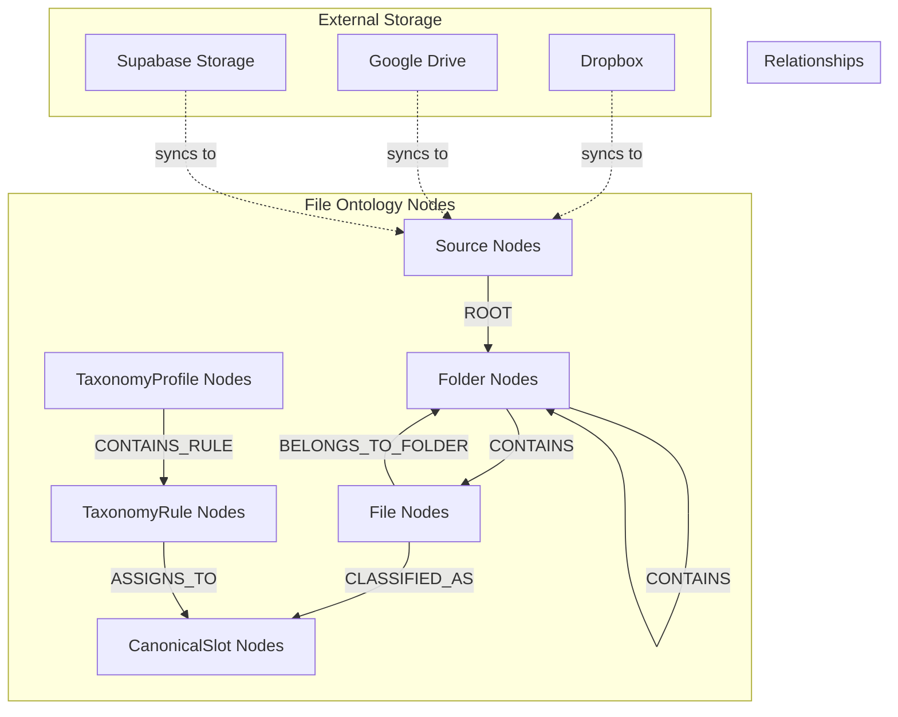

# File Ontology Architecture

## Overview

The File Ontology represents the "storage truth" layer of the knowledge graph, modeling files and folders from external storage providers (Dropbox, Google Drive, Supabase Storage) in a unified, normalized structure. This layer serves as the foundation that connects raw storage assets to the higher-level content and operational ontologies.

## Ontology Design



## Core Node Types

### 1. Source Nodes
Represents a storage source/account (Dropbox, Google Drive, etc.)

**Properties:**
```cypher
CREATE (s:Source {
    id: "uuid-123",                    // UUID primary key
    org_id: "org-456",                 // Multi-tenant scoping
    type: "dropbox",                   // Provider type: "dropbox", "google_drive", "supabase"
    title: "Production Dropbox",       // Human-readable name
    url: "https://dropbox.com/...",    // Optional URL
    provider_type: "dropbox",          // UI display type
    is_default: false,                 // Whether this is the default storage
    metadata: {                        // JSON for non-sensitive config
        folder_count: 150,
        file_count: 2500,
        last_sync: "2025-08-11T09:00:00Z"
    }
})
```

**Security Note:** Provider tokens and credentials are NOT stored in metadata but managed externally via Vault/KMS with only opaque references in the graph.

### 2. Folder Nodes
Represents directories in the storage hierarchy

**Properties:**
```cypher
CREATE (f:Folder {
    id: "folder-uuid-789",             // UUID primary key
    org_id: "org-456",                 // Multi-tenant scoping
    db_id: 12345,                      // Integer from Supabase for relational lookups
    name: "Scripts",                   // Folder name
    path: "/Production/Scripts",       // Full path within source
    parent_id: "parent-folder-uuid",   // UUID of parent folder (NULL for root)
    created_at: datetime(),
    updated_at: datetime()
})
```

**Constraints:**
```cypher
CREATE CONSTRAINT unique_folder_db_org IF NOT EXISTS 
FOR (f:Folder) REQUIRE (f.db_id, f.org_id) IS UNIQUE;
```

### 3. File Nodes
Represents actual files (documents, images, videos, etc.)

**Properties:**
```cypher
CREATE (f:File {
    id: "file-uuid-101",               // UUID primary key
    org_id: "org-456",                 // Multi-tenant scoping
    db_id: 67890,                      // Integer from Supabase
    name: "shooting_script_v3.pdf",    // Filename
    path: "/Production/Scripts/shooting_script_v3.pdf",
    size: 2048576,                     // Size in bytes
    mime_type: "application/pdf",      // MIME type
    bucket_id: "storage-bucket-123",   // Storage container identifier
    created_at: datetime(),
    updated_at: datetime(),
    metadata: {                        // JSON for extra attributes
        checksum: "sha256:abc123...",
        tags: ["script", "final"],
        version: "v3"
    }
})
```

**Constraints:**
```cypher
CREATE CONSTRAINT unique_file_db_org IF NOT EXISTS 
FOR (f:File) REQUIRE (f.db_id, f.org_id) IS UNIQUE;
```

### 4. CanonicalSlot Nodes (Planned)
Abstract categories that files can be classified into

**Properties:**
```cypher
CREATE (cs:CanonicalSlot {
    key: "SCRIPT_PRIMARY",             // Unique slot identifier
    org_id: "org-456",                 // Multi-tenant scoping
    description: "Main shooting script for production",
    category: "script",                // Grouping category
    required: true,                    // Whether this slot must be filled
    multiple: false,                   // Whether multiple files can fill this slot
    validation_rules: {                // JSON validation criteria
        mime_types: ["application/pdf", "text/plain"],
        max_size_mb: 50,
        naming_pattern: ".*script.*"
    }
})
```

**Standard CanonicalSlots:**
- `SCRIPT_PRIMARY` - Main shooting script
- `SCRIPT_DRAFT` - Script drafts and revisions
- `BUDGET_MASTER` - Master budget document
- `BUDGET_DRAFT` - Budget drafts and versions
- `CALLSHEET_FINAL` - Final call sheets
- `CALLSHEET_DRAFT` - Call sheet drafts
- `SCHEDULE_SHOOTING` - Shooting schedules
- `SCHEDULE_PREP` - Pre-production schedules
- `BREAKDOWN_SCENE` - Scene breakdown sheets
- `BREAKDOWN_CHARACTER` - Character breakdown
- `CONTACT_SHEET` - Cast/crew contact information
- `LOCATION_RELEASE` - Location permits and releases
- `TALENT_RELEASE` - Talent release forms
- `STORYBOARD` - Visual storyboards
- `LOOKBOOK` - Visual reference materials
- `SHOT_LIST` - Shot lists and camera plans
- `EQUIPMENT_LIST` - Equipment rental lists
- `CREW_LIST` - Crew contact and role information
- `INSURANCE_DOC` - Insurance certificates and policies
- `PERMIT_DOC` - Filming permits and licenses
- `RATE_CARD` - Union or crew rate cards

### 5. TaxonomyProfile Nodes (Planned)
Groups of classification rules for different organizations or projects

**Properties:**
```cypher
CREATE (tp:TaxonomyProfile {
    id: "profile-uuid-202",            // UUID primary key
    org_id: "org-456",                 // Multi-tenant scoping
    name: "Studio_A_Standard",         // Profile identifier
    description: "Standard classification rules for Studio A projects",
    active: true,                      // Whether profile is currently active
    priority: 100,                     // Priority when multiple profiles apply
    created_at: datetime(),
    metadata: {                        // JSON for profile configuration
        auto_apply: true,
        confidence_threshold: 0.8,
        fallback_slot: "MISC_DOCUMENT"
    }
})
```

### 6. TaxonomyRule Nodes (Planned)
Individual classification rules within profiles

**Properties:**
```cypher
CREATE (tr:TaxonomyRule {
    id: "rule-uuid-303",               // UUID primary key
    org_id: "org-456",                 // Multi-tenant scoping
    match_pattern: ".*script.*",       // Regex for filename/path matching
    slot_key: "SCRIPT_PRIMARY",        // Target CanonicalSlot
    file_type: "application/pdf",      // Optional MIME type filter
    path_pattern: "/Scripts/.*",       // Optional path pattern
    priority: 10,                      // Rule priority (lower = higher priority)
    enabled: true,                     // Whether rule is active
    confidence: 0.9,                   // Confidence score for this rule
    conditions: {                      // JSON for complex conditions
        min_size_bytes: 1024,
        max_size_bytes: 52428800,
        required_keywords: ["script", "shooting"],
        excluded_keywords: ["draft", "old"]
    }
})
```

## Relationship Types

### 1. Storage Hierarchy Relationships

#### Source to Root Folder
```cypher
(:Source)-[:ROOT]->(:Folder)
```
Links each storage source to its top-level folder.

#### Folder Containment
```cypher
(:Folder)-[:CONTAINS]->(:Folder)
(:Folder)-[:CONTAINS]->(:File)
```
Represents the hierarchical structure of folders and files.

#### File to Folder Membership
```cypher
(:File)-[:BELONGS_TO_FOLDER]->(:Folder)
```
Inverse relationship for quick parent folder lookups.

### 2. Classification Relationships

#### File Classification (via EdgeFacts)
```cypher
(:File)<-[:FROM]-(:EdgeFact {type: 'CLASSIFIED_AS'})-[:TO]->(:CanonicalSlot)
```
Temporal relationship tracking file classifications with confidence scores and timestamps.

#### Rule Assignment
```cypher
(:TaxonomyRule)-[:ASSIGNS_TO]->(:CanonicalSlot)
```
Links classification rules to their target slots.

#### Profile Rule Membership
```cypher
(:TaxonomyProfile)-[:CONTAINS_RULE]->(:TaxonomyRule)
```
Groups rules within profiles.

## Implementation Patterns

### 1. File Sync Pattern
```cypher
// Atomic file upsert with provenance
MERGE (f:File {id: $file_id, org_id: $org_id})
SET f += $properties
SET f.updated_at = datetime()

// Create version if changed
WITH f
CALL apoc.do.when(
    $properties.size <> f.size OR $properties.modified <> f.modified,
    "
    CREATE (v:EntityVersion {
        id: randomUUID(),
        entity_id: f.id,
        entity_type: 'File',
        props: $properties,
        valid_from: datetime(),
        valid_to: null,
        org_id: f.org_id
    })
    CREATE (f)-[:HAS_VERSION]->(v)
    RETURN v
    ",
    "RETURN null as v",
    {f: f, properties: $properties}
) YIELD value as version

// Update folder relationship
MERGE (folder:Folder {id: $folder_id, org_id: $org_id})
MERGE (folder)-[:CONTAINS]->(f)
MERGE (f)-[:BELONGS_TO_FOLDER]->(folder)

RETURN f, version.v as version
```

### 2. Classification Pattern
```cypher
// Apply taxonomy rules to classify file
MATCH (f:File {id: $file_id, org_id: $org_id})
MATCH (tp:TaxonomyProfile {org_id: $org_id, active: true})
MATCH (tp)-[:CONTAINS_RULE]->(tr:TaxonomyRule {enabled: true})
MATCH (tr)-[:ASSIGNS_TO]->(cs:CanonicalSlot)

WHERE f.name =~ tr.match_pattern
  AND (tr.file_type IS NULL OR f.mime_type = tr.file_type)
  AND (tr.path_pattern IS NULL OR f.path =~ tr.path_pattern)

WITH f, cs, tr, 
     CASE 
       WHEN f.size >= coalesce(tr.conditions.min_size_bytes, 0)
        AND f.size <= coalesce(tr.conditions.max_size_bytes, 999999999)
       THEN tr.confidence
       ELSE 0.0
     END as confidence

WHERE confidence > 0.5

// Create EdgeFact for classification
CREATE (ef:EdgeFact {
    id: randomUUID(),
    type: 'CLASSIFIED_AS',
    from_id: f.id,
    to_id: cs.key,
    valid_from: datetime(),
    valid_to: null,
    confidence: confidence,
    method: 'rule_based',
    rule_id: tr.id,
    org_id: f.org_id
})
CREATE (ef)-[:FROM]->(f)
CREATE (ef)-[:TO]->(cs)

RETURN f, cs, confidence
```

### 3. Folder Traversal Pattern
```cypher
// Get all files in folder hierarchy
MATCH (root:Folder {id: $folder_id, org_id: $org_id})
MATCH path = (root)-[:CONTAINS*0..]->(item)
WHERE item:File OR item:Folder
RETURN 
    item,
    length(path) as depth,
    [n in nodes(path) | n.name] as path_names
ORDER BY depth, item.name
```

## Storage Provider Integration

### Dropbox Integration (Implemented)
```python
class DropboxFileSync:
    def sync_file_event(self, event):
        """Sync Dropbox file event to Neo4j"""
        with self.neo4j.session() as session:
            # Upsert file node
            result = session.run("""
                MERGE (f:File {id: $file_id, org_id: $org_id})
                SET f += $properties
                SET f.updated_at = datetime()
                
                // Update source relationship
                MERGE (s:Source {id: $source_id, org_id: $org_id})
                
                // Update folder hierarchy
                MERGE (folder:Folder {id: $folder_id, org_id: $org_id})
                MERGE (folder)-[:CONTAINS]->(f)
                MERGE (f)-[:BELONGS_TO_FOLDER]->(folder)
                
                RETURN f
            """, {
                'file_id': event.file_id,
                'org_id': event.org_id,
                'source_id': event.source_id,
                'folder_id': event.folder_id,
                'properties': {
                    'name': event.file_name,
                    'path': event.file_path,
                    'size': event.file_size,
                    'mime_type': event.mime_type,
                    'modified': event.modified_at
                }
            })
            
            file_node = result.single()['f']
            
            # Trigger classification
            self.classify_file(file_node['id'])
```

### Google Drive Integration (Planned)
```python
class GoogleDriveFileSync:
    def setup_push_notifications(self):
        """Setup Google Drive push notifications"""
        service = build('drive', 'v3', credentials=self.credentials)
        
        # Create watch request
        body = {
            'id': str(uuid.uuid4()),
            'type': 'web_hook',
            'address': f'{self.webhook_url}/gdrive/webhook'
        }
        
        # Start watching for changes
        service.files().watch(body=body).execute()
    
    def process_drive_event(self, event):
        """Process Google Drive change event"""
        # Similar to Dropbox but using Drive API
        pass
```

## Classification System

### Rule-Based Classification
```python
class FileClassifier:
    def classify_file(self, file_id: str) -> List[Classification]:
        """Classify file using taxonomy rules"""
        with self.neo4j.session() as session:
            result = session.run("""
                MATCH (f:File {id: $file_id})
                MATCH (tp:TaxonomyProfile {org_id: f.org_id, active: true})
                MATCH (tp)-[:CONTAINS_RULE]->(tr:TaxonomyRule {enabled: true})
                MATCH (tr)-[:ASSIGNS_TO]->(cs:CanonicalSlot)
                
                WHERE f.name =~ tr.match_pattern
                  AND (tr.file_type IS NULL OR f.mime_type = tr.file_type)
                
                WITH f, cs, tr, tr.confidence as base_confidence
                
                // Apply additional scoring logic
                WITH f, cs, tr,
                     CASE
                       WHEN size([kw IN tr.conditions.required_keywords WHERE f.name CONTAINS kw]) = size(tr.conditions.required_keywords)
                       THEN base_confidence
                       ELSE base_confidence * 0.5
                     END as confidence
                
                WHERE confidence >= 0.5
                
                RETURN cs.key as slot, confidence, tr.id as rule_id
                ORDER BY confidence DESC
            """, file_id=file_id)
            
            return [Classification(
                slot=record['slot'],
                confidence=record['confidence'],
                method='rule_based',
                rule_id=record['rule_id']
            ) for record in result]
```

### ML-Based Classification (Planned)
```python
class MLFileClassifier:
    def __init__(self):
        self.model = joblib.load('models/file_classifier.pkl')
        self.vectorizer = joblib.load('models/text_vectorizer.pkl')
    
    def classify_file(self, file_path: str, content: str = None) -> List[Classification]:
        """Classify file using ML model"""
        features = self.extract_features(file_path, content)
        predictions = self.model.predict_proba([features])[0]
        
        classifications = []
        for i, prob in enumerate(predictions):
            if prob > 0.3:  # Confidence threshold
                slot = self.model.classes_[i]
                classifications.append(Classification(
                    slot=slot,
                    confidence=prob,
                    method='ml_based'
                ))
        
        return sorted(classifications, key=lambda x: x.confidence, reverse=True)
    
    def extract_features(self, file_path: str, content: str = None) -> np.ndarray:
        """Extract features for ML classification"""
        features = []
        
        # Path-based features
        path_features = self.vectorizer.transform([file_path]).toarray()[0]
        features.extend(path_features)
        
        # Content-based features (if available)
        if content:
            content_features = self.extract_content_features(content)
            features.extend(content_features)
        
        return np.array(features)
```

## Performance Optimization

### Indexing Strategy
```cypher
// File lookup indexes
CREATE INDEX file_org_name IF NOT EXISTS FOR (f:File) ON (f.org_id, f.name);
CREATE INDEX file_org_path IF NOT EXISTS FOR (f:File) ON (f.org_id, f.path);
CREATE INDEX file_mime_type IF NOT EXISTS FOR (f:File) ON (f.mime_type);
CREATE INDEX file_size IF NOT EXISTS FOR (f:File) ON (f.size);

// Classification indexes
CREATE INDEX classification_lookup IF NOT EXISTS FOR (ef:EdgeFact) 
ON (ef.type, ef.from_id, ef.valid_to) WHERE ef.type = 'CLASSIFIED_AS';

// Taxonomy indexes
CREATE INDEX rule_pattern IF NOT EXISTS FOR (tr:TaxonomyRule) ON (tr.match_pattern);
CREATE INDEX rule_priority IF NOT EXISTS FOR (tr:TaxonomyRule) ON (tr.priority);
```

### Caching Strategy
```python
from functools import lru_cache
import redis

class FileOntologyCache:
    def __init__(self):
        self.redis = redis.Redis(host='localhost', port=6379, db=0)
    
    @lru_cache(maxsize=1000)
    def get_taxonomy_rules(self, org_id: str) -> List[TaxonomyRule]:
        """Cache taxonomy rules per organization"""
        cache_key = f"taxonomy_rules:{org_id}"
        cached = self.redis.get(cache_key)
        
        if cached:
            return pickle.loads(cached)
        
        # Fetch from Neo4j
        rules = self.fetch_taxonomy_rules(org_id)
        self.redis.setex(cache_key, 3600, pickle.dumps(rules))  # 1 hour TTL
        return rules
    
    def invalidate_taxonomy_cache(self, org_id: str):
        """Invalidate cache when rules change"""
        cache_key = f"taxonomy_rules:{org_id}"
        self.redis.delete(cache_key)
        self.get_taxonomy_rules.cache_clear()
```

## Testing Strategy

### Unit Tests
```python
def test_file_node_creation():
    """Test file node creation and properties"""
    with neo4j_session() as session:
        result = session.run("""
            CREATE (f:File {
                id: $file_id,
                org_id: $org_id,
                name: $name,
                path: $path,
                size: $size,
                mime_type: $mime_type
            })
            RETURN f
        """, {
            'file_id': 'test-file-123',
            'org_id': 'test-org-456',
            'name': 'test_script.pdf',
            'path': '/scripts/test_script.pdf',
            'size': 1024000,
            'mime_type': 'application/pdf'
        })
        
        file_node = result.single()['f']
        assert file_node['name'] == 'test_script.pdf'
        assert file_node['size'] == 1024000

def test_file_classification():
    """Test file classification with taxonomy rules"""
    # Setup test data
    setup_test_taxonomy_rules()
    
    classifier = FileClassifier()
    classifications = classifier.classify_file('test-file-123')
    
    assert len(classifications) > 0
    assert classifications[0].slot == 'SCRIPT_PRIMARY'
    assert classifications[0].confidence > 0.8
```

### Integration Tests
```python
def test_dropbox_sync_integration():
    """Test full Dropbox sync pipeline"""
    # Mock Dropbox webhook event
    event = DropboxEvent(
        file_id='dropbox-file-789',
        file_name='shooting_script_final.pdf',
        file_path='/Production/Scripts/shooting_script_final.pdf',
        file_size=2048000,
        modified_at=datetime.now()
    )
    
    # Process event
    sync = DropboxFileSync()
    sync.sync_file_event(event)
    
    # Verify file node created
    with neo4j_session() as session:
        result = session.run("""
            MATCH (f:File {id: $file_id})
            RETURN f
        """, file_id='dropbox-file-789')
        
        file_node = result.single()['f']
        assert file_node['name'] == 'shooting_script_final.pdf'
    
    # Verify classification applied
    with neo4j_session() as session:
        result = session.run("""
            MATCH (f:File {id: $file_id})
            MATCH (f)<-[:FROM]-(ef:EdgeFact {type: 'CLASSIFIED_AS', valid_to: null})-[:TO]->(cs:CanonicalSlot)
            RETURN cs.key as slot
        """, file_id='dropbox-file-789')
        
        classification = result.single()
        assert classification['slot'] == 'SCRIPT_PRIMARY'
```

## Security & Privacy

### Data Protection
- **Encryption**: File metadata encrypted at rest
- **Access Control**: Org-scoped queries prevent cross-tenant access
- **Audit Trail**: All file operations logged with provenance
- **Token Security**: Provider credentials stored in secure vault

### Privacy Compliance
- **Data Minimization**: Only necessary file metadata stored
- **Retention Policies**: Automatic cleanup of old file versions
- **Right to Deletion**: Support for removing user data
- **Consent Management**: Track user permissions for file access

## Monitoring & Alerting

### Key Metrics
```python
def collect_file_ontology_metrics():
    """Collect metrics for monitoring dashboard"""
    with neo4j_session() as session:
        metrics = {}
        
        # File count by organization
        result = session.run("""
            MATCH (f:File)
            RETURN f.org_id as org_id, count(f) as file_count
        """)
        metrics['files_by_org'] = dict(result)
        
        # Classification coverage
        result = session.run("""
            MATCH (f:File)
            OPTIONAL MATCH (f)<-[:FROM]-(ef:EdgeFact {type: 'CLASSIFIED_AS', valid_to: null})
            RETURN 
                count(f) as total_files,
                count(ef) as classified_files,
                (count(ef) * 100.0 / count(f)) as classification_percentage
        """)
        metrics['classification_coverage'] = result.single()
        
        # Storage usage by provider
        result = session.run("""
            MATCH (f:File)-[:BELONGS_TO_FOLDER]->(:Folder)<-[:CONTAINS*0..]-(root:Folder)<-[:ROOT]-(s:Source)
            RETURN s.type as provider, sum(f.size) as total_bytes
        """)
        metrics['storage_by_provider'] = dict(result)
        
        return metrics
```

### Health Checks
```python
def health_check_file_ontology():
    """Perform health checks on file ontology"""
    checks = {}
    
    with neo4j_session() as session:
        # Check for orphaned files
        result = session.run("""
            MATCH (f:File)
            WHERE NOT (f)-[:BELONGS_TO_FOLDER]->(:Folder)
            RETURN count(f) as orphaned_files
        """)
        checks['orphaned_files'] = result.single()['orphaned_files']
        
        # Check for missing classifications
        result = session.run("""
            MATCH (f:File)
            WHERE NOT (f)<-[:FROM]-(:EdgeFact {type: 'CLASSIFIED_AS'})
            RETURN count(f) as unclassified_files
        """)
        checks['unclassified_files'] = result.single()['unclassified_files']
        
        # Check constraint violations
        result = session.run("CALL db.constraints()")
        active_constraints = [r['name'] for r in result]
        checks['constraints_active'] = len(active_constraints)
        
    return checks
```

## Future Enhancements

### Advanced Classification
- **Multi-modal Analysis**: Combine filename, content, and visual analysis
- **Active Learning**: Improve classification with user feedback
- **Semantic Understanding**: Use NLP for deep content analysis
- **Custom Taxonomies**: Per-project classification schemes

### Performance Improvements
- **Parallel Processing**: Multi-threaded file processing
- **Incremental Sync**: Only sync changed files
- **Compression**: Reduce storage for file metadata
- **Distributed Processing**: Scale across multiple workers

### Integration Enhancements
- **Additional Providers**: OneDrive, Box, AWS S3, etc.
- **Real-time Sync**: Instant file updates via websockets
- **Conflict Resolution**: Handle concurrent file modifications
- **Offline Support**: Queue operations when providers unavailable
