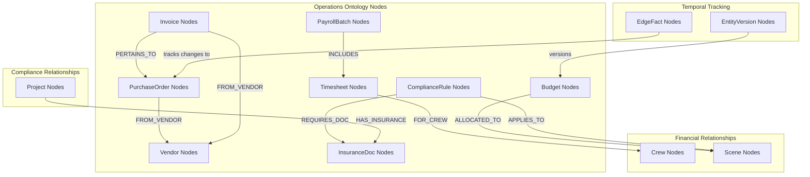

# Operations Ontology Architecture

## Overview

The Operations Ontology represents the "operational reality" layer, covering logistical, financial, and compliance aspects of production including purchasing, budgeting, time tracking, payroll, and regulatory compliance. This layer connects business operations to creative content, enabling end-to-end visibility and automated workflow triggers.

## Ontology Design



## Core Node Types

### 1. Vendor Nodes
External vendors and service providers

**Properties:**
```cypher
CREATE (v:Vendor {
    id: "vendor-uuid-123",            // UUID primary key
    org_id: "org-456",                // Multi-tenant scoping
    name: "Equipment Rental Co",      // Vendor name
    category: "equipment_rental",     // Category: equipment_rental, catering, transportation, etc.
    contact_name: "John Smith",       // Primary contact
    contact_email: "john@equiprent.com",
    contact_phone: "+1-555-0123",
    address: "123 Industry St, Los Angeles, CA 90028",
    tax_id: "12-3456789",            // Tax identification number
    payment_terms: "Net 30",         // Payment terms
    preferred_payment_method: "ACH",  // Payment method preference
    status: "active",                 // active, inactive, suspended
    rating: 4.5,                     // Vendor rating (1-5)
    created_at: datetime(),
    updated_at: datetime(),
    metadata: {                       // JSON for vendor details
        specialties: ["cameras", "lighting", "grip"],
        insurance_verified: true,
        union_signatory: true,
        previous_projects: ["Film A", "Series B"],
        notes: "Reliable for last-minute requests"
    }
})
```

### 2. PurchaseOrder Nodes
Purchase orders for goods and services

**Properties:**
```cypher
CREATE (po:PurchaseOrder {
    id: "po-uuid-789",               // UUID primary key
    org_id: "org-456",               // Multi-tenant scoping
    project_id: "project-uuid-123",  // Parent project
    po_number: "PO-2025-001",        // Human-readable PO number
    vendor_id: "vendor-uuid-123",    // Vendor reference
    scene_id: "scene-uuid-456",      // Optional scene reference
    crew_role: "camera_department",   // Optional department reference
    description: "Camera equipment rental for Scene 5",
    amount: 2500.00,                 // Total amount
    currency: "USD",                 // Currency
    status: "approved",              // draft, pending, approved, ordered, received, cancelled
    order_date: date("2025-10-01"),  // Order date
    needed_date: date("2025-10-15"), // When items are needed
    delivery_address: "Studio Lot A, Stage 3",
    approved_by: "user-uuid-789",    // Approver user ID
    created_by: "user-uuid-456",     // Creator user ID
    created_at: datetime(),
    updated_at: datetime(),
    metadata: {                       // JSON for PO details
        line_items: [
            {
                "description": "RED Camera Package",
                "quantity": 1,
                "unit_price": 1500.00,
                "total": 1500.00
            },
            {
                "description": "Lens Kit",
                "quantity": 1,
                "unit_price": 1000.00,
                "total": 1000.00
            }
        ],
        special_instructions: "Deliver to Stage 3 by 6 AM",
        insurance_required: true
    }
})
```

### 3. Invoice Nodes
Vendor invoices for payment processing

**Properties:**
```cypher
CREATE (i:Invoice {
    id: "invoice-uuid-101",          // UUID primary key
    org_id: "org-456",               // Multi-tenant scoping
    project_id: "project-uuid-123",  // Parent project
    vendor_id: "vendor-uuid-123",    // Vendor reference
    po_id: "po-uuid-789",           // Related purchase order
    invoice_number: "INV-2025-0123", // Vendor's invoice number
    amount: 2500.00,                 // Invoice amount
    currency: "USD",                 // Currency
    tax_amount: 200.00,              // Tax amount
    total_amount: 2700.00,           // Total including tax
    invoice_date: date("2025-10-16"), // Invoice date
    due_date: date("2025-11-15"),    // Payment due date
    status: "pending_payment",        // received, approved, pending_payment, paid, disputed
    payment_date: null,              // Actual payment date
    payment_method: "ACH",           // Payment method used
    approved_by: "user-uuid-789",    // Approver user ID
    created_at: datetime(),
    updated_at: datetime(),
    metadata: {                       // JSON for invoice details
        line_items: [
            {
                "description": "Camera rental - 5 days",
                "amount": 2500.00
            }
        ],
        payment_reference: null,
        notes: "Equipment returned in good condition"
    }
})
```

### 4. Timesheet Nodes
Crew time tracking for payroll

**Properties:**
```cypher
CREATE (ts:Timesheet {
    id: "timesheet-uuid-202",        // UUID primary key
    org_id: "org-456",               // Multi-tenant scoping
    project_id: "project-uuid-123",  // Parent project
    crew_id: "crew-uuid-404",        // Crew member reference
    shoot_day_id: "shootday-uuid-606", // Shoot day reference
    work_date: date("2025-10-15"),   // Work date
    call_time: time("06:00"),        // Call time
    wrap_time: time("19:00"),        // Wrap time
    meal_break_start: time("12:00"), // Meal break start
    meal_break_end: time("13:00"),   // Meal break end
    regular_hours: 10.0,             // Regular hours worked
    overtime_hours: 3.0,             // Overtime hours
    double_time_hours: 0.0,          // Double time hours
    regular_rate: 50.00,             // Regular hourly rate
    overtime_rate: 75.00,            // Overtime rate (1.5x)
    double_time_rate: 100.00,        // Double time rate (2x)
    total_amount: 725.00,            // Total pay amount
    status: "submitted",             // draft, submitted, approved, processed
    submitted_by: "crew-uuid-404",   // Who submitted
    approved_by: "user-uuid-789",    // Who approved
    created_at: datetime(),
    updated_at: datetime(),
    metadata: {                       // JSON for timesheet details
        location: "Studio Lot A",
        department: "camera",
        role: "camera_operator",
        notes: "Long day with multiple setups",
        expenses: [
            {
                "type": "mileage",
                "amount": 25.00,
                "description": "Travel to location"
            }
        ]
    }
})
```

### 5. PayrollBatch Nodes
Payroll processing batches

**Properties:**
```cypher
CREATE (pb:PayrollBatch {
    id: "payroll-uuid-303",          // UUID primary key
    org_id: "org-456",               // Multi-tenant scoping
    project_id: "project-uuid-123",  // Parent project
    batch_name: "Week 3 Payroll",    // Batch identifier
    pay_period_start: date("2025-10-14"),
    pay_period_end: date("2025-10-20"),
    total_amount: 45000.00,          // Total batch amount
    currency: "USD",                 // Currency
    status: "processed",             // draft, calculating, approved, processed, paid
    processed_date: date("2025-10-22"),
    pay_date: date("2025-10-25"),    // When payments are made
    processed_by: "user-uuid-789",   // Who processed
    created_at: datetime(),
    updated_at: datetime(),
    metadata: {                       // JSON for batch details
        timesheet_count: 25,
        crew_count: 15,
        total_regular_hours: 400.0,
        total_overtime_hours: 75.0,
        payroll_service: "ADP",
        confirmation_number: "ADP-2025-1015-001"
    }
})
```

### 6. Budget Nodes
Project budget tracking

**Properties:**
```cypher
CREATE (b:Budget {
    id: "budget-uuid-404",           // UUID primary key
    org_id: "org-456",               // Multi-tenant scoping
    project_id: "project-uuid-123",  // Parent project
    name: "Master Budget v2.1",      // Budget name/version
    total_budget: 2500000.00,        // Total project budget
    currency: "USD",                 // Currency
    status: "approved",              // draft, pending, approved, locked
    version: "2.1",                  // Budget version
    approved_by: "user-uuid-789",    // Approver
    approved_date: date("2025-08-15"),
    created_at: datetime(),
    updated_at: datetime(),
    metadata: {                       // JSON for budget breakdown
        categories: {
            "above_line": 500000.00,
            "below_line": 1800000.00,
            "post_production": 200000.00
        },
        departments: {
            "camera": 150000.00,
            "lighting": 120000.00,
            "sound": 80000.00,
            "locations": 200000.00
        },
        contingency_percentage: 10.0
    }
})
```

### 7. ComplianceRule Nodes
Regulatory and safety compliance rules

**Properties:**
```cypher
CREATE (cr:ComplianceRule {
    id: "compliance-uuid-505",       // UUID primary key
    org_id: "org-456",               // Multi-tenant scoping
    name: "Stunt Safety Requirements", // Rule name
    category: "safety",              // safety, union, insurance, permit
    description: "Stunt coordinator and medic required for action scenes",
    jurisdiction: "California",       // Geographic scope
    authority: "Cal/OSHA",           // Regulatory authority
    severity: "mandatory",           // mandatory, recommended, optional
    effective_date: date("2025-01-01"),
    expiry_date: null,               // Rule expiry (null = permanent)
    status: "active",                // active, inactive, superseded
    created_at: datetime(),
    updated_at: datetime(),
    metadata: {                       // JSON for rule details
        triggers: [
            "scene_involves_stunts",
            "scene_involves_weapons",
            "scene_involves_vehicles"
        ],
        requirements: [
            "certified_stunt_coordinator",
            "on_set_medic",
            "safety_briefing"
        ],
        documentation_required: [
            "stunt_coordinator_certificate",
            "medic_certification",
            "safety_plan"
        ],
        penalties: "Production shutdown, fines up to $10,000"
    }
})
```

### 8. InsuranceDoc Nodes
Insurance certificates and compliance documents

**Properties:**
```cypher
CREATE (id:InsuranceDoc {
    id: "insurance-uuid-606",        // UUID primary key
    org_id: "org-456",               // Multi-tenant scoping
    project_id: "project-uuid-123",  // Parent project
    doc_type: "general_liability",    // general_liability, equipment, errors_omissions, etc.
    policy_number: "GL-2025-789456", // Insurance policy number
    carrier: "Production Insurance Co", // Insurance carrier
    coverage_amount: 2000000.00,     // Coverage amount
    currency: "USD",                 // Currency
    effective_date: date("2025-09-01"),
    expiry_date: date("2026-08-31"),
    status: "active",                // active, expired, cancelled
    certificate_holder: "Alpha Studios",
    additional_insured: ["Location Owner", "Equipment Vendor"],
    created_at: datetime(),
    updated_at: datetime(),
    metadata: {                       // JSON for insurance details
        coverage_types: [
            "bodily_injury",
            "property_damage",
            "personal_injury"
        ],
        deductible: 5000.00,
        premium: 15000.00,
        broker: "Insurance Broker LLC",
        broker_contact: "broker@insurance.com"
    }
})
```

## Relationship Types

### 1. Financial Relationships

#### Purchase Order to Vendor
```cypher
(:PurchaseOrder)-[:FROM_VENDOR]->(:Vendor)
```
Links purchase orders to their vendors.

#### Invoice Relationships
```cypher
(:Invoice)-[:FROM_VENDOR]->(:Vendor)
(:Invoice)-[:PERTAINS_TO]->(:PurchaseOrder)
```
Connects invoices to vendors and related purchase orders.

#### Timesheet to Crew
```cypher
(:Timesheet)-[:FOR_CREW]->(:Crew)
```
Links timesheets to crew members.

#### Payroll Batch Inclusion
```cypher
(:PayrollBatch)-[:INCLUDES]->(:Timesheet)
```
Groups timesheets into payroll batches.

### 2. Project Allocation (via EdgeFacts)

#### Purchase Order Scene Assignment
```cypher
(:PurchaseOrder)<-[:FROM]-(:EdgeFact {type: 'FOR_SCENE'})-[:TO]->(:Scene)
```
Temporal relationship linking expenses to specific scenes.

#### Budget Allocation
```cypher
(:Budget)<-[:FROM]-(:EdgeFact {type: 'ALLOCATED_TO'})-[:TO]->(:Scene)
```
Budget allocations to scenes with temporal tracking.

### 3. Compliance Relationships

#### Rule Application
```cypher
(:ComplianceRule)<-[:FROM]-(:EdgeFact {type: 'APPLIES_TO'})-[:TO]->(:Scene)
(:ComplianceRule)<-[:FROM]-(:EdgeFact {type: 'APPLIES_TO'})-[:TO]->(:ShootDay)
```
Links compliance rules to scenes or shoot days.

#### Document Requirements
```cypher
(:ComplianceRule)-[:REQUIRES_DOC]->(:InsuranceDoc)
```
Specifies required documentation for compliance.

#### Insurance Coverage
```cypher
(:Project)-[:HAS_INSURANCE]->(:InsuranceDoc)
```
Links projects to their insurance coverage.

## Implementation Patterns

### 1. Purchase Order Creation with Approval Workflow
```cypher
// Create purchase order with approval workflow
CREATE (po:PurchaseOrder {
    id: $po_id,
    org_id: $org_id,
    project_id: $project_id,
    po_number: $po_number,
    vendor_id: $vendor_id,
    description: $description,
    amount: $amount,
    status: "pending",
    created_by: $user_id,
    created_at: datetime()
})

// Link to vendor
MATCH (v:Vendor {id: $vendor_id, org_id: $org_id})
CREATE (po)-[:FROM_VENDOR]->(v)

// Link to scene if specified
CALL apoc.do.when(
    $scene_id IS NOT NULL,
    "
    MATCH (s:Scene {id: $scene_id, org_id: $org_id})
    CREATE (ef:EdgeFact {
        id: randomUUID(),
        type: 'FOR_SCENE',
        from_id: po.id,
        to_id: s.id,
        valid_from: datetime(),
        valid_to: null,
        org_id: $org_id
    })
    CREATE (ef)-[:FROM]->(po)
    CREATE (ef)-[:TO]->(s)
    RETURN ef
    ",
    "RETURN null",
    {po: po, scene_id: $scene_id, org_id: $org_id}
) YIELD value

// Create approval workflow
CREATE (approval:Action {
    id: randomUUID(),
    tool: "purchase_order_approval",
    inputs: {po_id: po.id, amount: po.amount},
    status: "pending",
    timestamp: datetime()
})

RETURN po, approval
```

### 2. Payroll Processing Pipeline
```cypher
// Process payroll batch with timesheets
MATCH (ts:Timesheet {status: "approved", org_id: $org_id})
WHERE ts.work_date >= $pay_period_start 
  AND ts.work_date <= $pay_period_end

// Calculate totals
WITH collect(ts) as timesheets,
     sum(ts.total_amount) as total_amount,
     count(DISTINCT ts.crew_id) as crew_count

// Create payroll batch
CREATE (pb:PayrollBatch {
    id: randomUUID(),
    org_id: $org_id,
    project_id: $project_id,
    batch_name: $batch_name,
    pay_period_start: $pay_period_start,
    pay_period_end: $pay_period_end,
    total_amount: total_amount,
    status: "calculating",
    created_at: datetime()
})

// Link timesheets to batch
UNWIND timesheets as ts
CREATE (pb)-[:INCLUDES]->(ts)
SET ts.status = "processing"

// Update batch status
SET pb.status = "approved"
SET pb.processed_date = date()

RETURN pb, size(timesheets) as timesheet_count
```

### 3. Compliance Checking
```cypher
// Check compliance for a scene
MATCH (s:Scene {id: $scene_id, org_id: $org_id})

// Find applicable compliance rules
MATCH (cr:ComplianceRule {org_id: $org_id, status: "active"})
WHERE any(trigger IN cr.metadata.triggers 
    WHERE s.metadata.special_requirements CONTAINS trigger)

// Check if required documents exist
OPTIONAL MATCH (p:Project {id: s.project_id})-[:HAS_INSURANCE]->(id:InsuranceDoc)
WHERE id.doc_type IN cr.metadata.documentation_required

WITH s, cr, collect(id) as available_docs
WHERE size(available_docs) < size(cr.metadata.documentation_required)

RETURN 
    s.number as scene_number,
    cr.name as rule_name,
    cr.metadata.documentation_required as required_docs,
    [doc IN available_docs | doc.doc_type] as available_docs,
    "COMPLIANCE_VIOLATION" as status
```

## Financial Reporting Queries

### 1. Budget vs Actual Analysis
```cypher
// Compare budget allocations to actual spending
MATCH (p:Project {id: $project_id, org_id: $org_id})
MATCH (b:Budget {project_id: p.id, status: "approved"})

// Get budget allocations by department
WITH b, b.metadata.departments as budget_by_dept

// Get actual spending
MATCH (po:PurchaseOrder {project_id: p.id, status: "approved"})
OPTIONAL MATCH (po)<-[:FROM]-(ef:EdgeFact {type: "FOR_SCENE"})-[:TO]->(s:Scene)

WITH budget_by_dept, 
     collect({
         department: coalesce(po.metadata.department, "unassigned"),
         amount: po.amount,
         scene: s.number
     }) as actual_spending

RETURN 
    budget_by_dept,
    actual_spending,
    [dept IN keys(budget_by_dept) | {
        department: dept,
        budgeted: budget_by_dept[dept],
        actual: reduce(total = 0.0, spend IN actual_spending | 
            CASE WHEN spend.department = dept THEN total + spend.amount ELSE total END),
        variance: budget_by_dept[dept] - reduce(total = 0.0, spend IN actual_spending | 
            CASE WHEN spend.department = dept THEN total + spend.amount ELSE total END)
    }] as variance_analysis
```

### 2. Vendor Performance Analysis
```cypher
// Analyze vendor performance metrics
MATCH (v:Vendor {org_id: $org_id})
OPTIONAL MATCH (v)<-[:FROM_VENDOR]-(po:PurchaseOrder)
OPTIONAL MATCH (v)<-[:FROM_VENDOR]-(i:Invoice)

WITH v, 
     count(po) as total_pos,
     sum(po.amount) as total_po_amount,
     count(i) as total_invoices,
     sum(i.total_amount) as total_invoice_amount,
     avg(duration.between(po.order_date, i.invoice_date).days) as avg_delivery_days

RETURN 
    v.name as vendor_name,
    v.category as category,
    v.rating as rating,
    total_pos,
    total_po_amount,
    total_invoices,
    total_invoice_amount,
    avg_delivery_days,
    CASE 
        WHEN avg_delivery_days <= 7 THEN "Excellent"
        WHEN avg_delivery_days <= 14 THEN "Good"
        WHEN avg_delivery_days <= 21 THEN "Fair"
        ELSE "Poor"
    END as delivery_performance
ORDER BY total_po_amount DESC
```

## Performance Optimization

### 1. Indexing Strategy
```cypher
// Financial indexes
CREATE INDEX po_project_status IF NOT EXISTS FOR (po:PurchaseOrder) ON (po.project_id, po.status);
CREATE INDEX invoice_vendor_date IF NOT EXISTS FOR (i:Invoice) ON (i.vendor_id, i.invoice_date);
CREATE INDEX timesheet_crew_date IF NOT EXISTS FOR (ts:Timesheet) ON (ts.crew_id, ts.work_date);
CREATE INDEX budget_project_version IF NOT EXISTS FOR (b:Budget) ON (b.project_id, b.version);

// Compliance indexes
CREATE INDEX compliance_category_status IF NOT EXISTS FOR (cr:ComplianceRule) ON (cr.category, cr.status);
CREATE INDEX insurance_project_type IF NOT EXISTS FOR (id:InsuranceDoc) ON (id.project_id, id.doc_type);

// Financial relationship indexes
CREATE INDEX po_scene_relationships IF NOT EXISTS FOR (ef:EdgeFact) 
ON (ef.type, ef.from_id, ef.valid_to) WHERE ef.type = 'FOR_SCENE';
```

### 2. Caching Strategy
```python
class OperationsCache:
    def __init__(self):
        self.redis = redis.Redis()
    
    @lru_cache(maxsize=100)
    def get_active_compliance_rules(self, org_id: str) -> List[ComplianceRule]:
        """Cache active compliance rules"""
        cache_key = f"compliance_rules:active:{org_id}"
        cached = self.redis.get(cache_key)
        
        if cached:
            return pickle.loads(cached)
        
        rules = self.fetch_active_compliance_rules(org_id)
        self.redis.setex(cache_key, 1800, pickle.dumps(rules))  # 30 min TTL
        return rules
    
    def get_budget_summary(self, project_id: str) -> BudgetSummary:
        """Cache budget vs actual analysis"""
        cache_key = f"budget_summary:{project_id}"
        cached = self.redis.get(cache_key)
        
        if cached:
            return pickle.loads(cached)
        
        summary = self.calculate_budget_summary(project_id)
        self.redis.setex(cache_key, 300, pickle.dumps(summary))  # 5 min TTL
        return summary
```

## Testing Strategy

### 1. Unit Tests
```python
def test_purchase_order_creation():
    """Test PO creation with vendor relationship"""
    with neo4j_session() as session:
        vendor_id = create_test_vendor(session)
        
        result = session.run("""
            CREATE (po:PurchaseOrder {
                id: $po_id,
                org_id: $org_id,
                vendor_id: $vendor_id,
                amount: $amount,
                status: "pending"
            })
            MATCH (v:Vendor {id: $vendor_id})
            CREATE (po)-[:FROM_VENDOR]->(v)
            RETURN po, v
        """, {
            'po_id': 'test-po-123',
            'org_id': 'test-org-456',
            'vendor_id': vendor_id,
            'amount': 1500.00
        })
        
        po, vendor = result.single()
        assert po['amount'] == 1500.00
        assert po['status'] == 'pending'

def test_compliance_checking():
    """Test compliance rule evaluation"""
    checker = ComplianceChecker()
    violations = checker.check_scene_compliance('test-scene-123')
    
    assert len(violations) >= 0
    for violation in violations:
        assert violation.rule_name is not None
        assert violation.required_docs is not None
```

### 2. Integration Tests
```python
def test_payroll_processing_pipeline():
    """Test complete payroll processing"""
    # Setup test data
    crew_id = create_test_crew()
    timesheets = create_test_timesheets(crew_id, 5)  # 5 days of work
    
    # Process payroll
    processor = PayrollProcessor()
    batch = processor.process_payroll_batch(
        pay_period_start=date(2025, 10, 14),
        pay_period_end=date(2025, 10, 20)
    )
    
    # Verify results
    assert batch.total_amount > 0
    assert batch.timesheet_count == 5
    assert batch.status == 'processed'
    
    # Verify timesheets updated
    for timesheet in timesheets:
        updated_ts = get_timesheet(timesheet.id)
        assert updated_ts.status == 'processing'
```

## Security & Compliance

### 1. Financial Data Protection
- **Encryption**: All financial amounts encrypted at rest
- **Access Control**: Role-based permissions for financial operations
- **Audit Trail**: Complete history of all financial transactions
- **Approval Workflows**: Multi-level approval for large expenditures

### 2. Compliance Automation
```python
class ComplianceMonitor:
    def monitor_scene_compliance(self, scene_id: str):
        """Continuously monitor scene for compliance violations"""
        violations = self.check_compliance_rules(scene_id)
        
        if violations:
            # Alert production team
            self.send_compliance_alerts(violations)
            
            # Block scheduling if critical violations
            critical_violations = [v for v in violations if v.severity == 'mandatory']
            if critical_violations:
                self.block_scene_scheduling(scene_id)
        
        return violations
    
    def validate_insurance_coverage(self, project_id: str) -> ValidationResult:
        """Validate insurance coverage for project activities"""
        required_coverage = self.get_required_coverage(project_id)
        actual_coverage = self.get_project_insurance(project_id)
        
        gaps = []
        for requirement in required_coverage:
            if not self.is_covered(requirement, actual_coverage):
                gaps.append(requirement)
        
        return ValidationResult(
            valid=len(gaps) == 0,
            coverage_gaps=gaps
        )
```

## Future Enhancements

### 1. Advanced Financial Features
- **Predictive Budgeting**: ML models for cost forecasting
- **Automated Invoicing**: Generate invoices from timesheets
- **Currency Management**: Multi-currency support with real-time rates
- **Tax Compliance**: Automated tax calculations and reporting

### 2. Enhanced Compliance
- **Regulatory Updates**: Automatic updates to compliance rules
- **Risk Assessment**: Automated risk scoring for productions
- **Document Management**: Intelligent document classification and storage
- **Audit Automation**: Automated compliance audit reports

### 3. Integration Capabilities
- **Accounting Systems**: QuickBooks, SAP, Oracle integration
- **Payroll Services**: ADP, Paychex, Gusto integration
- **Banking APIs**: Direct bank integration for payments
- **Insurance Platforms**: Real-time insurance verification
