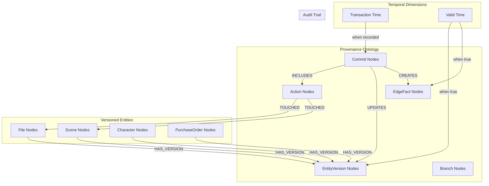

# Provenance & Versioning Architecture

## Overview

The Provenance & Versioning layer turns the knowledge graph into a bitemporal ledger, tracking both transaction time (when data was recorded) and valid time (when data was true in reality). This provides complete audit trails, enables point-in-time queries, supports branching/merging workflows, and ensures no data is ever lost through overwrites.

## Architecture Design



## Core Node Types

### 1. Commit Nodes
High-level transactions grouping related changes

**Properties:**
```cypher
CREATE (c:Commit {
    id: "commit-uuid-123",            // UUID primary key
    message: "Updated Scene 5 location and props", // Commit message
    author: "user-uuid-456",          // User who made the change
    timestamp: datetime(),            // When commit was created
    branch: "main",                   // Branch name (default: "main")
    parent_commits: ["commit-uuid-122"], // Parent commit IDs for merge tracking
    org_id: "org-456",                // Multi-tenant scoping
    metadata: {                       // JSON for commit details
        tool_used: "scene_editor",
        session_id: "session-789",
        ip_address: "192.168.1.100",
        user_agent: "Mozilla/5.0...",
        change_summary: {
            "entities_modified": 2,
            "relationships_created": 3,
            "relationships_ended": 1
        }
    }
})
```

### 2. Action Nodes
Atomic operations within commits

**Properties:**
```cypher
CREATE (a:Action {
    id: "action-uuid-789",            // UUID primary key
    tool: "scene_location_updater",   // Tool/service that performed action
    action_type: "UPDATE_ENTITY",     // Type of action performed
    inputs: {                         // JSON of input parameters
        "scene_id": "scene-uuid-123",
        "old_location": "Kitchen - Interior",
        "new_location": "Warehouse - Interior"
    },
    outputs: {                        // JSON of results/outputs
        "success": true,
        "entity_version_created": "version-uuid-456",
        "relationships_updated": 2
    },
    status: "success",                // success, failed, partial
    timestamp: datetime(),            // When action was executed
    duration_ms: 150,                 // Execution time in milliseconds
    metadata: {                       // JSON for action details
        "validation_passed": true,
        "constraints_checked": ["location_exists", "scene_not_locked"],
        "side_effects": ["schedule_recalculation_triggered"]
    }
})
```

### 3. EntityVersion Nodes
Immutable snapshots of entity states

**Properties:**
```cypher
CREATE (ev:EntityVersion {
    id: "version-uuid-456",           // UUID primary key
    entity_id: "scene-uuid-123",      // ID of the versioned entity
    entity_type: "Scene",             // Type of entity being versioned
    props: {                          // JSON snapshot of entity properties
        "number": "5A",
        "title": "Kitchen Confrontation",
        "location": "Warehouse - Interior",
        "time_of_day": "DAY",
        "page_count": 2.5,
        "status": "scheduled"
    },
    valid_from: datetime("2025-08-11T10:30:00Z"), // When this version became valid
    valid_to: null,                   // When this version was superseded (null = current)
    tx_time: datetime("2025-08-11T10:30:00Z"),    // When recorded in system
    created_by_commit: "commit-uuid-123", // Commit that created this version
    org_id: "org-456",                // Multi-tenant scoping
    metadata: {                       // JSON for version metadata
        "change_reason": "Location changed due to permit issues",
        "previous_version": "version-uuid-455",
        "validation_hash": "sha256:abc123...",
        "size_bytes": 1024
    }
})
```

### 4. EdgeFact Nodes
Temporal relationships between entities

**Properties:**
```cypher
CREATE (ef:EdgeFact {
    id: "edgefact-uuid-789",          // UUID primary key
    type: "SCHEDULED_FOR",            // Relationship type
    from_id: "scene-uuid-123",        // Source entity ID
    to_id: "shootday-uuid-456",       // Target entity ID
    from_type: "Scene",               // Source entity type
    to_type: "ShootDay",              // Target entity type
    valid_from: datetime("2025-08-11T10:30:00Z"), // When relationship became valid
    valid_to: null,                   // When relationship ended (null = current)
    created_by_commit: "commit-uuid-123", // Commit that created this EdgeFact
    ended_by_commit: null,            // Commit that ended this EdgeFact
    org_id: "org-456",                // Multi-tenant scoping
    props: {                          // JSON for relationship properties
        "confidence": 1.0,
        "method": "manual_assignment",
        "priority": "high",
        "notes": "Moved from original date due to weather"
    },
    metadata: {                       // JSON for EdgeFact metadata
        "created_by_tool": "schedule_manager",
        "validation_rules_applied": ["no_double_booking", "talent_availability"],
        "impact_analysis": {
            "affected_scenes": 3,
            "crew_notifications_sent": 15
        }
    }
})
```

### 5. Branch Nodes
Support for experimental changes and parallel development

**Properties:**
```cypher
CREATE (b:Branch {
    name: "schedule_experiment_v2",   // Branch name (unique within org)
    org_id: "org-456",                // Multi-tenant scoping
    project_id: "project-uuid-123",   // Parent project
    description: "Testing alternative shooting schedule", // Branch description
    created_from_commit: "commit-uuid-120", // Base commit for branch
    head_commit: "commit-uuid-125",   // Current head commit
    status: "active",                 // active, merged, abandoned
    created_by: "user-uuid-456",      // User who created branch
    created_at: datetime(),           // Branch creation time
    merged_at: null,                  // When branch was merged (null if not merged)
    merged_by: null,                  // User who merged branch
    metadata: {                       // JSON for branch details
        "purpose": "schedule_optimization",
        "expected_completion": "2025-08-15",
        "stakeholders": ["director", "producer", "line_producer"],
        "approval_required": true
    }
})
```

## Atomic Write Pattern

All graph modifications follow a standardized atomic pattern ensuring consistency and provenance:

```cypher
// Universal atomic write template
CALL apoc.do.when(
    $should_create_commit,
    "
    // Create commit node
    CREATE (commit:Commit {
        id: $commit_id,
        message: $commit_message,
        author: $author,
        timestamp: datetime(),
        branch: coalesce($branch, 'main'),
        org_id: $org_id
    })
    
    // Create action node
    CREATE (action:Action {
        id: $action_id,
        tool: $tool_name,
        action_type: $action_type,
        inputs: $inputs,
        outputs: $outputs,
        status: 'success',
        timestamp: datetime()
    })
    
    // Link commit to action
    CREATE (commit)-[:INCLUDES]->(action)
    
    RETURN commit, action
    ",
    "RETURN null as commit, null as action",
    {
        commit_id: $commit_id,
        commit_message: $commit_message,
        author: $author,
        branch: $branch,
        org_id: $org_id,
        action_id: $action_id,
        tool_name: $tool_name,
        action_type: $action_type,
        inputs: $inputs,
        outputs: $outputs
    }
) YIELD value as prov

// Main entity operations
MERGE (entity:EntityType {id: $entity_id, org_id: $org_id})

// End previous version if versioning enabled
CALL apoc.do.when(
    $should_version,
    "
    // Find and end current version
    MATCH (entity)-[:HAS_VERSION]->(current_version:EntityVersion {valid_to: null})
    SET current_version.valid_to = datetime()
    SET current_version.ended_by_commit = prov.commit.id
    
    // Create new version
    CREATE (new_version:EntityVersion {
        id: randomUUID(),
        entity_id: entity.id,
        entity_type: $entity_type,
        props: $properties,
        valid_from: datetime(),
        valid_to: null,
        tx_time: datetime(),
        created_by_commit: prov.commit.id,
        org_id: entity.org_id
    })
    
    // Link entity to new version
    CREATE (entity)-[:HAS_VERSION]->(new_version)
    
    RETURN new_version, current_version
    ",
    "RETURN null as new_version, null as current_version",
    {
        entity: entity,
        entity_type: $entity_type,
        properties: $properties,
        prov: prov
    }
) YIELD value as version_result

// Update entity properties for current access
SET entity += $properties
SET entity.updated_at = datetime()

// Link to provenance if commit created
CALL apoc.do.when(
    prov.commit IS NOT NULL,
    "
    CREATE (prov.action)-[:TOUCHED]->(entity)
    WITH prov, version_result
    CALL apoc.do.when(
        version_result.new_version IS NOT NULL,
        'CREATE (prov.commit)-[:UPDATES]->(version_result.new_version) RETURN true',
        'RETURN false',
        {prov: prov, version_result: version_result}
    ) YIELD value
    RETURN true
    ",
    "RETURN false",
    {prov: prov, entity: entity, version_result: version_result}
) YIELD value

RETURN entity, version_result.new_version as version, prov.commit as commit
```

## Temporal Query Patterns

### 1. Point-in-Time Queries
```cypher
// "What was the schedule on August 1st, 2025?"
MATCH (ef:EdgeFact {type: 'SCHEDULED_FOR'})
WHERE ef.valid_from <= datetime('2025-08-01T23:59:59Z')
  AND (ef.valid_to IS NULL OR ef.valid_to > datetime('2025-08-01T00:00:00Z'))
MATCH (ef)-[:FROM]->(scene:Scene)
MATCH (ef)-[:TO]->(day:ShootDay)
RETURN scene.number, scene.title, day.date
ORDER BY scene.number
```

### 2. Entity History Queries
```cypher
// "How did Scene 5's properties change over time?"
MATCH (s:Scene {number: "5", org_id: $org_id})
MATCH (s)-[:HAS_VERSION]->(ev:EntityVersion)
OPTIONAL MATCH (ev)<-[:UPDATES]-(c:Commit)<-[:INCLUDES]-(a:Action)
RETURN 
    ev.valid_from as change_date,
    ev.valid_to as superseded_date,
    ev.props as properties,
    c.message as change_reason,
    c.author as changed_by,
    a.tool as tool_used
ORDER BY ev.valid_from
```

### 3. Audit Trail Queries
```cypher
// "Who changed what in the last 24 hours?"
MATCH (c:Commit {org_id: $org_id})
WHERE c.timestamp >= datetime() - duration('P1D')
MATCH (c)-[:INCLUDES]->(a:Action)-[:TOUCHED]->(entity)
OPTIONAL MATCH (c)-[:UPDATES]->(ev:EntityVersion)
RETURN 
    c.timestamp as when,
    c.author as who,
    c.message as what,
    a.tool as how,
    labels(entity)[0] as entity_type,
    entity.id as entity_id,
    CASE 
        WHEN ev IS NOT NULL THEN ev.props
        ELSE null
    END as new_state
ORDER BY c.timestamp DESC
```

### 4. Branch Comparison
```cypher
// "What's different between main and experiment branch?"
MATCH (main_branch:Branch {name: "main", org_id: $org_id})
MATCH (exp_branch:Branch {name: "schedule_experiment_v2", org_id: $org_id})

// Find commits unique to experiment branch
MATCH path = (exp_branch.head_commit)-[:PARENT*0..]->(base_commit)
WHERE base_commit = main_branch.head_commit
WITH [c IN nodes(path) WHERE c <> base_commit] as exp_commits

// Get changes in experiment branch
UNWIND exp_commits as commit
MATCH (commit)-[:INCLUDES]->(action:Action)-[:TOUCHED]->(entity)
RETURN 
    entity.id as entity_id,
    labels(entity)[0] as entity_type,
    collect({
        commit_message: commit.message,
        action_type: action.action_type,
        timestamp: commit.timestamp
    }) as changes
```

## Branching & Merging

### 1. Branch Creation
```cypher
// Create new branch from current main
MATCH (main:Branch {name: "main", org_id: $org_id})
CREATE (new_branch:Branch {
    name: $branch_name,
    org_id: $org_id,
    project_id: $project_id,
    description: $description,
    created_from_commit: main.head_commit,
    head_commit: main.head_commit,
    status: "active",
    created_by: $user_id,
    created_at: datetime()
})
RETURN new_branch
```

### 2. Branch Merge Strategy
```cypher
// Merge experiment branch back to main
MATCH (main:Branch {name: "main", org_id: $org_id})
MATCH (exp:Branch {name: $experiment_branch, org_id: $org_id})

// Create merge commit
CREATE (merge_commit:Commit {
    id: randomUUID(),
    message: "Merge " + exp.name + " into main",
    author: $user_id,
    timestamp: datetime(),
    branch: "main",
    parent_commits: [main.head_commit, exp.head_commit],
    org_id: $org_id
})

// Update main branch head
SET main.head_commit = merge_commit.id

// Mark experiment branch as merged
SET exp.status = "merged"
SET exp.merged_at = datetime()
SET exp.merged_by = $user_id

// Apply experiment changes to main entities
// (This would involve complex conflict resolution logic)

RETURN merge_commit, main, exp
```

## Performance Optimization

### 1. Temporal Indexes
```cypher
// Optimized indexes for temporal queries
CREATE INDEX temporal_edgefacts IF NOT EXISTS FOR (ef:EdgeFact) 
ON (ef.type, ef.valid_from, ef.valid_to);

CREATE INDEX current_edgefacts IF NOT EXISTS FOR (ef:EdgeFact) 
ON (ef.type, ef.from_id, ef.to_id) WHERE ef.valid_to IS NULL;

CREATE INDEX entity_versions_temporal IF NOT EXISTS FOR (ev:EntityVersion) 
ON (ev.entity_id, ev.entity_type, ev.valid_from, ev.valid_to);

CREATE INDEX current_versions IF NOT EXISTS FOR (ev:EntityVersion) 
ON (ev.entity_id, ev.entity_type) WHERE ev.valid_to IS NULL;

CREATE INDEX commit_timeline IF NOT EXISTS FOR (c:Commit) 
ON (c.org_id, c.timestamp, c.branch);

CREATE INDEX action_entity_lookup IF NOT EXISTS FOR (a:Action) 
ON (a.tool, a.action_type, a.timestamp);
```

### 2. Query Optimization Patterns
```cypher
// Optimized current state query
MATCH (entity:EntityType {org_id: $org_id})
WHERE entity.id = $entity_id
OPTIONAL MATCH (entity)-[:HAS_VERSION]->(current:EntityVersion {valid_to: null})
RETURN entity, current

// Optimized temporal range query with LIMIT
MATCH (ef:EdgeFact {type: $relationship_type})
WHERE ef.valid_from <= $end_time 
  AND (ef.valid_to IS NULL OR ef.valid_to >= $start_time)
  AND ef.org_id = $org_id
WITH ef
ORDER BY ef.valid_from DESC
LIMIT $max_results
MATCH (ef)-[:FROM]->(from_entity)
MATCH (ef)-[:TO]->(to_entity)
RETURN ef, from_entity, to_entity
```

## Implementation Patterns

### 1. Provenance-Aware Service Layer
```python
class ProvenanceService:
    def __init__(self, neo4j_driver):
        self.neo4j = neo4j_driver
    
    def execute_with_provenance(self, 
                               operation: str,
                               entity_updates: List[EntityUpdate],
                               user_id: str,
                               commit_message: str,
                               tool_name: str) -> ProvenanceResult:
        """Execute operation with full provenance tracking"""
        
        commit_id = str(uuid.uuid4())
        
        with self.neo4j.session() as session:
            with session.begin_transaction() as tx:
                # Create commit and actions
                commit_result = tx.run("""
                    CREATE (c:Commit {
                        id: $commit_id,
                        message: $message,
                        author: $user_id,
                        timestamp: datetime(),
                        branch: 'main',
                        org_id: $org_id
                    })
                    RETURN c
                """, {
                    'commit_id': commit_id,
                    'message': commit_message,
                    'user_id': user_id,
                    'org_id': self.org_id
                })
                
                commit_node = commit_result.single()['c']
                
                # Process each entity update
                for update in entity_updates:
                    self._apply_entity_update(tx, update, commit_id, tool_name)
                
                # Commit transaction
                tx.commit()
                
                return ProvenanceResult(
                    commit_id=commit_id,
                    success=True,
                    entities_updated=len(entity_updates)
                )
    
    def _apply_entity_update(self, tx, update: EntityUpdate, commit_id: str, tool_name: str):
        """Apply single entity update with versioning"""
        
        action_id = str(uuid.uuid4())
        
        # Use atomic write pattern
        result = tx.run(atomic_write_template, {
            'entity_id': update.entity_id,
            'entity_type': update.entity_type,
            'properties': update.new_properties,
            'should_create_commit': False,  # Already created
            'should_version': True,
            'commit_id': commit_id,
            'action_id': action_id,
            'tool_name': tool_name,
            'action_type': 'UPDATE_ENTITY',
            'inputs': {'entity_id': update.entity_id, 'changes': update.changes},
            'outputs': {'success': True}
        })
        
        return result.single()
```

### 2. Temporal Query Service
```python
class TemporalQueryService:
    def __init__(self, neo4j_driver):
        self.neo4j = neo4j_driver
    
    def get_entity_at_time(self, entity_id: str, timestamp: datetime) -> Optional[dict]:
        """Get entity state at specific point in time"""
        
        with self.neo4j.session() as session:
            result = session.run("""
                MATCH (e:Entity {id: $entity_id})
                MATCH (e)-[:HAS_VERSION]->(v:EntityVersion)
                WHERE v.valid_from <= $timestamp
                  AND (v.valid_to IS NULL OR v.valid_to > $timestamp)
                RETURN v.props as properties, v.valid_from as valid_from
            """, {
                'entity_id': entity_id,
                'timestamp': timestamp
            })
            
            record = result.single()
            return record['properties'] if record else None
    
    def get_relationship_history(self, 
                               from_id: str, 
                               to_id: str, 
                               relationship_type: str) -> List[RelationshipPeriod]:
        """Get complete history of relationship between entities"""
        
        with self.neo4j.session() as session:
            result = session.run("""
                MATCH (ef:EdgeFact {type: $rel_type, from_id: $from_id, to_id: $to_id})
                OPTIONAL MATCH (ef)<-[:CREATES]-(create_commit:Commit)
                OPTIONAL MATCH (ef)<-[:ENDS]-(end_commit:Commit)
                RETURN 
                    ef.valid_from as valid_from,
                    ef.valid_to as valid_to,
                    ef.props as properties,
                    create_commit.message as created_reason,
                    end_commit.message as ended_reason
                ORDER BY ef.valid_from
            """, {
                'rel_type': relationship_type,
                'from_id': from_id,
                'to_id': to_id
            })
            
            return [RelationshipPeriod(
                valid_from=record['valid_from'],
                valid_to=record['valid_to'],
                properties=record['properties'],
                created_reason=record['created_reason'],
                ended_reason=record['ended_reason']
            ) for record in result]
```

## Testing Strategy

### 1. Provenance Tests
```python
def test_atomic_write_with_provenance():
    """Test that all writes create proper provenance"""
    service = ProvenanceService(neo4j_driver)
    
    # Execute operation
    result = service.execute_with_provenance(
        operation="update_scene_location",
        entity_updates=[EntityUpdate(
            entity_id="scene-123",
            entity_type="Scene",
            new_properties={"location": "New Location"},
            changes={"location": {"old": "Old Location", "new": "New Location"}}
        )],
        user_id="user-456",
        commit_message="Updated scene location",
        tool_name="scene_editor"
    )
    
    assert result.success
    assert result.commit_id is not None
    
    # Verify commit created
    with neo4j_session() as session:
        commit_check = session.run("""
            MATCH (c:Commit {id: $commit_id})
            MATCH (c)-[:INCLUDES]->(a:Action)
            MATCH (a)-[:TOUCHED]->(e:Scene {id: $entity_id})
            RETURN c, a, e
        """, commit_id=result.commit_id, entity_id="scene-123")
        
        record = commit_check.single()
        assert record is not None
        assert record['c']['message'] == "Updated scene location"

def test_temporal_queries():
    """Test point-in-time and history queries"""
    query_service = TemporalQueryService(neo4j_driver)
    
    # Create entity with multiple versions
    create_versioned_test_entity()
    
    # Query at different points in time
    state_t1 = query_service.get_entity_at_time("test-entity", datetime(2025, 8, 1))
    state_t2 = query_service.get_entity_at_time("test-entity", datetime(2025, 8, 15))
    
    assert state_t1['location'] == "Original Location"
    assert state_t2['location'] == "Updated Location"
```

### 2. Performance Tests
```python
def test_temporal_query_performance():
    """Test performance of temporal queries with large datasets"""
    # Create large dataset with many versions
    create_large_temporal_dataset(entities=10000, versions_per_entity=50)
    
    start_time = time.time()
    
    # Execute complex temporal query
    with neo4j_session() as session:
        result = session.run("""
            MATCH (ef:EdgeFact {type: 'SCHEDULED_FOR'})
            WHERE ef.valid_from <= datetime('2025-08-15T00:00:00Z')
              AND (ef.valid_to IS NULL OR ef.valid_to > datetime('2025-08-15T00:00:00Z'))
            RETURN count(ef) as active_relationships
        """)
        
        count = result.single()['active_relationships']
    
    end_time = time.time()
    query_time = end_time - start_time
    
    assert query_time < 2.0  # Should complete in under 2 seconds
    assert count > 0
```

## Security & Compliance

### 1. Audit Trail Integrity
- **Immutable Commits**: Commits cannot be modified after creation
- **Cryptographic Hashing**: Commit integrity verified with hashes
- **Digital Signatures**: Optional signing of commits for legal compliance
- **Tamper Detection**: Automatic detection of unauthorized changes

### 2. Data Retention Policies
```python
class RetentionPolicyManager:
    def apply_retention_policies(self, org_id: str):
        """Apply data retention policies to old versions"""
        
        with self.neo4j.session() as session:
            # Archive versions older than retention period
            session.run("""
                MATCH (ev:EntityVersion {org_id: $org_id})
                WHERE ev.valid_to < datetime() - duration('P7Y')  // 7 years
                SET ev.archived = true
                SET ev.props = null  // Clear sensitive data
                SET ev.archived_at = datetime()
            """, org_id=org_id)
            
            # Compress old EdgeFacts
            session.run("""
                MATCH (ef:EdgeFact {org_id: $org_id})
                WHERE ef.valid_to < datetime() - duration('P5Y')  // 5 years
                SET ef.compressed = true
                SET ef.props = {}  // Clear detailed properties
            """, org_id=org_id)
```

## Future Enhancements

### 1. Advanced Temporal Features
- **Temporal Constraints**: Enforce business rules across time
- **Predictive Versioning**: ML-based prediction of future states
- **Automated Archival**: Intelligent data lifecycle management
- **Cross-System Provenance**: Track changes across multiple systems

### 2. Enhanced Branching
- **Conflict Resolution**: Automated merge conflict resolution
- **Branch Policies**: Governance rules for branch operations
- **Collaborative Branching**: Multi-user branch collaboration
- **Branch Analytics**: Insights into branching patterns and efficiency
