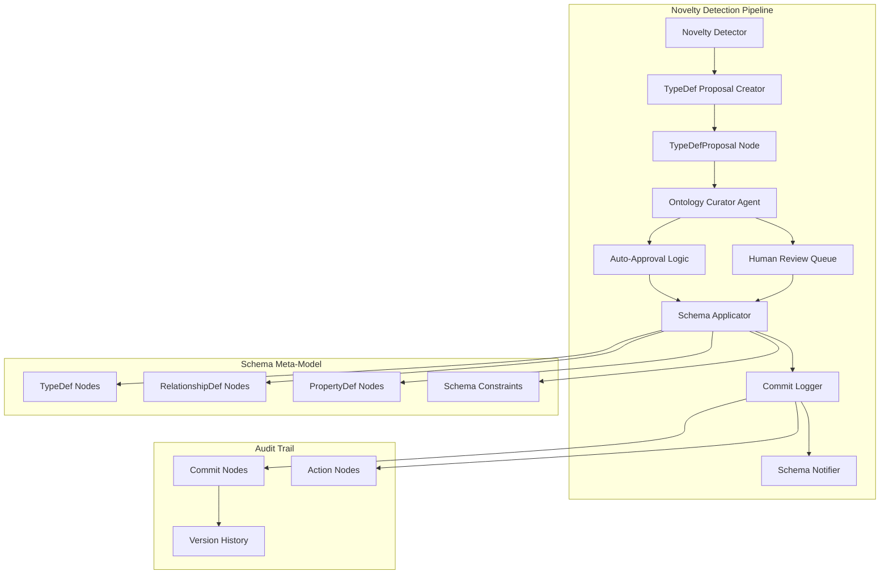

# Novelty Detection & Adaptive Schema Architecture

## Overview

The Novelty Detection system enables the knowledge graph to dynamically extend its ontology when encountering new concepts that don't fit the current schema. This ensures the graph remains a **living model** that evolves with creative productions while maintaining controlled, versioned, and auditable schema changes.

## Core Components



## Node Types & Relationships

### TypeDefProposal Node
```cypher
CREATE CONSTRAINT typedef_proposal_id IF NOT EXISTS 
FOR (p:TypeDefProposal) REQUIRE p.id IS UNIQUE;

CREATE INDEX typedef_proposal_label IF NOT EXISTS 
FOR (p:TypeDefProposal) ON (p.label);
```

**Properties:**
- `id`: UUID for the proposal
- `label`: Name of proposed type (e.g., "RiggingTeam")
- `kind`: Type of schema element ("NodeType", "RelationshipType", "Property")
- `rationale`: Text explanation of why needed
- `sample_count`: Number of instances that triggered proposal
- `status`: "pending", "approved", "rejected", "applied"
- `created_at`: Timestamp
- `created_by`: User or agent ID
- `priority`: "low", "medium", "high", "critical"

### TypeDef Meta-Nodes
```cypher
// Node type definitions
CREATE (td:TypeDef {
    label: "RiggingTeam",
    kind: "NodeType",
    description: "Specialized crew unit for rigging operations",
    properties: ["name", "lead_rigger", "team_size"],
    constraints: ["UNIQUE name"],
    created_at: datetime()
});

// Relationship type definitions
CREATE (rd:RelationshipDef {
    type: "REQUIRES_SPECIAL_PERMIT",
    source_types: ["Scene"],
    target_types: ["Permit"],
    properties: ["permit_type", "expiry_date"],
    cardinality: "many_to_many"
});
```

## Novelty Detection Points

### 1. Data Ingestion Pipeline
```python
class NoveltyDetector:
    def __init__(self, neo4j_client, known_schema):
        self.neo4j = neo4j_client
        self.schema_registry = known_schema
    
    def validate_entity_type(self, entity_type: str) -> bool:
        """Check if entity type exists in current schema"""
        return entity_type in self.schema_registry.node_types
    
    def validate_relationship_type(self, rel_type: str) -> bool:
        """Check if relationship type exists in current schema"""
        return rel_type in self.schema_registry.relationship_types
    
    def create_novelty_proposal(self, novel_element: dict):
        """Create TypeDefProposal for novel schema element"""
        proposal = {
            'id': str(uuid.uuid4()),
            'label': novel_element['name'],
            'kind': novel_element['type'],
            'rationale': novel_element['rationale'],
            'sample_count': novel_element.get('count', 1),
            'status': 'pending',
            'created_at': datetime.utcnow(),
            'created_by': novel_element.get('source', 'system')
        }
        
        self.neo4j.execute_write("""
            CREATE (p:TypeDefProposal $props)
            RETURN p
        """, props=proposal)
        
        # Trigger curator notification
        self.notify_curator(proposal['id'])
```

### 2. LLM Agent Integration
```python
class LangGraphWorker:
    def process_script_breakdown(self, script_content: str):
        """Process script with novelty detection"""
        breakdown_result = self.llm.breakdown_script(script_content)
        
        for element in breakdown_result.elements:
            # Check if element type is known
            if not self.novelty_detector.validate_entity_type(element.type):
                # Create proposal instead of creating unknown node
                self.novelty_detector.create_novelty_proposal({
                    'name': element.type,
                    'type': 'NodeType',
                    'rationale': f"Found in script breakdown: {element.context}",
                    'count': breakdown_result.count_occurrences(element.type),
                    'source': 'script_breakdown_agent'
                })
                
                # Store element as pending until schema updated
                self.store_pending_element(element)
            else:
                # Normal processing
                self.create_graph_node(element)
```

## Ontology Curator Agent

### Auto-Approval Logic
```python
class OntologyCurator:
    def __init__(self, neo4j_client, llm_client):
        self.neo4j = neo4j_client
        self.llm = llm_client
        self.auto_approval_rules = self.load_approval_rules()
    
    def evaluate_proposal(self, proposal_id: str) -> str:
        """Evaluate TypeDefProposal for auto-approval"""
        proposal = self.get_proposal(proposal_id)
        
        # Check auto-approval criteria
        if self.can_auto_approve(proposal):
            return self.auto_approve(proposal)
        else:
            return self.escalate_to_human(proposal)
    
    def can_auto_approve(self, proposal: dict) -> bool:
        """Determine if proposal can be auto-approved"""
        # Simple property additions
        if proposal['kind'] == 'Property' and proposal['sample_count'] >= 5:
            return True
            
        # Common crew roles
        if (proposal['kind'] == 'NodeType' and 
            'crew' in proposal['label'].lower() and
            proposal['sample_count'] >= 3):
            return True
            
        # Use LLM for complex evaluation
        return self.llm_evaluate_proposal(proposal)
    
    def llm_evaluate_proposal(self, proposal: dict) -> bool:
        """Use LLM to evaluate proposal safety"""
        prompt = f"""
        Evaluate this schema change proposal:
        Type: {proposal['kind']}
        Label: {proposal['label']}
        Rationale: {proposal['rationale']}
        Sample Count: {proposal['sample_count']}
        
        Is this a safe, non-conflicting addition to a film production ontology?
        Consider: naming conflicts, semantic overlap, necessity.
        
        Respond with: APPROVE or ESCALATE with brief reason.
        """
        
        response = self.llm.complete(prompt)
        return response.startswith('APPROVE')
```

### Schema Application
```python
def apply_schema_change(self, proposal_id: str):
    """Apply approved schema change"""
    proposal = self.get_proposal(proposal_id)
    
    with self.neo4j.session() as session:
        with session.begin_transaction() as tx:
            # Create commit for schema change
            commit_id = str(uuid.uuid4())
            tx.run("""
                CREATE (c:Commit {
                    id: $commit_id,
                    message: $message,
                    author: 'ontology_curator',
                    timestamp: datetime(),
                    type: 'schema_change'
                })
            """, commit_id=commit_id, 
                message=f"Added {proposal['kind']}: {proposal['label']}")
            
            if proposal['kind'] == 'NodeType':
                self.create_node_type_def(tx, proposal, commit_id)
            elif proposal['kind'] == 'RelationshipType':
                self.create_relationship_type_def(tx, proposal, commit_id)
            elif proposal['kind'] == 'Property':
                self.add_property_def(tx, proposal, commit_id)
            
            # Mark proposal as applied
            tx.run("""
                MATCH (p:TypeDefProposal {id: $proposal_id})
                SET p.status = 'applied', p.applied_at = datetime()
                CREATE (p)-[:RESULTED_IN_COMMIT]->(c:Commit {id: $commit_id})
            """, proposal_id=proposal_id, commit_id=commit_id)
            
            # Process any pending instances
            self.process_pending_instances(tx, proposal)
```

## Implementation Steps

### Phase 1: Core Infrastructure
1. **Schema Meta-Model Setup**
   - Create TypeDef, RelationshipDef node types
   - Implement schema registry service
   - Add constraints and indexes

2. **Novelty Detection Integration**
   - Add validation hooks to ingestion pipeline
   - Update LangGraph workers with schema checks
   - Implement TypeDefProposal creation

### Phase 2: Curator Agent
1. **Auto-Approval Engine**
   - Implement rule-based approval logic
   - Integrate LLM evaluation
   - Add human escalation queue

2. **Schema Application**
   - Build schema change applicator
   - Implement pending instance processor
   - Add commit logging for schema changes

### Phase 3: Advanced Features
1. **Schema Versioning**
   - Implement schema version tracking
   - Add rollback capabilities (with caution)
   - Build schema diff utilities

2. **Monitoring & Alerting**
   - Add schema change notifications
   - Implement approval queue dashboards
   - Monitor novelty detection rates

## Technology Stack

- **Neo4j 4.4+**: Graph database with APOC procedures
- **Python 3.9+**: Curator agent implementation
- **LangChain/LangGraph**: LLM integration for evaluation
- **FastAPI**: REST endpoints for human review interface
- **Prometheus**: Metrics for novelty detection rates
- **Grafana**: Dashboards for schema evolution monitoring

## Testing Strategy

### Unit Tests
```python
def test_novelty_detection():
    detector = NoveltyDetector(mock_neo4j, test_schema)
    
    # Test unknown entity type detection
    assert not detector.validate_entity_type("UnknownType")
    
    # Test proposal creation
    detector.create_novelty_proposal({
        'name': 'TestType',
        'type': 'NodeType',
        'rationale': 'Test rationale'
    })
    
    # Verify proposal was created
    proposals = detector.get_pending_proposals()
    assert len(proposals) == 1
    assert proposals[0]['label'] == 'TestType'

def test_auto_approval():
    curator = OntologyCurator(mock_neo4j, mock_llm)
    
    # Test simple property addition
    proposal = {
        'kind': 'Property',
        'label': 'test_property',
        'sample_count': 10
    }
    assert curator.can_auto_approve(proposal)
    
    # Test complex type requiring human review
    proposal = {
        'kind': 'NodeType',
        'label': 'ComplexNewType',
        'sample_count': 1
    }
    assert not curator.can_auto_approve(proposal)
```

### Integration Tests
- End-to-end novelty detection workflow
- Schema change application and rollback
- Pending instance processing
- Multi-agent coordination

## Security Considerations

1. **Schema Change Authorization**
   - Role-based access for manual approvals
   - Audit trail for all schema modifications
   - Rate limiting on proposal creation

2. **Validation & Sanitization**
   - Input validation for proposal data
   - SQL injection prevention in dynamic queries
   - Schema conflict detection

3. **Rollback Safety**
   - Careful rollback procedures for schema changes
   - Data migration validation
   - Backup requirements before major changes

## Performance Considerations

1. **Novelty Detection Overhead**
   - Cache known schema elements
   - Batch proposal creation
   - Async processing for non-critical paths

2. **Schema Query Optimization**
   - Index on TypeDef labels and kinds
   - Efficient schema registry lookups
   - Minimize schema validation calls

## Future Enhancements

1. **Machine Learning Integration**
   - Pattern recognition for common novelties
   - Confidence scoring for auto-approval
   - Semantic similarity detection for duplicates

2. **Collaborative Schema Evolution**
   - Multi-user proposal review
   - Voting mechanisms for complex changes
   - Community-driven ontology growth

3. **Cross-Project Schema Sharing**
   - Shared ontology components
   - Industry-standard schema imports
   - Template-based schema initialization

## Monitoring & Observability

### Key Metrics
- `olivine_novelty_proposals_total{kind}`: Total proposals created
- `olivine_novelty_auto_approved_total{kind}`: Auto-approved proposals
- `olivine_novelty_human_review_total{kind}`: Escalated to human review
- `olivine_schema_changes_applied_total{kind}`: Successfully applied changes
- `olivine_novelty_detection_latency`: Time to detect and propose

### Alerts
- High novelty detection rate (potential schema gaps)
- Long-pending human reviews
- Schema application failures
- Unusual proposal patterns

This architecture ensures the knowledge graph can evolve dynamically while maintaining data integrity, auditability, and controlled growth patterns essential for production environments.
