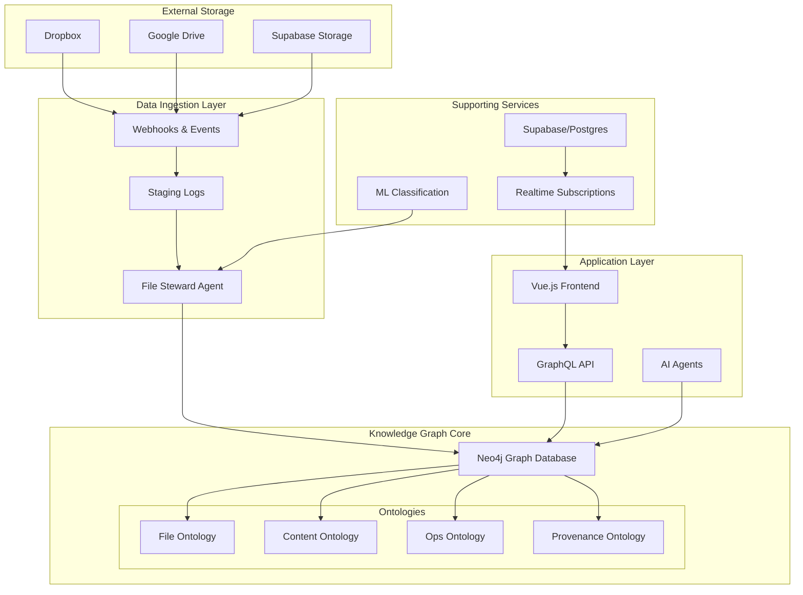

# System Architecture Overview

## Vision & Purpose

The **Unified, Versioned Knowledge Layer for Creative Production** is a living production operating system built on a knowledge graph that synchronizes multiple "realities" of a production:

- **File Reality** - Raw files/folders from storage providers (Dropbox, Google Drive, Supabase)
- **Creative Reality** - Conceptual world of scenes, scripts, characters, props, cast/crew, schedules
- **Operational Reality** - Business layer (purchase orders, invoices, timesheets, payroll, compliance)
- **Agent Reality** - Record of decisions, AI actions, and audit trail of all changes

## High-Level Architecture

## Core Principles

### 1. Everything is Versioned
- All data changes create new versions rather than overwriting
- Full audit trail with Git-like commits and branching
- Temporal queries: "What was true at time T?"
- Safe rollbacks and what-if experiments

### 2. Event-Driven Architecture
- No polling - all changes propagate via events
- Durable event logs for reliability
- Real-time UI updates via Supabase Realtime
- Idempotent processing for consistency

### 3. Canonical Knowledge Model
- Single source of truth regardless of source data formats
- Adaptive mapping profiles for different organizations
- Extensible ontologies for new document types
- Graph-based relationships enable complex queries

### 4. Full Provenance
- Every change tracked with who/what/when/why
- AI actions recorded with inputs/outputs
- Defensible audit trail for compliance
- Signed commits for accountability

## Technology Stack

### Core Infrastructure
- **Graph Database**: Neo4j 4.4+ with constraints and indexes
- **Relational Database**: Supabase/PostgreSQL for staging and metadata
- **Real-time**: Supabase Realtime for live UI updates
- **Storage**: Multi-provider (Dropbox, Google Drive, Supabase Storage)

### Application Layer
- **Backend**: Python with FastAPI
- **Frontend**: Vue.js 3 with Composition API
- **API**: GraphQL for flexible data queries
- **Authentication**: Supabase Auth with multi-tenancy

### AI & ML
- **Classification**: ML models for file categorization
- **Agents**: AI assistants for automation
- **OCR/NLP**: Document content extraction
- **Novelty Detection**: Identifying new patterns

### DevOps & Observability
- **Deployment**: Docker containers
- **Monitoring**: Comprehensive logging and metrics
- **Testing**: Automated test suites
- **CI/CD**: GitHub Actions

## Key Benefits

1. **Consistent Automation Across Chaos**: Same quality outputs regardless of source folder structures
2. **Fewer Costly Errors**: Validation rules and provenance tracking prevent mistakes
3. **Faster Onboarding**: Learned mapping profiles for new projects/regions
4. **Defensible Audit Trail**: Complete history for compliance and accountability
5. **Real-time Collaboration**: Instant updates across all users and systems

## Implementation Phases

### Phase 1: Foundation (Current)
- File Ontology with Dropbox integration
- Basic Neo4j graph structure
- Supabase Realtime subscriptions
- Vue.js frontend with file explorer

### Phase 2: Content Layer
- Content Ontology (scenes, characters, props)
- Script parsing and breakdown
- Taxonomy profiles and classification
- AI-powered content extraction

### Phase 3: Operations
- Ops Ontology (vendors, POs, timesheets)
- Financial tracking and compliance
- Automated workflow triggers
- Advanced reporting

### Phase 4: Intelligence
- Full AI agent system
- Predictive analytics
- Advanced automation
- Multi-branch experimentation

## Next Steps

Refer to the detailed architecture documents for each component:
- [Data Ingestion & Normalization](./02-Data-Ingestion-Architecture.md)
- [Knowledge Graph Design](./03-Knowledge-Graph-Architecture.md)
- [File Ontology](./04-File-Ontology-Architecture.md)
- [Content Ontology](./05-Content-Ontology-Architecture.md)
- [Operations Ontology](./06-Operations-Ontology-Architecture.md)
- [Provenance & Versioning](./07-Provenance-Architecture.md)
- [AI Agent System](./08-Agent-System-Architecture.md)
- [Security & Compliance](./09-Security-Architecture.md)
- [Performance & Scalability](./10-Performance-Architecture.md)
