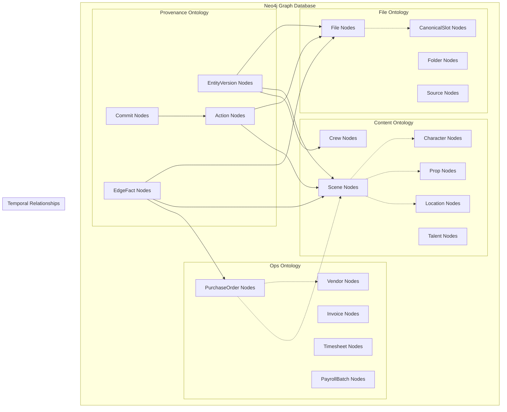

# Knowledge Graph Architecture

## Overview

The Knowledge Graph is the central nervous system of the production platform, implemented in Neo4j as a unified, versioned graph database. It serves as the single source of truth that connects file storage, creative content, operational data, and audit trails into a queryable, traversable network of relationships.

## Graph Database Design



## Core Graph Principles

### 1. Bitemporal Versioning
Every entity and relationship can be versioned across two time dimensions:
- **Transaction Time**: When data was recorded in the system
- **Valid Time**: When the data was true in the real world

### 2. Immutable History
- No data is ever deleted or overwritten
- All changes create new versions with temporal bounds
- Full audit trail maintained automatically
- Point-in-time queries supported

### 3. Reified Relationships
Time-varying relationships are modeled as first-class EdgeFact nodes:
```cypher
// Instead of direct relationship that can't be versioned
(:Scene)-[:SCHEDULED_FOR]->(:ShootDay)

// Use EdgeFact for temporal relationships
(:Scene)<-[:FROM]-(:EdgeFact {type: 'SCHEDULED_FOR', valid_from: datetime(), valid_to: null})-[:TO]->(:ShootDay)
```

## Neo4j Schema & Constraints

### Core Constraints
```cypher
// === Uniqueness constraints ===
CREATE CONSTRAINT unique_commit        IF NOT EXISTS FOR (c:Commit)          REQUIRE c.id IS UNIQUE;
CREATE CONSTRAINT unique_action        IF NOT EXISTS FOR (a:Action)          REQUIRE a.id IS UNIQUE;
CREATE CONSTRAINT unique_org           IF NOT EXISTS FOR (o:Org)             REQUIRE o.id IS UNIQUE;
CREATE CONSTRAINT unique_project       IF NOT EXISTS FOR (p:Project)         REQUIRE p.id IS UNIQUE;
CREATE CONSTRAINT unique_source        IF NOT EXISTS FOR (s:Source)          REQUIRE s.id IS UNIQUE;
CREATE CONSTRAINT unique_folder        IF NOT EXISTS FOR (f:Folder)          REQUIRE f.id IS UNIQUE;
CREATE CONSTRAINT unique_file          IF NOT EXISTS FOR (f:File)            REQUIRE f.id IS UNIQUE;
CREATE CONSTRAINT unique_slot          IF NOT EXISTS FOR (s:CanonicalSlot)   REQUIRE s.key IS UNIQUE;
CREATE CONSTRAINT unique_edgefact      IF NOT EXISTS FOR (e:EdgeFact)        REQUIRE e.id IS UNIQUE;
CREATE CONSTRAINT unique_branch        IF NOT EXISTS FOR (b:Branch)          REQUIRE b.name IS UNIQUE;

// === Performance indexes ===
CREATE INDEX file_org_id          IF NOT EXISTS FOR (f:File)          ON (f.org_id);
CREATE INDEX project_org_id       IF NOT EXISTS FOR (p:Project)       ON (p.org_id);
CREATE INDEX edgefact_lookup      IF NOT EXISTS FOR (e:EdgeFact)      ON (e.type, e.from_id, e.to_id, e.valid_to);
CREATE INDEX entityversion_lookup IF NOT EXISTS FOR (v:EntityVersion) ON (v.entity_id, v.entity_type, v.valid_to);
CREATE INDEX temporal_queries     IF NOT EXISTS FOR (e:EdgeFact)      ON (e.valid_from, e.valid_to);
```

### Multi-Tenancy
All nodes include `org_id` for tenant isolation:
```cypher
// Tenant-scoped queries
MATCH (f:File {org_id: $org_id})
WHERE f.name CONTAINS $search_term
RETURN f
```

## Graph Traversal Patterns

### Complex Production Queries
```cypher
// "What scenes are scheduled for Aug 9, 2025, and what props do they need?"
MATCH (sd:ShootDay {date: date('2025-08-09')})
MATCH (ef1:EdgeFact {type: 'SCHEDULED_FOR', valid_to: null})-[:FROM]->(s:Scene)
MATCH (ef1)-[:TO]->(sd)
MATCH (ef2:EdgeFact {type: 'NEEDS_PROP', valid_to: null})-[:FROM]->(s)
MATCH (ef2)-[:TO]->(p:Prop)
RETURN s.title, collect(p.name) as props

// "What's the total budget for Scene 5?"
MATCH (scene:Scene {number: 5})
MATCH (ef:EdgeFact {type: 'FOR_SCENE', valid_to: null})-[:FROM]->(po:PurchaseOrder)
MATCH (ef)-[:TO]->(scene)
RETURN scene.title, sum(po.amount) as total_cost

// "Show me all files related to the main character"
MATCH (char:Character {name: 'Main Character'})
MATCH (ef1:EdgeFact {type: 'FEATURES_CHARACTER', valid_to: null})-[:TO]->(char)
MATCH (ef1)-[:FROM]->(scene:Scene)
MATCH (ef2:EdgeFact {type: 'REFERENCED_BY', valid_to: null})-[:FROM]->(scene)
MATCH (ef2)-[:TO]->(file:File)
RETURN file.name, file.path, scene.title
```

### Temporal Queries
```cypher
// "What was the schedule on August 1st?"
MATCH (ef:EdgeFact {type: 'SCHEDULED_FOR'})
WHERE ef.valid_from <= datetime('2025-08-01T00:00:00Z') 
  AND (ef.valid_to IS NULL OR ef.valid_to > datetime('2025-08-01T00:00:00Z'))
MATCH (ef)-[:FROM]->(scene:Scene)
MATCH (ef)-[:TO]->(day:ShootDay)
RETURN scene.title, day.date

// "How did Scene 5's location change over time?"
MATCH (scene:Scene {number: 5})
MATCH (ev:EntityVersion {entity_id: scene.id, entity_type: 'Scene'})
RETURN ev.valid_from, ev.valid_to, ev.props.location
ORDER BY ev.valid_from
```

## Write Path Architecture

### Atomic Commit Pattern
All graph modifications follow a standardized atomic pattern:

```cypher
// Template for all graph writes
CALL apoc.do.when(
    $should_create_commit,
    "
    CREATE (commit:Commit {
        id: $commit_id,
        message: $commit_message,
        author: $author,
        timestamp: datetime(),
        org_id: $org_id
    })
    CREATE (action:Action {
        id: $action_id,
        tool: $tool_name,
        inputs: $inputs,
        outputs: $outputs,
        status: 'success',
        timestamp: datetime()
    })
    CREATE (commit)-[:INCLUDES]->(action)
    RETURN commit, action
    ",
    "RETURN null as commit, null as action",
    {
        commit_id: $commit_id,
        commit_message: $commit_message,
        author: $author,
        org_id: $org_id,
        action_id: $action_id,
        tool_name: $tool_name,
        inputs: $inputs,
        outputs: $outputs
    }
) YIELD value as prov

// Main entity operations
MERGE (entity:EntityType {id: $entity_id, org_id: $org_id})
SET entity += $properties
SET entity.updated_at = datetime()

// Create version if versioning enabled
CALL apoc.do.when(
    $should_version,
    "
    CREATE (version:EntityVersion {
        id: randomUUID(),
        entity_id: $entity_id,
        entity_type: $entity_type,
        props: $properties,
        valid_from: datetime(),
        valid_to: null,
        tx_time: datetime(),
        org_id: $org_id
    })
    CREATE (entity)-[:HAS_VERSION]->(version)
    RETURN version
    ",
    "RETURN null as version",
    {
        entity_id: $entity_id,
        entity_type: $entity_type,
        properties: $properties,
        org_id: $org_id
    }
) YIELD value as version_result

// Link to provenance if commit created
CALL apoc.do.when(
    prov.commit IS NOT NULL,
    "
    CREATE (prov.action)-[:TOUCHED]->(entity)
    WITH prov, version_result
    CALL apoc.do.when(
        version_result.version IS NOT NULL,
        'CREATE (prov.commit)-[:UPDATES]->(version_result.version) RETURN true',
        'RETURN false',
        {prov: prov, version_result: version_result}
    ) YIELD value
    RETURN true
    ",
    "RETURN false",
    {prov: prov, entity: entity, version_result: version_result}
) YIELD value

RETURN entity, version_result.version as version, prov.commit as commit
```

## Performance Optimization

### Indexing Strategy
```cypher
// Hot path indexes for common queries
CREATE INDEX file_classification   IF NOT EXISTS FOR (ef:EdgeFact) ON (ef.type, ef.from_id) WHERE ef.type = 'CLASSIFIED_AS';
CREATE INDEX scene_scheduling     IF NOT EXISTS FOR (ef:EdgeFact) ON (ef.type, ef.to_id) WHERE ef.type = 'SCHEDULED_FOR';
CREATE INDEX current_relationships IF NOT EXISTS FOR (ef:EdgeFact) ON (ef.valid_to) WHERE ef.valid_to IS NULL;
CREATE INDEX org_scoped_files     IF NOT EXISTS FOR (f:File) ON (f.org_id, f.name);
CREATE INDEX temporal_range       IF NOT EXISTS FOR (ev:EntityVersion) ON (ev.valid_from, ev.valid_to);
```

### Query Optimization Patterns
```cypher
// Use LIMIT for pagination
MATCH (f:File {org_id: $org_id})
RETURN f
ORDER BY f.created_at DESC
LIMIT 50

// Use WITH for query plan optimization
MATCH (project:Project {org_id: $org_id})
WITH project
MATCH (project)<-[:BELONGS_TO_PROJECT]-(file:File)
RETURN file.name, file.size

// Avoid cartesian products with proper relationship patterns
MATCH (scene:Scene {org_id: $org_id})
OPTIONAL MATCH (scene)<-[:FROM]-(ef:EdgeFact {type: 'NEEDS_PROP', valid_to: null})-[:TO]->(prop:Prop)
RETURN scene.title, collect(prop.name) as props
```

### Memory Management
- **Batch Processing**: Process large datasets in chunks
- **Connection Pooling**: Reuse database connections
- **Query Caching**: Cache frequently executed queries
- **Result Streaming**: Stream large result sets

## Data Consistency

### ACID Properties
- **Atomicity**: All operations in transaction succeed or fail together
- **Consistency**: Graph constraints maintained across all operations
- **Isolation**: Concurrent transactions don't interfere
- **Durability**: Committed changes survive system failures

### Concurrent Access Patterns
```cypher
// Optimistic locking for version conflicts
MATCH (entity:Entity {id: $entity_id})
WHERE entity.version = $expected_version
SET entity.version = $expected_version + 1
SET entity += $updates
WITH entity
WHERE entity.version = $expected_version + 1
RETURN entity
```

### Conflict Resolution
- **Last Writer Wins**: For simple property updates
- **Merge Strategies**: For complex relationship changes
- **Manual Resolution**: For critical conflicts requiring human intervention
- **Branch and Merge**: For experimental changes

## Backup & Recovery

### Backup Strategy
```bash
# Full database backup
neo4j-admin dump --database=neo4j --to=/backups/neo4j-$(date +%Y%m%d).dump

# Incremental transaction log backup
neo4j-admin backup --backup-dir=/backups/incremental --name=graph.db
```

### Recovery Procedures
```bash
# Restore from full backup
neo4j-admin load --from=/backups/neo4j-20250811.dump --database=neo4j --force

# Point-in-time recovery using transaction logs
neo4j-admin restore --from=/backups/incremental/graph.db --database=neo4j
```

### High Availability
- **Cluster Setup**: Multi-node Neo4j cluster for redundancy
- **Read Replicas**: Scale read operations across multiple instances
- **Automatic Failover**: Leader election for write operations
- **Data Replication**: Synchronous replication for consistency

## Monitoring & Observability

### Key Metrics
```cypher
// Graph size and growth
MATCH (n) RETURN count(n) as total_nodes;
MATCH ()-[r]->() RETURN count(r) as total_relationships;

// Query performance
CALL db.stats.retrieve('QUERY') YIELD section, data
RETURN section, data.value as query_count;

// Memory usage
CALL dbms.listQueries() 
YIELD query, elapsedTimeMillis, allocatedBytes
WHERE elapsedTimeMillis > 1000
RETURN query, elapsedTimeMillis, allocatedBytes;
```

### Health Checks
```python
def check_graph_health():
    with driver.session() as session:
        # Check basic connectivity
        result = session.run("RETURN 1 as test")
        assert result.single()["test"] == 1
        
        # Check constraint integrity
        result = session.run("CALL db.constraints()")
        constraints = [record["name"] for record in result]
        assert "unique_file" in constraints
        
        # Check index performance
        result = session.run("CALL db.indexes()")
        for record in result:
            assert record["state"] == "ONLINE"
```

## Security & Access Control

### Authentication Integration
```python
# Supabase JWT validation
def validate_token(token):
    try:
        payload = jwt.decode(token, supabase_jwt_secret, algorithms=["HS256"])
        return payload["sub"], payload.get("org_id")
    except jwt.InvalidTokenError:
        raise AuthenticationError("Invalid token")

# Neo4j session with user context
def create_session(user_id, org_id):
    return driver.session(
        default_access_mode=neo4j.WRITE_ACCESS,
        bookmarks=None,
        database="neo4j",
        impersonated_user=user_id
    )
```

### Row-Level Security
```cypher
// All queries automatically scoped by org_id
MATCH (entity:Entity {org_id: $org_id})
WHERE entity.property = $value
RETURN entity
```

## Testing Strategy

### Unit Tests
```python
def test_file_node_creation():
    with driver.session() as session:
        result = session.run("""
            CREATE (f:File {
                id: $file_id,
                org_id: $org_id,
                name: $name
            })
            RETURN f
        """, file_id="test-123", org_id="org-456", name="test.pdf")
        
        node = result.single()["f"]
        assert node["name"] == "test.pdf"
        assert node["org_id"] == "org-456"

def test_temporal_query():
    # Test point-in-time queries work correctly
    with driver.session() as session:
        # Create versioned data
        session.run(create_version_query, params)
        
        # Query at specific time
        result = session.run(temporal_query, timestamp="2025-08-01T00:00:00Z")
        assert len(result.data()) == expected_count
```

### Integration Tests
```python
def test_full_write_path():
    # Test complete atomic write operation
    with driver.session() as session:
        result = session.run(atomic_write_template, {
            "entity_id": "test-entity",
            "properties": {"name": "Test Entity"},
            "should_create_commit": True,
            "commit_message": "Test commit"
        })
        
        # Verify entity created
        entity = result.single()["entity"]
        assert entity["name"] == "Test Entity"
        
        # Verify commit created
        commit = result.single()["commit"]
        assert commit["message"] == "Test commit"
        
        # Verify relationships
        provenance = session.run("""
            MATCH (c:Commit)-[:INCLUDES]->(a:Action)-[:TOUCHED]->(e:Entity {id: $id})
            RETURN c, a, e
        """, id="test-entity")
        assert len(provenance.data()) == 1
```

### Performance Tests
```python
def test_query_performance():
    import time
    
    with driver.session() as session:
        start = time.time()
        result = session.run(complex_query, params)
        data = result.data()
        end = time.time()
        
        assert end - start < 1.0  # Query should complete in under 1 second
        assert len(data) > 0  # Should return results
```

## Migration & Evolution

### Schema Migrations
```cypher
// Example: Adding new node type
CREATE CONSTRAINT unique_equipment IF NOT EXISTS FOR (e:Equipment) REQUIRE e.id IS UNIQUE;
CREATE INDEX equipment_org_id IF NOT EXISTS FOR (e:Equipment) ON (e.org_id);

// Migrate existing data
MATCH (p:Prop)
WHERE p.type = 'equipment'
CREATE (e:Equipment {
    id: p.id + '_equipment',
    org_id: p.org_id,
    name: p.name,
    category: p.category
})
CREATE (ef:EdgeFact {
    id: randomUUID(),
    type: 'MIGRATED_FROM',
    from_id: e.id,
    to_id: p.id,
    valid_from: datetime(),
    valid_to: null
})
CREATE (ef)-[:FROM]->(e)
CREATE (ef)-[:TO]->(p);
```

### Backward Compatibility
- **Gradual Migration**: Support both old and new patterns during transition
- **API Versioning**: Maintain multiple API versions
- **Feature Flags**: Toggle new functionality on/off
- **Rollback Plans**: Ability to revert schema changes

## Future Enhancements

### Advanced Graph Features
- **Graph Algorithms**: PageRank, community detection, shortest paths
- **Machine Learning**: Graph neural networks for predictions
- **Real-time Analytics**: Stream processing for live insights
- **Multi-Graph Support**: Separate graphs for different domains

### Scalability Improvements
- **Sharding Strategy**: Distribute graph across multiple databases
- **Caching Layer**: Redis for frequently accessed subgraphs
- **Query Optimization**: Advanced query planning and execution
- **Compression**: Reduce storage requirements for large graphs
