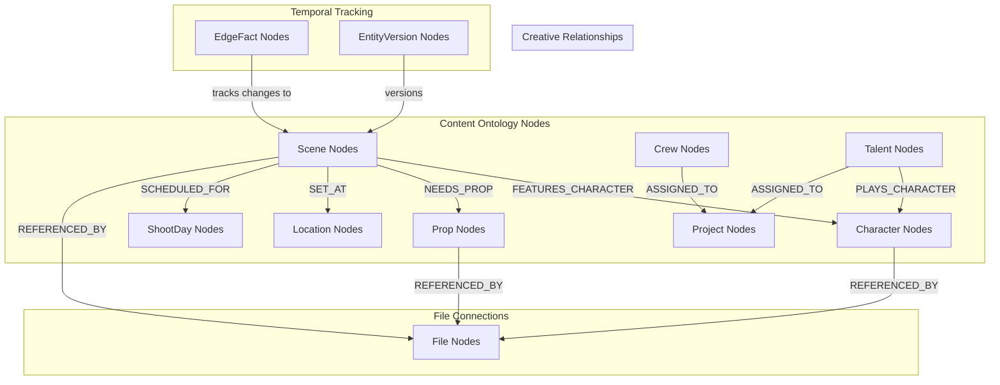

# Content Ontology Architecture

## Overview

The Content Ontology represents the "creative reality" layer of the knowledge graph, modeling the conceptual world of production including scenes, scripts, characters, props, cast/crew, schedules, and locations. This layer bridges the gap between raw documents and structured production data, enabling complex queries that join creative and logistical information.

## Ontology Design



## Core Node Types

### 1. Project Nodes
```cypher
CREATE (p:Project {
    id: "project-uuid-123",
    org_id: "org-456",
    title: "Feature Film Alpha",
    type: "feature_film",
    status: "pre_production",
    start_date: date("2025-09-01"),
    budget: 2500000.00,
    metadata: {
        genre: "thriller",
        director: "Jane Director"
    }
})
```

### 2. Scene Nodes
```cypher
CREATE (s:Scene {
    id: "scene-uuid-789",
    org_id: "org-456",
    project_id: "project-uuid-123",
    number: "5A",
    title: "Kitchen Confrontation",
    location: "Kitchen - Interior",
    time_of_day: "DAY",
    page_count: 2.5,
    status: "scheduled"
})
```

### 3. Character Nodes
```cypher
CREATE (c:Character {
    id: "character-uuid-101",
    org_id: "org-456",
    project_id: "project-uuid-123",
    name: "Detective Sarah Chen",
    role_type: "lead",
    description: "Experienced homicide detective",
    age_range: "35-45"
})
```

### 4. Talent & Crew Nodes
```cypher
CREATE (t:Talent {
    id: "talent-uuid-505",
    org_id: "org-456",
    name: "Emma Thompson",
    agent_contact: "sarah@talentgroup.com",
    union_status: "SAG-AFTRA",
    rate_amount: 1500.00,
    status: "confirmed"
})

CREATE (cr:Crew {
    id: "crew-uuid-404",
    org_id: "org-456",
    name: "Mike Rodriguez",
    role: "Director of Photography",
    department: "camera",
    rate_amount: 800.00,
    status: "confirmed"
})
```

## Relationship Patterns

### Temporal Relationships via EdgeFacts
```cypher
// Scene to Character relationship
(:Scene)<-[:FROM]-(:EdgeFact {
    type: 'FEATURES_CHARACTER',
    valid_from: datetime(),
    valid_to: null
})-[:TO]->(:Character)

// Scene scheduling
(:Scene)<-[:FROM]-(:EdgeFact {
    type: 'SCHEDULED_FOR',
    valid_from: datetime(),
    valid_to: null
})-[:TO]->(:ShootDay)
```

## Implementation Patterns

### Scene Creation with Dependencies
```cypher
CREATE (s:Scene {
    id: $scene_id,
    org_id: $org_id,
    project_id: $project_id,
    number: $scene_number,
    title: $scene_title,
    created_at: datetime()
})

// Link characters via EdgeFacts
UNWIND $character_ids as char_id
MATCH (ch:Character {id: char_id, org_id: $org_id})
CREATE (ef:EdgeFact {
    id: randomUUID(),
    type: 'FEATURES_CHARACTER',
    from_id: s.id,
    to_id: ch.id,
    valid_from: datetime(),
    valid_to: null,
    org_id: $org_id
})
CREATE (ef)-[:FROM]->(s)
CREATE (ef)-[:TO]->(ch)
```

### Complex Production Queries
```cypher
// Complete breakdown for shoot day
MATCH (sd:ShootDay {date: date("2025-10-15"), org_id: $org_id})
MATCH (sd)<-[:TO]-(ef:EdgeFact {type: 'SCHEDULED_FOR', valid_to: null})-[:FROM]->(scene:Scene)
OPTIONAL MATCH (scene)<-[:FROM]-(ef_char:EdgeFact {type: 'FEATURES_CHARACTER', valid_to: null})-[:TO]->(char:Character)
OPTIONAL MATCH (char)<-[:TO]-(ef_talent:EdgeFact {type: 'PLAYS_CHARACTER', valid_to: null})-[:FROM]->(talent:Talent)

RETURN 
    sd.date as shoot_date,
    collect({
        scene_number: scene.number,
        characters: collect(DISTINCT char.name),
        talent: collect(DISTINCT talent.name)
    }) as breakdown
```

## AI Integration

### Script Breakdown Agent
```python
class ScriptBreakdownAgent:
    def process_script(self, script_text: str, project_id: str):
        scenes = self.parse_scenes(script_text)
        
        for scene_data in scenes:
            characters = self.extract_characters(scene_data['dialogue'])
            props = self.extract_props(scene_data['action_lines'])
            
            # Create scene and relationships in Neo4j
            self.create_scene_with_dependencies(scene_data, characters, props)
```

### Schedule Optimization
```python
class ScheduleOptimizer:
    def optimize_schedule(self, project_id: str):
        # Get scenes and constraints
        scenes = self.get_scenes_with_constraints(project_id)
        
        # Apply optimization algorithm
        optimized_schedule = self.genetic_algorithm_optimize(scenes)
        
        # Update schedule in graph
        self.update_shoot_day_schedule(optimized_schedule)
```

## Performance & Testing

### Indexing Strategy
```cypher
CREATE INDEX scene_project_number IF NOT EXISTS FOR (s:Scene) ON (s.project_id, s.number);
CREATE INDEX character_project_name IF NOT EXISTS FOR (c:Character) ON (c.project_id, c.name);
CREATE INDEX scene_character_relationships IF NOT EXISTS FOR (ef:EdgeFact) 
ON (ef.type, ef.from_id, ef.valid_to) WHERE ef.type = 'FEATURES_CHARACTER';
```

### Testing Approach
- Unit tests for node creation and relationships
- Integration tests for script breakdown pipeline
- Performance tests for complex queries
- AI model validation for extraction accuracy

## Implementation Phases

### Phase 1: Core Entities
- Project, Scene, Character, Talent, Crew nodes
- Basic relationship patterns
- Simple queries and traversals

### Phase 2: Advanced Features
- AI-powered script breakdown
- Schedule optimization
- Complex production queries
- Template system

### Phase 3: Intelligence Layer
- Predictive scheduling
- Resource optimization
- Automated conflict detection
- Advanced reporting
