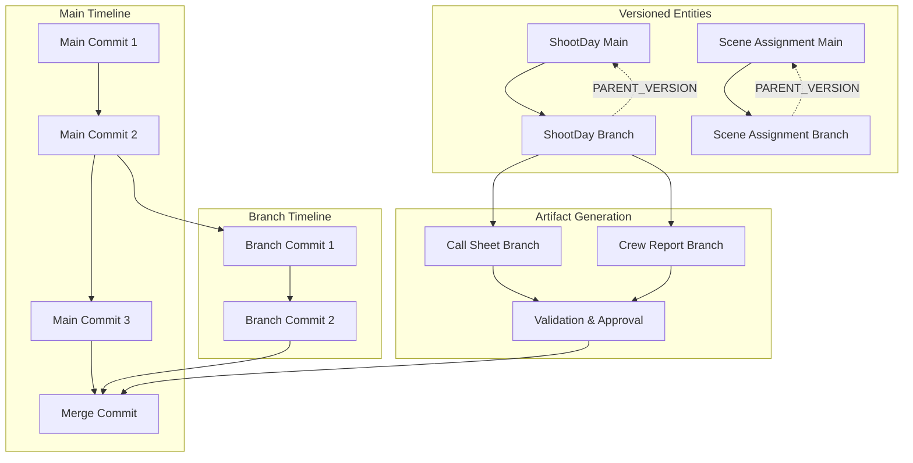

# Branching & Merging Architecture

## Overview

The Branching & Merging system enables safe handling of mid-project changes by treating schedule updates like version-controlled code changes. Instead of overwriting the main production timeline, the system creates alternate branches, applies changes in isolation, validates impacts, and merges back when approved.

## Core Concepts



## Node Types & Relationships

### Commit Node
```cypher
CREATE CONSTRAINT commit_id IF NOT EXISTS 
FOR (c:Commit) REQUIRE c.id IS UNIQUE;

CREATE INDEX commit_branch IF NOT EXISTS 
FOR (c:Commit) ON (c.branch);

CREATE INDEX commit_timestamp IF NOT EXISTS 
FOR (c:Commit) ON (c.timestamp);
```

**Properties:**
- `id`: UUID for the commit
- `branch`: Branch name (e.g., "main", "schedule_alt_B")
- `message`: Descriptive commit message
- `author`: User or agent ID who created the commit
- `timestamp`: When the commit was created
- `type`: "data_change", "schema_change", "merge", "branch_create"
- `parent_commits`: Array of parent commit IDs

**Relationships:**
- `(:Commit)-[:PARENT]->(:Commit)`: Parent-child commit relationships
- `(:Commit)-[:CONTAINS]->(:Action)`: Actions within this commit
- `(:Entity)-[:CREATED_IN]->(:Commit)`: Entity creation tracking
- `(:Entity)-[:MODIFIED_IN]->(:Commit)`: Entity modification tracking

### Branch Node (Optional Enhancement)
```cypher
CREATE CONSTRAINT branch_name IF NOT EXISTS 
FOR (b:Branch) REQUIRE b.name IS UNIQUE;
```

**Properties:**
- `name`: Branch identifier
- `status`: "active", "merged", "abandoned"
- `created_at`: Branch creation timestamp
- `created_by`: User who created the branch
- `description`: Purpose of the branch

**Relationships:**
- `(:Branch)-[:HEAD]->(:Commit)`: Current HEAD commit of branch
- `(:Branch)-[:FORKED_FROM]->(:Commit)`: Original fork point

### Versioned Entity Pattern
```cypher
// Example: Versioned ShootDay
CREATE (sd_main:ShootDay {
    id: "shootday_001",
    date: date("2025-08-09"),
    day_number: 5,
    project_id: "proj_123"
});

CREATE (sd_branch:ShootDay {
    id: "shootday_001_branch_alt_B",
    date: date("2025-08-09"),
    day_number: 5,
    project_id: "proj_123"
});

CREATE (sd_branch)-[:PARENT_VERSION {
    branch_name: "schedule_alt_B",
    created_in_commit: "commit_456"
}]->(sd_main);
```

## Branch Creation Workflow

### 1. Fork Point Identification
```python
class BranchManager:
    def __init__(self, neo4j_client):
        self.neo4j = neo4j_client
    
    def create_branch(self, branch_name: str, user_id: str, description: str = None):
        """Create a new branch from current main HEAD"""
        
        # Get current main HEAD commit
        main_head = self.get_branch_head("main")
        
        # Create branch creation commit
        branch_commit_id = str(uuid.uuid4())
        
        with self.neo4j.session() as session:
            with session.begin_transaction() as tx:
                # Create the branch commit
                tx.run("""
                    CREATE (c:Commit {
                        id: $commit_id,
                        branch: $branch_name,
                        message: $message,
                        author: $user_id,
                        timestamp: datetime(),
                        type: 'branch_create',
                        parent_commits: [$parent_commit]
                    })
                    
                    WITH c
                    MATCH (parent:Commit {id: $parent_commit})
                    CREATE (c)-[:PARENT]->(parent)
                    
                    RETURN c
                """, {
                    'commit_id': branch_commit_id,
                    'branch_name': branch_name,
                    'message': f"Created branch {branch_name}",
                    'user_id': user_id,
                    'parent_commit': main_head['id']
                })
                
                # Copy relevant entities to branch
                self.copy_entities_to_branch(tx, branch_name, branch_commit_id)
                
                return branch_commit_id
    
    def copy_entities_to_branch(self, tx, branch_name: str, commit_id: str):
        """Copy ShootDay and related entities to branch"""
        
        # Copy all ShootDays for the project
        tx.run("""
            MATCH (sd_main:ShootDay {project_id: $project_id})
            
            CREATE (sd_branch:ShootDay)
            SET sd_branch = sd_main
            SET sd_branch.id = sd_main.id + '_branch_' + $branch_name
            
            CREATE (sd_branch)-[:PARENT_VERSION {
                branch_name: $branch_name,
                created_in_commit: $commit_id
            }]->(sd_main)
            
            // Copy scene assignments
            WITH sd_main, sd_branch
            MATCH (sd_main)-[r:COVERS_SCENE]->(scene:Scene)
            CREATE (sd_branch)-[:COVERS_SCENE {
                call_time: r.call_time,
                setup_time: r.setup_time,
                estimated_duration: r.estimated_duration
            }]->(scene)
            
            RETURN count(sd_branch) as copied_days
        """, {
            'project_id': self.current_project_id,
            'branch_name': branch_name,
            'commit_id': commit_id
        })
```

### 2. Schedule Change Application
```python
def apply_schedule_changes(self, branch_name: str, schedule_data: dict, user_id: str):
    """Apply schedule changes to branch entities"""
    
    change_commit_id = str(uuid.uuid4())
    
    with self.neo4j.session() as session:
        with session.begin_transaction() as tx:
            # Create commit for changes
            tx.run("""
                CREATE (c:Commit {
                    id: $commit_id,
                    branch: $branch_name,
                    message: $message,
                    author: $user_id,
                    timestamp: datetime(),
                    type: 'data_change'
                })
            """, {
                'commit_id': change_commit_id,
                'branch_name': branch_name,
                'message': f"Applied schedule changes to {branch_name}",
                'user_id': user_id
            })
            
            # Apply scene moves and updates
            for change in schedule_data['changes']:
                if change['type'] == 'move_scene':
                    self.move_scene_on_branch(
                        tx, branch_name, change['scene_id'], 
                        change['from_date'], change['to_date'], 
                        change_commit_id
                    )
                elif change['type'] == 'add_shoot_day':
                    self.add_shoot_day_on_branch(
                        tx, branch_name, change['date'], 
                        change_commit_id
                    )
                elif change['type'] == 'remove_shoot_day':
                    self.remove_shoot_day_on_branch(
                        tx, branch_name, change['date'], 
                        change_commit_id
                    )
    
    def move_scene_on_branch(self, tx, branch_name: str, scene_id: str, 
                           from_date: str, to_date: str, commit_id: str):
        """Move scene assignment between days on branch"""
        
        tx.run("""
            // Find branch versions of shoot days
            MATCH (from_day)-[:PARENT_VERSION {branch_name: $branch_name}]->(:ShootDay)
            MATCH (from_day_main:ShootDay {date: date($from_date)})
            WHERE (from_day)-[:PARENT_VERSION]-(from_day_main)
            
            MATCH (to_day)-[:PARENT_VERSION {branch_name: $branch_name}]->(:ShootDay)
            MATCH (to_day_main:ShootDay {date: date($to_date)})
            WHERE (to_day)-[:PARENT_VERSION]-(to_day_main)
            
            MATCH (scene:Scene {id: $scene_id})
            
            // Remove from old day
            MATCH (from_day)-[old_rel:COVERS_SCENE]->(scene)
            DELETE old_rel
            
            // Add to new day
            CREATE (to_day)-[:COVERS_SCENE {
                call_time: time("07:00"),
                setup_time: time("06:00"),
                estimated_duration: duration("PT4H")
            }]->(scene)
            
            // Log the action
            CREATE (a:Action {
                id: randomUUID(),
                tool: 'schedule.move_scene',
                description: 'Moved scene ' + $scene_id + ' from ' + $from_date + ' to ' + $to_date,
                timestamp: datetime()
            })
            
            WITH a
            MATCH (c:Commit {id: $commit_id})
            CREATE (c)-[:CONTAINS]->(a)
        """, {
            'branch_name': branch_name,
            'scene_id': scene_id,
            'from_date': from_date,
            'to_date': to_date,
            'commit_id': commit_id
        })
```

## Isolated Artifact Generation

### Branch-Scoped Queries
```python
class BranchAwareComposer:
    def __init__(self, neo4j_client):
        self.neo4j = neo4j_client
    
    def generate_call_sheet(self, date: str, branch_name: str = "main"):
        """Generate call sheet using branch-specific data"""
        
        query = """
        // Get branch version of shoot day
        MATCH (sd:ShootDay)
        WHERE ($branch_name = 'main' AND NOT EXISTS((sd)-[:PARENT_VERSION]->()))
           OR (EXISTS((sd)-[:PARENT_VERSION {branch_name: $branch_name}]->()))
        AND sd.date = date($date)
        
        // Get scenes scheduled for this day
        MATCH (sd)-[:COVERS_SCENE]->(scene:Scene)
        
        // Get cast and crew for these scenes
        OPTIONAL MATCH (scene)-[:FEATURES_CHARACTER]->(char:Character)
        OPTIONAL MATCH (char)-[:PLAYED_BY]->(talent:Talent)
        OPTIONAL MATCH (scene)-[:REQUIRES_CREW_ROLE]->(role:CrewRole)
        OPTIONAL MATCH (role)-[:FILLED_BY]->(crew:CrewMember)
        
        // Get location and equipment
        OPTIONAL MATCH (scene)-[:TAKES_PLACE_AT]->(location:Location)
        OPTIONAL MATCH (scene)-[:REQUIRES_PROP]->(prop:Prop)
        
        RETURN sd, scene, char, talent, role, crew, location, prop
        ORDER BY scene.scene_number
        """
        
        result = self.neo4j.execute_read(query, {
            'date': date,
            'branch_name': branch_name
        })
        
        # Format into call sheet document
        call_sheet_data = self.format_call_sheet_data(result)
        
        # Generate PDF and store as File node
        pdf_content = self.generate_call_sheet_pdf(call_sheet_data)
        
        # Store with branch context
        file_name = f"call_sheet_{date}_{branch_name}.pdf"
        return self.store_generated_file(pdf_content, file_name, branch_name)
```

### Validation & Impact Analysis
```python
def analyze_branch_impact(self, branch_name: str):
    """Analyze the impact of branch changes"""
    
    impact_query = """
    // Find all changed entities on branch
    MATCH (branch_entity)-[:PARENT_VERSION {branch_name: $branch_name}]->(main_entity)
    
    // Detect moved scenes
    MATCH (branch_day:ShootDay)-[:COVERS_SCENE]->(scene:Scene)
    MATCH (main_day:ShootDay)-[:COVERS_SCENE]->(scene)
    WHERE (branch_day)-[:PARENT_VERSION {branch_name: $branch_name}]->()
      AND NOT EXISTS((main_day)-[:PARENT_VERSION]->())
      AND branch_day.date <> main_day.date
    
    WITH scene, main_day.date as old_date, branch_day.date as new_date
    
    // Find affected crew and talent
    MATCH (scene)-[:FEATURES_CHARACTER]->(char:Character)-[:PLAYED_BY]->(talent:Talent)
    MATCH (scene)-[:REQUIRES_CREW_ROLE]->(role:CrewRole)-[:FILLED_BY]->(crew:CrewMember)
    
    RETURN scene.scene_number as scene,
           old_date, new_date,
           collect(DISTINCT talent.name) as affected_talent,
           collect(DISTINCT crew.name) as affected_crew
    """
    
    impact_data = self.neo4j.execute_read(impact_query, {
        'branch_name': branch_name
    })
    
    return {
        'scene_moves': impact_data,
        'affected_people': self.get_affected_people_count(impact_data),
        'equipment_conflicts': self.check_equipment_conflicts(branch_name),
        'location_conflicts': self.check_location_conflicts(branch_name)
    }
```

## Merge Workflow

### Three-Way Merge Strategy
```python
def merge_branch(self, source_branch: str, target_branch: str = "main", user_id: str = None):
    """Merge source branch into target branch"""
    
    # Analyze conflicts
    conflicts = self.detect_merge_conflicts(source_branch, target_branch)
    if conflicts:
        raise MergeConflictError(f"Conflicts detected: {conflicts}")
    
    merge_commit_id = str(uuid.uuid4())
    
    with self.neo4j.session() as session:
        with session.begin_transaction() as tx:
            # Get HEAD commits of both branches
            source_head = self.get_branch_head(source_branch)
            target_head = self.get_branch_head(target_branch)
            
            # Create merge commit
            tx.run("""
                CREATE (c:Commit {
                    id: $commit_id,
                    branch: $target_branch,
                    message: $message,
                    author: $user_id,
                    timestamp: datetime(),
                    type: 'merge',
                    parent_commits: [$source_head, $target_head]
                })
                
                WITH c
                MATCH (source:Commit {id: $source_head})
                MATCH (target:Commit {id: $target_head})
                CREATE (c)-[:PARENT]->(source)
                CREATE (c)-[:PARENT]->(target)
            """, {
                'commit_id': merge_commit_id,
                'target_branch': target_branch,
                'message': f"Merge {source_branch} into {target_branch}",
                'user_id': user_id,
                'source_head': source_head['id'],
                'target_head': target_head['id']
            })
            
            # Apply branch changes to target
            self.apply_branch_changes_to_target(tx, source_branch, target_branch, merge_commit_id)
            
            # Update branch status
            tx.run("""
                MATCH (b:Branch {name: $source_branch})
                SET b.status = 'merged', b.merged_at = datetime()
            """, {'source_branch': source_branch})
            
            return merge_commit_id

def apply_branch_changes_to_target(self, tx, source_branch: str, target_branch: str, merge_commit_id: str):
    """Apply all changes from source branch to target"""
    
    # Replace target entities with branch versions
    tx.run("""
        // Find all branch entities that should replace main entities
        MATCH (branch_entity)-[pv:PARENT_VERSION {branch_name: $source_branch}]->(main_entity)
        
        // Copy branch entity properties to main entity
        SET main_entity = branch_entity
        
        // Remove branch-specific ID suffix
        SET main_entity.id = main_entity.id.replace('_branch_' + $source_branch, '')
        
        // Update relationships to point to main entity
        MATCH (branch_entity)-[r]-(other)
        WHERE NOT type(r) = 'PARENT_VERSION'
        
        CREATE (main_entity)-[new_r:type(r)]->(other)
        SET new_r = r
        DELETE r
        
        // Mark as modified in merge commit
        CREATE (main_entity)-[:MODIFIED_IN]->(c:Commit {id: $merge_commit_id})
        
        // Clean up branch entity
        DETACH DELETE branch_entity
        
        RETURN count(main_entity) as merged_entities
    """, {
        'source_branch': source_branch,
        'merge_commit_id': merge_commit_id
    })
```

## Implementation Steps

### Phase 1: Core Infrastructure
1. **Commit & Branch Nodes**
   - Add Commit node type with constraints
   - Implement branch management service
   - Add parent-child commit relationships

2. **Versioned Entity Pattern**
   - Add PARENT_VERSION relationships
   - Implement entity copying utilities
   - Add branch-aware query helpers

### Phase 2: Branch Operations
1. **Branch Creation**
   - Implement fork point identification
   - Build entity copying pipeline
   - Add branch validation

2. **Change Application**
   - Build schedule change applicator
   - Implement atomic change commits
   - Add change impact analysis

### Phase 3: Merge Capabilities
1. **Conflict Detection**
   - Implement three-way merge analysis
   - Build conflict resolution UI
   - Add merge validation

2. **Merge Execution**
   - Build merge commit creation
   - Implement entity replacement logic
   - Add post-merge cleanup

## Technology Stack

- **Neo4j 4.4+**: Graph database with APOC procedures
- **Python 3.9+**: Branch management service
- **FastAPI**: REST endpoints for branch operations
- **Celery**: Async processing for large merges
- **Redis**: Branch operation queuing
- **Prometheus**: Metrics for branch operations

## Testing Strategy

### Unit Tests
```python
def test_branch_creation():
    manager = BranchManager(mock_neo4j)
    
    # Create test branch
    commit_id = manager.create_branch("test_branch", "user_123")
    
    # Verify branch commit exists
    commit = manager.get_commit(commit_id)
    assert commit['branch'] == "test_branch"
    assert commit['type'] == "branch_create"
    
    # Verify entities were copied
    branch_entities = manager.get_branch_entities("test_branch")
    assert len(branch_entities) > 0

def test_merge_workflow():
    manager = BranchManager(mock_neo4j)
    
    # Create and modify branch
    branch_commit = manager.create_branch("feature_branch", "user_123")
    manager.apply_schedule_changes("feature_branch", test_changes, "user_123")
    
    # Merge back to main
    merge_commit = manager.merge_branch("feature_branch", "main", "user_123")
    
    # Verify merge commit has two parents
    commit = manager.get_commit(merge_commit)
    assert len(commit['parent_commits']) == 2
    
    # Verify changes are in main
    main_entities = manager.get_branch_entities("main")
    assert any(e['modified_in'] == merge_commit for e in main_entities)
```

## Security Considerations

1. **Branch Access Control**
   - Role-based branch creation permissions
   - Merge approval workflows
   - Audit trail for all branch operations

2. **Data Isolation**
   - Ensure branch data doesn't leak to main
   - Validate merge permissions
   - Prevent unauthorized branch access

## Performance Considerations

1. **Large Branch Operations**
   - Async processing for entity copying
   - Batch operations for large datasets
   - Progress tracking for long-running merges

2. **Query Optimization**
   - Index on branch_name properties
   - Efficient parent-child traversals
   - Cached branch HEAD lookups

## Monitoring & Observability

### Key Metrics
- `olivine_branches_created_total`: Total branches created
- `olivine_branches_merged_total`: Successfully merged branches
- `olivine_merge_conflicts_total`: Merge conflicts detected
- `olivine_branch_operation_duration`: Time for branch operations

### Alerts
- Long-running merge operations
- High merge conflict rates
- Failed branch operations
- Orphaned branches

This architecture enables safe, controlled changes to production schedules while maintaining full auditability and the ability to validate impacts before committing to the main timeline.
