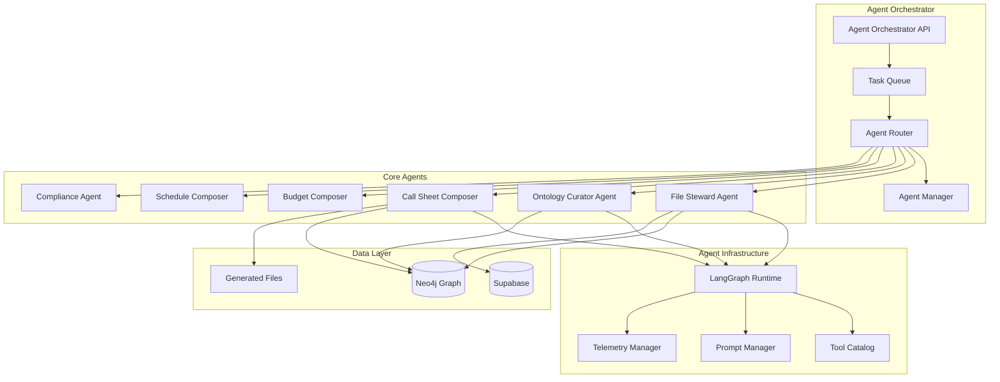

# Agent System Architecture (LangGraph)

## Overview

The Agent System provides intelligent automation through specialized agents that operate on the unified knowledge graph. Each agent has well-defined responsibilities and tools, with every action recorded in the Provenance ontology as auditable events. This LangGraph-based architecture enables content extraction, document generation, compliance checks, and autonomous data management.

## Core Architecture



## Agent Types & Responsibilities

### File Steward Agent

**Role:** Librarian of the system, maintaining File Ontology sync with external storage and mapping files into canonical structure.

```python
class FileStewardAgent:
    def __init__(self, neo4j_client, supabase_client, ml_classifier):
        self.neo4j = neo4j_client
        self.supabase = supabase_client
        self.classifier = ml_classifier
        self.tools = [
            "file.upsert_node",
            "file.classify_slot",
            "file.link_to_project",
            "taxonomy.apply_rules",
            "provenance.create_commit"
        ]
    
    async def process_file_event(self, event: FileEvent):
        """Main processing workflow for file events"""
        
        with self.create_commit_context(event) as commit:
            # 1. Upsert File node
            file_node = await self.upsert_file_node(event, commit)
            
            # 2. Classify file into canonical slots
            slot_assignments = await self.classify_file(file_node, commit)
            
            # 3. Update folder hierarchy
            await self.update_folder_hierarchy(file_node, commit)
            
            # 4. Create temporal relationships
            await self.create_edge_facts(file_node, slot_assignments, commit)
            
            # 5. Apply taxonomy rules
            await self.apply_taxonomy_rules(file_node, commit)
            
            # 6. Mark event processed
            await self.mark_event_processed(event.id)
            
            # 7. Emit telemetry
            self.emit_metrics("file_steward", "process_file", "success")
    
    async def classify_file(self, file_node: dict, commit: CommitContext):
        """Classify file into canonical slots using rules + ML"""
        
        # Apply deterministic rules first
        rule_matches = await self.apply_classification_rules(file_node)
        
        if rule_matches and rule_matches.confidence > 0.8:
            return await self.assign_canonical_slot(file_node, rule_matches.slot, commit)
        
        # Fall back to ML classification
        ml_prediction = await self.ml_classify_file(file_node)
        
        if ml_prediction.confidence > 0.7:
            return await self.assign_canonical_slot(file_node, ml_prediction.slot, commit)
        
        # Create novelty proposal for unclassifiable files
        await self.create_novelty_proposal(file_node, "Unknown file type", commit)
        return None
    
    async def apply_classification_rules(self, file_node: dict):
        """Apply taxonomy rules for file classification"""
        
        query = """
        MATCH (rule:TaxonomyRule)
        WHERE rule.pattern_type = 'filename_regex'
          AND $filename =~ rule.pattern
        
        OPTIONAL MATCH (rule)-[:ASSIGNS_TO_SLOT]->(slot:CanonicalSlot)
        
        RETURN rule, slot, rule.confidence as confidence
        ORDER BY rule.priority DESC, confidence DESC
        LIMIT 1
        """
        
        result = await self.neo4j.execute_read(query, {
            'filename': file_node['name']
        })
        
        if result:
            return ClassificationResult(
                slot=result[0]['slot']['name'],
                confidence=result[0]['confidence'],
                rule_id=result[0]['rule']['id']
            )
        
        return None
```

**Telemetry:**
- `olivine_agent_jobs_total{agent="file_steward", job_type="process_file|classify|link"}`
- `olivine_agent_jobs_failed_total{agent="file_steward", job_type}`
- `olivine_actions_failed_total{tool="file.classify|file.link|slot.assign"}`

### Ontology Curator Agent

**Role:** Governance mechanism for evolving schema, reviewing TypeDefProposals and managing ontology changes.

```python
class OntologyCuratorAgent:
    def __init__(self, neo4j_client, llm_client):
        self.neo4j = neo4j_client
        self.llm = llm_client
        self.tools = [
            "ontology.evaluate_proposal",
            "ontology.apply_schema_change",
            "ontology.create_typedef",
            "llm.evaluate_safety",
            "provenance.create_commit"
        ]
    
    async def process_proposals(self):
        """Main workflow for processing TypeDefProposals"""
        
        pending_proposals = await self.get_pending_proposals()
        
        for proposal in pending_proposals:
            try:
                decision = await self.evaluate_proposal(proposal)
                
                if decision.action == "auto_approve":
                    await self.auto_approve_proposal(proposal, decision.rationale)
                elif decision.action == "escalate":
                    await self.escalate_to_human(proposal, decision.rationale)
                elif decision.action == "reject":
                    await self.reject_proposal(proposal, decision.rationale)
                    
                self.emit_metrics("ontology_curator", "evaluate_proposal", decision.action)
                
            except Exception as e:
                await self.handle_evaluation_error(proposal, e)
                self.emit_metrics("ontology_curator", "evaluate_proposal", "error")
    
    async def evaluate_proposal(self, proposal: dict) -> EvaluationDecision:
        """Evaluate TypeDefProposal using rules + LLM"""
        
        # Check auto-approval rules
        if await self.can_auto_approve(proposal):
            return EvaluationDecision(
                action="auto_approve",
                rationale="Meets auto-approval criteria",
                confidence=0.9
            )
        
        # Use LLM for complex evaluation
        llm_evaluation = await self.llm_evaluate_proposal(proposal)
        
        if llm_evaluation.safety_score > 0.8 and llm_evaluation.necessity_score > 0.7:
            return EvaluationDecision(
                action="auto_approve",
                rationale=f"LLM evaluation: {llm_evaluation.reasoning}",
                confidence=llm_evaluation.confidence
            )
        elif llm_evaluation.safety_score < 0.5:
            return EvaluationDecision(
                action="reject",
                rationale=f"Safety concerns: {llm_evaluation.safety_concerns}",
                confidence=llm_evaluation.confidence
            )
        else:
            return EvaluationDecision(
                action="escalate",
                rationale="Requires human review for complexity",
                confidence=llm_evaluation.confidence
            )
    
    async def llm_evaluate_proposal(self, proposal: dict):
        """Use LLM to evaluate proposal safety and necessity"""
        
        prompt = f"""
        Evaluate this ontology change proposal for a film production knowledge graph:
        
        Type: {proposal['kind']}
        Label: {proposal['label']}
        Rationale: {proposal['rationale']}
        Sample Count: {proposal['sample_count']}
        
        Consider:
        1. Safety: Does this conflict with existing schema? Could it cause data issues?
        2. Necessity: Is this genuinely needed or redundant with existing types?
        3. Naming: Does the label follow conventions and avoid confusion?
        
        Respond with JSON:
        {{
            "safety_score": 0.0-1.0,
            "necessity_score": 0.0-1.0,
            "confidence": 0.0-1.0,
            "reasoning": "explanation",
            "safety_concerns": "specific issues if any",
            "recommendation": "approve|reject|escalate"
        }}
        """
        
        response = await self.llm.complete(prompt, response_format="json")
        return LLMEvaluation.from_json(response)
```

### Composer Agents (Document Generators)

**Role:** Generate aggregate documents by pulling data from graph and formatting into deliverables.

```python
class CallSheetComposerAgent:
    def __init__(self, neo4j_client, template_engine, pdf_generator):
        self.neo4j = neo4j_client
        self.template_engine = template_engine
        self.pdf_generator = pdf_generator
        self.tools = [
            "graph.query_shoot_day",
            "graph.get_scene_details",
            "graph.get_cast_crew",
            "template.render_callsheet",
            "pdf.generate_document",
            "file.store_generated"
        ]
    
    async def generate_call_sheet(self, shoot_date: str, branch: str = "main"):
        """Generate call sheet for specific shoot day"""
        
        with self.create_commit_context(f"Generate call sheet for {shoot_date}") as commit:
            # 1. Gather data from graph
            shoot_data = await self.gather_shoot_day_data(shoot_date, branch)
            
            # 2. Validate prerequisites
            validation_result = await self.validate_call_sheet_data(shoot_data)
            if not validation_result.is_complete:
                await self.handle_incomplete_data(validation_result, commit)
                return None
            
            # 3. Render template
            rendered_content = await self.render_call_sheet_template(shoot_data)
            
            # 4. Generate PDF
            pdf_content = await self.generate_pdf(rendered_content)
            
            # 5. Store as File node
            file_node = await self.store_generated_file(
                pdf_content, 
                f"call_sheet_{shoot_date}_{branch}.pdf",
                commit
            )
            
            # 6. Link to canonical slot
            await self.assign_to_canonical_slot(file_node, "CALLSHEET_FINAL", commit)
            
            self.emit_metrics("composer", "generate_callsheet", "success")
            return file_node
    
    async def gather_shoot_day_data(self, shoot_date: str, branch: str):
        """Gather all data needed for call sheet"""
        
        query = """
        // Get shoot day (branch-aware)
        MATCH (sd:ShootDay)
        WHERE ($branch = 'main' AND NOT EXISTS((sd)-[:PARENT_VERSION]->()))
           OR (EXISTS((sd)-[:PARENT_VERSION {branch_name: $branch}]->()))
        AND sd.date = date($shoot_date)
        
        // Get scenes for this day
        MATCH (sd)-[:COVERS_SCENE]->(scene:Scene)
        
        // Get cast and characters
        OPTIONAL MATCH (scene)-[:FEATURES_CHARACTER]->(char:Character)
        OPTIONAL MATCH (char)-[:PLAYED_BY]->(talent:Talent)
        
        // Get crew requirements
        OPTIONAL MATCH (scene)-[:REQUIRES_CREW_ROLE]->(role:CrewRole)
        OPTIONAL MATCH (role)-[:FILLED_BY]->(crew:CrewMember)
        
        // Get locations and logistics
        OPTIONAL MATCH (scene)-[:TAKES_PLACE_AT]->(location:Location)
        OPTIONAL MATCH (scene)-[:REQUIRES_PROP]->(prop:Prop)
        OPTIONAL MATCH (scene)-[:USES_EQUIPMENT]->(equipment:Equipment)
        
        // Get weather and special requirements
        OPTIONAL MATCH (sd)-[:HAS_WEATHER_CONDITION]->(weather:WeatherCondition)
        OPTIONAL MATCH (scene)-[:HAS_SPECIAL_REQUIREMENT]->(req:SpecialRequirement)
        
        RETURN sd, scene, char, talent, role, crew, location, prop, equipment, weather, req
        ORDER BY scene.scene_number
        """
        
        result = await self.neo4j.execute_read(query, {
            'shoot_date': shoot_date,
            'branch': branch
        })
        
        return self.format_shoot_day_data(result)
```

**Telemetry:**
- `olivine_agent_jobs_total{agent="composer", job_type="callsheet|budget|schedule"}`
- `olivine_agent_jobs_failed_total{agent="composer", job_type}`
- `olivine_actions_failed_total{tool="composer.callsheet|llm.call.openai|pdf.fill"}`

## Agent Infrastructure

### LangGraph Runtime
```python
class AgentRuntime:
    def __init__(self, neo4j_client, supabase_client):
        self.neo4j = neo4j_client
        self.supabase = supabase_client
        self.tool_catalog = ToolCatalog()
        self.prompt_manager = PromptManager()
        self.telemetry = TelemetryManager()
        
    def register_agent(self, agent_class, config: dict):
        """Register an agent with the runtime"""
        agent = agent_class(**config)
        agent.runtime = self
        agent.tools = self.tool_catalog.get_tools(agent.tool_names)
        return agent
    
    async def execute_agent_task(self, agent_name: str, task: dict):
        """Execute a task using specified agent"""
        
        agent = self.agents[agent_name]
        
        # Create execution context
        context = AgentExecutionContext(
            task=task,
            tools=agent.tools,
            neo4j=self.neo4j,
            supabase=self.supabase,
            telemetry=self.telemetry
        )
        
        try:
            # Execute agent workflow
            result = await agent.execute(context)
            
            # Record success metrics
            self.telemetry.record_agent_success(agent_name, task['type'])
            
            return result
            
        except Exception as e:
            # Record failure metrics
            self.telemetry.record_agent_failure(agent_name, task['type'], str(e))
            raise
```

### Tool Catalog
```python
class ToolCatalog:
    def __init__(self):
        self.tools = {}
        self.register_core_tools()
    
    def register_core_tools(self):
        """Register core tools available to agents"""
        
        # Neo4j tools
        self.register_tool("graph.query", GraphQueryTool())
        self.register_tool("graph.write", GraphWriteTool())
        self.register_tool("graph.upsert_node", UpsertNodeTool())
        
        # File tools
        self.register_tool("file.read", FileReadTool())
        self.register_tool("file.write", FileWriteTool())
        self.register_tool("file.classify", FileClassifyTool())
        
        # LLM tools
        self.register_tool("llm.complete", LLMCompletionTool())
        self.register_tool("llm.embed", LLMEmbeddingTool())
        
        # Document generation tools
        self.register_tool("template.render", TemplateRenderTool())
        self.register_tool("pdf.generate", PDFGeneratorTool())
        
        # Provenance tools
        self.register_tool("provenance.create_commit", CreateCommitTool())
        self.register_tool("provenance.create_action", CreateActionTool())
    
    def register_tool(self, name: str, tool: BaseTool):
        """Register a tool with the catalog"""
        self.tools[name] = tool
        tool.name = name
    
    def get_tools(self, tool_names: list) -> dict:
        """Get specified tools for an agent"""
        return {name: self.tools[name] for name in tool_names if name in self.tools}
```

### Provenance Integration
```python
class CommitContext:
    def __init__(self, agent_name: str, message: str, neo4j_client):
        self.agent_name = agent_name
        self.message = message
        self.neo4j = neo4j_client
        self.commit_id = str(uuid.uuid4())
        self.actions = []
    
    async def __aenter__(self):
        """Start commit transaction"""
        self.session = self.neo4j.session()
        self.tx = await self.session.begin_transaction()
        
        # Create commit node
        await self.tx.run("""
            CREATE (c:Commit {
                id: $commit_id,
                message: $message,
                author: $agent_name,
                timestamp: datetime(),
                type: 'agent_action'
            })
        """, {
            'commit_id': self.commit_id,
            'message': self.message,
            'agent_name': self.agent_name
        })
        
        return self
    
    async def __aexit__(self, exc_type, exc_val, exc_tb):
        """Commit or rollback transaction"""
        try:
            if exc_type is None:
                # Create action nodes for all recorded actions
                for action in self.actions:
                    await self.tx.run("""
                        CREATE (a:Action {
                            id: $action_id,
                            tool: $tool,
                            description: $description,
                            timestamp: datetime(),
                            success: $success
                        })
                        
                        WITH a
                        MATCH (c:Commit {id: $commit_id})
                        CREATE (c)-[:CONTAINS]->(a)
                    """, {
                        'action_id': action['id'],
                        'tool': action['tool'],
                        'description': action['description'],
                        'success': action['success'],
                        'commit_id': self.commit_id
                    })
                
                await self.tx.commit()
            else:
                await self.tx.rollback()
        finally:
            await self.session.close()
    
    def record_action(self, tool: str, description: str, success: bool = True):
        """Record an action within this commit"""
        self.actions.append({
            'id': str(uuid.uuid4()),
            'tool': tool,
            'description': description,
            'success': success
        })
```

## Implementation Steps

### Phase 1: Core Infrastructure
1. **Agent Runtime Setup**
   - Implement LangGraph runtime
   - Create tool catalog system
   - Add agent registration mechanism

2. **Provenance Integration**
   - Implement commit context manager
   - Add action recording utilities
   - Create audit trail queries

### Phase 2: Core Agents
1. **File Steward Agent**
   - Implement file event processing
   - Add classification pipeline
   - Integrate with taxonomy rules

2. **Ontology Curator Agent**
   - Build proposal evaluation logic
   - Add LLM safety assessment
   - Implement schema change application

### Phase 3: Composer Agents
1. **Document Generation Pipeline**
   - Implement template rendering
   - Add PDF generation capabilities
   - Create file storage integration

2. **Branch-Aware Operations**
   - Add branch context to queries
   - Implement branch-specific artifact generation
   - Add validation workflows

## Technology Stack

- **LangGraph**: Agent orchestration framework
- **Neo4j 4.4+**: Graph database with APOC procedures
- **Python 3.9+**: Agent implementation language
- **FastAPI**: REST API for agent coordination
- **Celery**: Async task processing
- **Redis**: Task queue and caching
- **OpenAI/Anthropic**: LLM services for reasoning
- **Jinja2**: Template rendering engine
- **WeasyPrint**: PDF generation

## Testing Strategy

### Unit Tests
```python
def test_file_steward_classification():
    agent = FileStewardAgent(mock_neo4j, mock_supabase, mock_classifier)
    
    # Test rule-based classification
    file_node = {'name': 'script_v1.pdf', 'path': '/project/scripts/'}
    result = await agent.classify_file(file_node, mock_commit)
    
    assert result.slot == 'SCRIPT_DRAFT'
    assert result.confidence > 0.8

def test_ontology_curator_evaluation():
    agent = OntologyCuratorAgent(mock_neo4j, mock_llm)
    
    # Test auto-approval
    proposal = {
        'kind': 'Property',
        'label': 'requires_battery',
        'sample_count': 10
    }
    
    decision = await agent.evaluate_proposal(proposal)
    assert decision.action == 'auto_approve'
```

### Integration Tests
- End-to-end agent workflows
- Multi-agent coordination scenarios
- Provenance trail validation
- Error handling and recovery

## Security Considerations

1. **Agent Authorization**
   - Role-based access for agent operations
   - Tool-level permission controls
   - Audit trail for all agent actions

2. **LLM Safety**
   - Input sanitization for LLM calls
   - Output validation and filtering
   - Rate limiting and cost controls

## Performance Considerations

1. **Agent Scalability**
   - Async processing for long-running tasks
   - Agent pool management
   - Resource allocation and limits

2. **Graph Query Optimization**
   - Efficient branch-aware queries
   - Caching for frequently accessed data
   - Batch operations for bulk updates

## Monitoring & Observability

### Key Metrics
- `olivine_agent_jobs_total{agent, job_type}`: Total agent jobs
- `olivine_agent_jobs_failed_total{agent, job_type}`: Failed agent jobs
- `olivine_agent_execution_duration{agent}`: Agent execution time
- `olivine_actions_failed_total{tool}`: Tool-level failures
- `olivine_llm_calls_total{model, agent}`: LLM usage tracking

### Alerts
- High agent failure rates
- Long-running agent tasks
- LLM cost thresholds exceeded
- Critical tool failures

This architecture provides a robust, scalable foundation for intelligent automation while maintaining full auditability and controlled operations essential for production environments.
