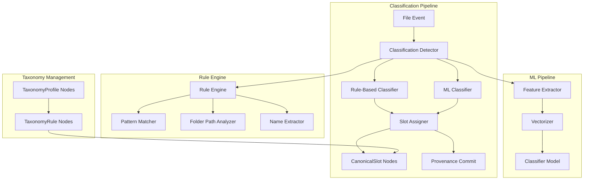

# Taxonomy & File Classification Architecture

## Overview

The Taxonomy & Classification system provides intelligent file categorization through CanonicalSlot assignments and TaxonomyRule definitions. This enables the system to automatically understand the role and purpose of files within creative productions, supporting both deterministic rule-based classification and ML-powered fuzzy matching.

## Core Components



## Node Types & Relationships

### CanonicalSlot Node
```cypher
CREATE CONSTRAINT canonical_slot_name IF NOT EXISTS 
FOR (cs:CanonicalSlot) REQUIRE cs.name IS UNIQUE;

CREATE INDEX canonical_slot_category IF NOT EXISTS 
FOR (cs:CanonicalSlot) ON (cs.category);
```

**Properties:**
- `name`: Unique slot identifier (e.g., "SCRIPT_PRIMARY", "BUDGET_FINAL")
- `category`: Broad category (e.g., "script", "budget", "schedule", "media")
- `description`: Human-readable description of slot purpose
- `file_types`: Array of expected MIME types
- `naming_patterns`: Array of common filename patterns
- `folder_patterns`: Array of expected folder path patterns
- `priority`: Priority level for conflict resolution
- `created_at`: Timestamp
- `is_active`: Boolean for enabling/disabling slots

### TaxonomyRule Node
```cypher
CREATE CONSTRAINT taxonomy_rule_id IF NOT EXISTS 
FOR (tr:TaxonomyRule) REQUIRE tr.id IS UNIQUE;

CREATE INDEX taxonomy_rule_priority IF NOT EXISTS 
FOR (tr:TaxonomyRule) ON (tr.priority);
```

**Properties:**
- `id`: UUID for the rule
- `name`: Descriptive rule name
- `pattern_type`: Type of pattern ("filename_regex", "folder_path", "mime_type", "file_size")
- `pattern`: The actual pattern/regex to match
- `confidence`: Confidence score (0.0-1.0) for this rule
- `priority`: Execution priority (higher = earlier)
- `conditions`: JSON object with additional conditions
- `created_at`: Timestamp
- `created_by`: User or agent who created the rule
- `is_active`: Boolean for enabling/disabling rules

**Relationships:**
- `(:TaxonomyRule)-[:ASSIGNS_TO_SLOT]->(:CanonicalSlot)`: Rule assigns files to slot
- `(:TaxonomyRule)-[:REQUIRES_CONDITION]->(:TaxonomyRule)`: Rule dependencies
- `(:TaxonomyProfile)-[:CONTAINS_RULE]->(:TaxonomyRule)`: Profile grouping

### TaxonomyProfile Node
```cypher
CREATE CONSTRAINT taxonomy_profile_name IF NOT EXISTS 
FOR (tp:TaxonomyProfile) REQUIRE tp.name IS UNIQUE;
```

**Properties:**
- `name`: Profile identifier (e.g., "film_production", "commercial", "documentary")
- `description`: Profile purpose and scope
- `version`: Version number for profile evolution
- `is_default`: Boolean indicating default profile
- `created_at`: Timestamp
- `project_types`: Array of applicable project types

**Relationships:**
- `(:Project)-[:USES_TAXONOMY_PROFILE]->(:TaxonomyProfile)`: Project-specific profiles
- `(:TaxonomyProfile)-[:CONTAINS_RULE]->(:TaxonomyRule)`: Rules within profile

### File-Slot Relationships
```cypher
// File assigned to canonical slot
CREATE (file:File)-[:FILLS_SLOT {
    confidence: 0.95,
    assigned_by: "rule_engine",
    assigned_at: datetime(),
    rule_id: "rule_123"
}]->(slot:CanonicalSlot);

// Historical slot assignments
CREATE (file:File)-[:PREVIOUSLY_FILLED_SLOT {
    confidence: 0.8,
    assigned_by: "ml_classifier",
    assigned_at: datetime("2025-01-01T10:00:00Z"),
    superseded_at: datetime(),
    superseded_by: "rule_engine"
}]->(old_slot:CanonicalSlot);
```

## Classification Engine

### Rule-Based Classifier
```python
class RuleBasedClassifier:
    def __init__(self, neo4j_client):
        self.neo4j = neo4j_client
        self.rule_cache = {}
    
    async def classify_file(self, file_node: dict, project_id: str = None) -> ClassificationResult:
        """Classify file using taxonomy rules"""
        
        # Get applicable rules for project
        rules = await self.get_applicable_rules(project_id)
        
        # Apply rules in priority order
        for rule in sorted(rules, key=lambda r: r['priority'], reverse=True):
            match_result = await self.apply_rule(file_node, rule)
            
            if match_result.matches and match_result.confidence >= rule['confidence']:
                return ClassificationResult(
                    slot=rule['target_slot'],
                    confidence=match_result.confidence,
                    method="rule_based",
                    rule_id=rule['id'],
                    details=match_result.details
                )
        
        return ClassificationResult(slot=None, confidence=0.0, method="rule_based")
    
    async def apply_rule(self, file_node: dict, rule: dict) -> RuleMatchResult:
        """Apply single taxonomy rule to file"""
        
        if rule['pattern_type'] == 'filename_regex':
            return self.match_filename_pattern(file_node['name'], rule['pattern'])
        
        elif rule['pattern_type'] == 'folder_path':
            return self.match_folder_pattern(file_node['path'], rule['pattern'])
        
        elif rule['pattern_type'] == 'mime_type':
            return self.match_mime_type(file_node['mime_type'], rule['pattern'])
        
        elif rule['pattern_type'] == 'file_size':
            return self.match_file_size(file_node['size'], rule['conditions'])
        
        elif rule['pattern_type'] == 'composite':
            return await self.match_composite_rule(file_node, rule)
        
        return RuleMatchResult(matches=False, confidence=0.0)
    
    def match_filename_pattern(self, filename: str, pattern: str) -> RuleMatchResult:
        """Match filename against regex pattern"""
        import re
        
        try:
            match = re.search(pattern, filename, re.IGNORECASE)
            if match:
                # Calculate confidence based on match quality
                confidence = min(1.0, len(match.group(0)) / len(filename))
                return RuleMatchResult(
                    matches=True,
                    confidence=confidence,
                    details={'matched_text': match.group(0), 'groups': match.groups()}
                )
        except re.error as e:
            # Log invalid regex pattern
            logger.warning(f"Invalid regex pattern: {pattern}, error: {e}")
        
        return RuleMatchResult(matches=False, confidence=0.0)
    
    async def match_composite_rule(self, file_node: dict, rule: dict) -> RuleMatchResult:
        """Apply composite rule with multiple conditions"""
        
        conditions = rule['conditions']
        results = []
        
        # Apply all sub-conditions
        for condition in conditions:
            sub_rule = {
                'pattern_type': condition['type'],
                'pattern': condition['pattern'],
                'confidence': condition.get('weight', 1.0)
            }
            
            result = await self.apply_rule(file_node, sub_rule)
            results.append(result)
        
        # Combine results based on logic (AND/OR)
        logic = conditions.get('logic', 'AND')
        
        if logic == 'AND':
            # All conditions must match
            if all(r.matches for r in results):
                combined_confidence = sum(r.confidence for r in results) / len(results)
                return RuleMatchResult(matches=True, confidence=combined_confidence)
        
        elif logic == 'OR':
            # At least one condition must match
            matching_results = [r for r in results if r.matches]
            if matching_results:
                best_confidence = max(r.confidence for r in matching_results)
                return RuleMatchResult(matches=True, confidence=best_confidence)
        
        return RuleMatchResult(matches=False, confidence=0.0)
```

### ML-Based Classifier
```python
class MLClassifier:
    def __init__(self, model_path: str, vectorizer_path: str):
        self.model = joblib.load(model_path)
        self.vectorizer = joblib.load(vectorizer_path)
        self.feature_extractor = FileFeatureExtractor()
    
    async def classify_file(self, file_node: dict) -> ClassificationResult:
        """Classify file using ML model"""
        
        # Extract features
        features = await self.feature_extractor.extract_features(file_node)
        
        # Vectorize features
        feature_vector = self.vectorizer.transform([features])
        
        # Predict slot
        probabilities = self.model.predict_proba(feature_vector)[0]
        predicted_slot_idx = np.argmax(probabilities)
        confidence = probabilities[predicted_slot_idx]
        
        slot_name = self.model.classes_[predicted_slot_idx]
        
        return ClassificationResult(
            slot=slot_name,
            confidence=confidence,
            method="ml_classifier",
            details={'all_probabilities': dict(zip(self.model.classes_, probabilities))}
        )

class FileFeatureExtractor:
    def __init__(self):
        self.text_extractor = TextExtractor()
    
    async def extract_features(self, file_node: dict) -> dict:
        """Extract features for ML classification"""
        
        features = {
            # Basic file properties
            'filename': file_node['name'],
            'file_extension': Path(file_node['name']).suffix.lower(),
            'file_size_mb': file_node['size'] / (1024 * 1024),
            'mime_type': file_node.get('mime_type', ''),
            
            # Path-based features
            'folder_depth': len(Path(file_node['path']).parts),
            'folder_names': [p.lower() for p in Path(file_node['path']).parts],
            
            # Filename analysis
            'has_version_number': bool(re.search(r'v\d+|version\d+', file_node['name'], re.I)),
            'has_date': bool(re.search(r'\d{4}-\d{2}-\d{2}|\d{2}-\d{2}-\d{4}', file_node['name'])),
            'has_draft_indicator': bool(re.search(r'draft|rough|temp|wip', file_node['name'], re.I)),
            'has_final_indicator': bool(re.search(r'final|approved|locked', file_node['name'], re.I)),
            
            # Content-based features (for text files)
            'text_content': await self.extract_text_content(file_node) if self.is_text_file(file_node) else '',
        }
        
        # Add derived features
        features.update(self.derive_semantic_features(features))
        
        return features
    
    def derive_semantic_features(self, features: dict) -> dict:
        """Derive higher-level semantic features"""
        
        filename_lower = features['filename'].lower()
        folder_names = features['folder_names']
        
        return {
            # Document type indicators
            'is_script_like': any(word in filename_lower for word in ['script', 'screenplay', 'treatment']),
            'is_budget_like': any(word in filename_lower for word in ['budget', 'cost', 'expense', 'financial']),
            'is_schedule_like': any(word in filename_lower for word in ['schedule', 'calendar', 'timeline', 'callsheet']),
            'is_media_like': features['file_extension'] in ['.mp4', '.mov', '.avi', '.jpg', '.png', '.wav', '.mp3'],
            
            # Folder context
            'in_scripts_folder': any('script' in folder for folder in folder_names),
            'in_budget_folder': any('budget' in folder for folder in folder_names),
            'in_media_folder': any(folder in ['media', 'footage', 'audio', 'images'] for folder in folder_names),
            
            # Version indicators
            'version_maturity': self.assess_version_maturity(filename_lower),
            'document_stage': self.assess_document_stage(filename_lower),
        }
    
    def assess_version_maturity(self, filename: str) -> str:
        """Assess document maturity from filename"""
        if any(word in filename for word in ['final', 'approved', 'locked', 'delivered']):
            return 'final'
        elif any(word in filename for word in ['draft', 'rough', 'wip', 'temp']):
            return 'draft'
        elif re.search(r'v[1-9]\d*', filename):  # v2, v3, etc.
            return 'revision'
        else:
            return 'unknown'
```

### Hybrid Classification Pipeline
```python
class HybridClassifier:
    def __init__(self, neo4j_client, rule_classifier, ml_classifier):
        self.neo4j = neo4j_client
        self.rule_classifier = rule_classifier
        self.ml_classifier = ml_classifier
    
    async def classify_file(self, file_node: dict, project_id: str = None) -> ClassificationResult:
        """Classify file using hybrid approach"""
        
        # Try rule-based classification first
        rule_result = await self.rule_classifier.classify_file(file_node, project_id)
        
        # If rule-based classification is confident, use it
        if rule_result.slot and rule_result.confidence >= 0.8:
            return rule_result
        
        # Fall back to ML classification
        ml_result = await self.ml_classifier.classify_file(file_node)
        
        # If ML is confident, use it
        if ml_result.slot and ml_result.confidence >= 0.7:
            return ml_result
        
        # If both have low confidence, combine them
        if rule_result.slot and ml_result.slot:
            if rule_result.slot == ml_result.slot:
                # Both agree, increase confidence
                combined_confidence = (rule_result.confidence + ml_result.confidence) / 2
                return ClassificationResult(
                    slot=rule_result.slot,
                    confidence=min(1.0, combined_confidence * 1.2),
                    method="hybrid_agreement",
                    details={'rule_confidence': rule_result.confidence, 'ml_confidence': ml_result.confidence}
                )
            else:
                # Disagreement, choose higher confidence
                return rule_result if rule_result.confidence > ml_result.confidence else ml_result
        
        # Return best available result or None
        return rule_result if rule_result.slot else ml_result
```

## Slot Assignment & Management

### Slot Assignment Service
```python
class SlotAssignmentService:
    def __init__(self, neo4j_client):
        self.neo4j = neo4j_client
    
    async def assign_file_to_slot(self, file_id: str, slot_name: str, 
                                 confidence: float, method: str, 
                                 rule_id: str = None, commit_context = None):
        """Assign file to canonical slot"""
        
        # Check if file already has slot assignment
        existing_assignment = await self.get_current_slot_assignment(file_id)
        
        if existing_assignment:
            # Handle slot reassignment
            await self.handle_slot_reassignment(
                file_id, existing_assignment, slot_name, 
                confidence, method, rule_id, commit_context
            )
        else:
            # Create new slot assignment
            await self.create_slot_assignment(
                file_id, slot_name, confidence, method, rule_id, commit_context
            )
    
    async def create_slot_assignment(self, file_id: str, slot_name: str,
                                   confidence: float, method: str,
                                   rule_id: str = None, commit_context = None):
        """Create new slot assignment relationship"""
        
        query = """
        MATCH (f:File {id: $file_id})
        MATCH (cs:CanonicalSlot {name: $slot_name})
        
        CREATE (f)-[:FILLS_SLOT {
            confidence: $confidence,
            assigned_by: $method,
            assigned_at: datetime(),
            rule_id: $rule_id
        }]->(cs)
        
        RETURN f, cs
        """
        
        result = await self.neo4j.execute_write(query, {
            'file_id': file_id,
            'slot_name': slot_name,
            'confidence': confidence,
            'method': method,
            'rule_id': rule_id
        })
        
        # Record action in commit context
        if commit_context:
            commit_context.record_action(
                tool="slot.assign",
                description=f"Assigned file {file_id} to slot {slot_name} (confidence: {confidence})",
                success=True
            )
        
        return result
    
    async def handle_slot_reassignment(self, file_id: str, existing_assignment: dict,
                                     new_slot_name: str, confidence: float,
                                     method: str, rule_id: str = None,
                                     commit_context = None):
        """Handle reassignment of file to different slot"""
        
        # Check if new assignment has higher confidence
        if confidence <= existing_assignment['confidence']:
            # Keep existing assignment
            return existing_assignment
        
        # Archive old assignment
        await self.archive_slot_assignment(file_id, existing_assignment, commit_context)
        
        # Create new assignment
        return await self.create_slot_assignment(
            file_id, new_slot_name, confidence, method, rule_id, commit_context
        )
    
    async def archive_slot_assignment(self, file_id: str, assignment: dict, commit_context = None):
        """Archive existing slot assignment"""
        
        query = """
        MATCH (f:File {id: $file_id})-[r:FILLS_SLOT]->(cs:CanonicalSlot)
        
        // Create historical record
        CREATE (f)-[:PREVIOUSLY_FILLED_SLOT {
            confidence: r.confidence,
            assigned_by: r.assigned_by,
            assigned_at: r.assigned_at,
            rule_id: r.rule_id,
            superseded_at: datetime(),
            superseded_by: $new_method
        }]->(cs)
        
        // Remove current assignment
        DELETE r
        
        RETURN f, cs
        """
        
        await self.neo4j.execute_write(query, {
            'file_id': file_id,
            'new_method': 'reassignment'
        })
        
        if commit_context:
            commit_context.record_action(
                tool="slot.archive",
                description=f"Archived slot assignment for file {file_id}",
                success=True
            )
```

## Implementation Steps

### Phase 1: Core Infrastructure
1. **Node Types & Constraints**
   - Create CanonicalSlot, TaxonomyRule, TaxonomyProfile nodes
   - Add constraints and indexes
   - Define relationship patterns

2. **Basic Rule Engine**
   - Implement pattern matching utilities
   - Create rule evaluation engine
   - Add rule priority handling

### Phase 2: Classification Pipeline
1. **Rule-Based Classifier**
   - Implement filename pattern matching
   - Add folder path analysis
   - Create composite rule support

2. **Slot Assignment Service**
   - Build slot assignment logic
   - Add reassignment handling
   - Implement historical tracking

### Phase 3: ML Integration
1. **Feature Extraction**
   - Build file feature extractor
   - Add content analysis capabilities
   - Create semantic feature derivation

2. **Hybrid Classification**
   - Combine rule-based and ML approaches
   - Add confidence weighting
   - Implement fallback strategies

### Phase 4: Management Interface
1. **Rule Management**
   - Create rule creation/editing interface
   - Add rule testing utilities
   - Implement rule performance monitoring

2. **Slot Management**
   - Build slot definition interface
   - Add slot usage analytics
   - Create taxonomy profile management

## Technology Stack

- **Neo4j 4.4+**: Graph database for taxonomy storage
- **Python 3.9+**: Classification engine implementation
- **scikit-learn**: ML classification models
- **spaCy**: Text processing and NLP
- **FastAPI**: REST API for management interface
- **Vue.js 3**: Frontend for taxonomy management
- **Prometheus**: Classification metrics and monitoring

## Testing Strategy

### Unit Tests
```python
def test_filename_pattern_matching():
    classifier = RuleBasedClassifier(mock_neo4j)
    
    # Test script pattern
    result = classifier.match_filename_pattern("script_v1.pdf", r"script.*\.pdf")
    assert result.matches
    assert result.confidence > 0.8
    
    # Test version extraction
    result = classifier.match_filename_pattern("budget_v3_final.xlsx", r"budget.*v(\d+)")
    assert result.matches
    assert result.details['groups'] == ('3',)

def test_hybrid_classification():
    classifier = HybridClassifier(mock_neo4j, mock_rule_classifier, mock_ml_classifier)
    
    file_node = {
        'name': 'shooting_schedule_v2.pdf',
        'path': '/project/schedules/',
        'mime_type': 'application/pdf'
    }
    
    result = await classifier.classify_file(file_node)
    assert result.slot == 'SCHEDULE_DRAFT'
    assert result.confidence > 0.7
```

### Integration Tests
- End-to-end classification pipeline
- Rule engine performance testing
- ML model accuracy validation
- Slot assignment workflows

## Security Considerations

1. **Rule Validation**
   - Sanitize regex patterns to prevent ReDoS attacks
   - Validate rule logic for safety
   - Audit rule creation and modifications

2. **Content Analysis**
   - Secure file content extraction
   - Limit analysis to safe file types
   - Prevent malicious file processing

## Performance Considerations

1. **Rule Engine Optimization**
   - Cache compiled regex patterns
   - Optimize rule evaluation order
   - Batch file processing

2. **ML Model Performance**
   - Model inference optimization
   - Feature extraction caching
   - Async processing for large files

## Monitoring & Observability

### Key Metrics
- `olivine_classification_attempts_total{method}`: Total classification attempts
- `olivine_classification_success_total{method, slot}`: Successful classifications
- `olivine_classification_confidence_histogram{method}`: Confidence distribution
- `olivine_slot_assignments_total{slot}`: Slot assignment counts
- `olivine_rule_matches_total{rule_id}`: Rule usage statistics

### Alerts
- Low classification confidence rates
- High unclassified file rates
- Rule engine performance degradation
- ML model accuracy drops

This architecture provides intelligent, scalable file classification while maintaining transparency and auditability essential for production content management systems.
