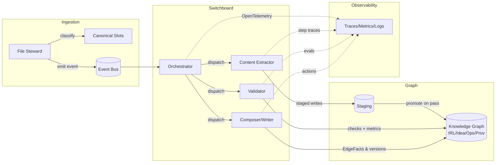
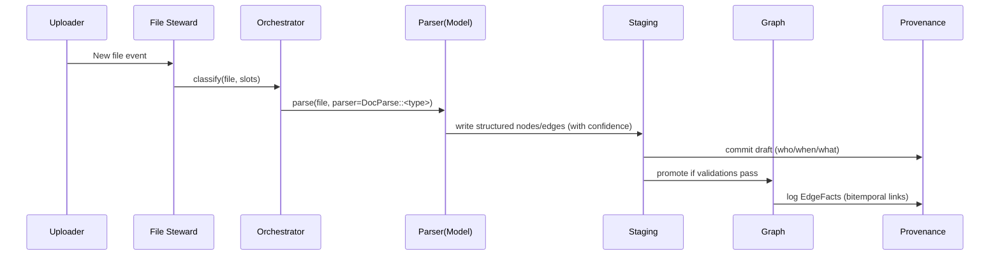
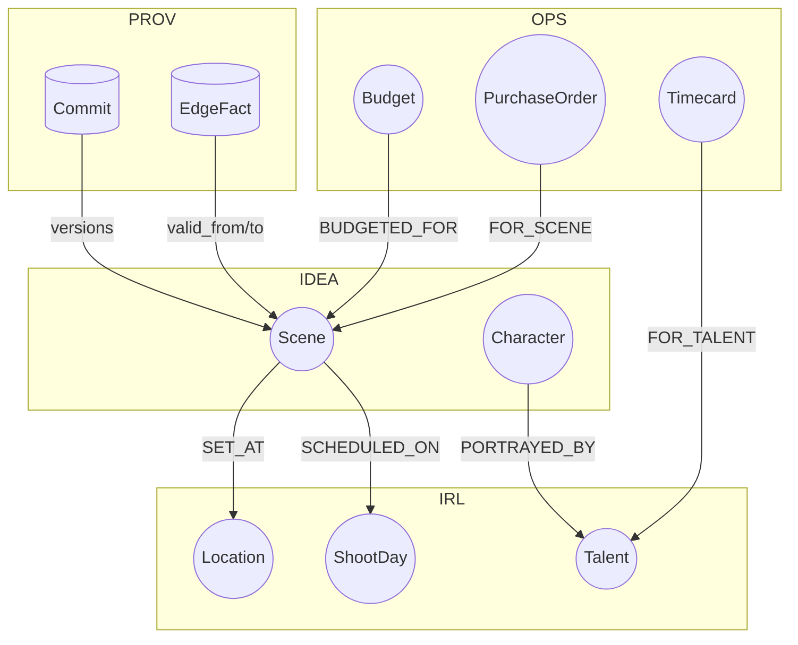
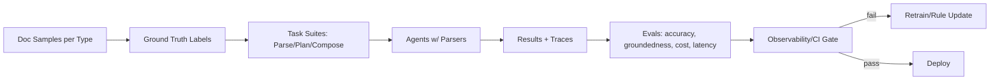

Jeff — agreed. Here’s an expanded, sharper **20‑slide pitch deck** built around the core: **Olivine Station is the reliable backbone (the “railway”) for agent networks**, with **domain‑specific parsers** that learn from creative docs and **provenance/observability** that keep agents honest. I’ve included **market data**, **current (Aug 2025) competitive context**, and **Mermaid diagrams** in the appendix.

---

## 0. Title

**Olivine Station** — The Rail Network for Reliable Agent Work
**Positioning:** Backbone infrastructure + domain models for creative operations

**Speaker note:** We don’t sell “a chat bot.” We sell the network that makes any agent dependable, measurable, and useful for complex creative work.

---

## 1. The Industry’s Pain: Agent Hype vs. Reliability

* “Autonomous agents” still **hallucinate, drift**, and **break on multi‑step jobs**.
* Most frameworks lack **standardized measurement**: you can’t tell **how accurate** an agent was or why it failed.
* Ambition exceeds reality: context limits + weak memory → brittle systems on complex productions.
* Enterprise is moving to **stateful agent platforms** and **observability** (e.g., LangGraph GA; Langfuse, Phoenix, AgentOps). ([LangChain Blog][1], [LangSmith][2], [Langfuse][3])

**Speaker note:** We’re solving the **agent industry’s** problem first (reliability & measurement), so we can solve the **creative industry’s** problem next (throughput & quality).

---

## 2. Market Signal & Timing

* **Agentic AI** projected to grow rapidly to **\$93B–\$127B** in the late 2020s/early 2030s; enterprises demand reliability & control. ([MarketsandMarkets][4], [CRN][5])
* **Media & Entertainment (E\&M)** approaching **\$3.5T by 2029**, with AI‑driven ad formats and ops efficiency as key levers. ([TV Tech][6])
* **Film & video** production market \~**\$328B in 2025**; cost pressure + fragmented workflows → automation appetite. ([The Business Research Company][7], [Research and Markets][8])

**Speaker note:** We target **creative operations** (film/commercial/episodic) where structured documents are abundant and mistakes are expensive.

---

## 3. Our Thesis

1. **Agents need rails**: deterministic orchestration, checks, and switches.
2. **Truth lives in a graph**, not in prompts — **bitemporal provenance** for audit & rollbacks.
3. **Moat = parsing expertise**: a **family of specialized ML parsers** for creative docs that feed the graph at high fidelity.
4. **Own the throughput**: **on‑prem / owned GPUs** make parsing **fast and cheap** at scale. ([TechRadar][9])

---

## 4. What Olivine Station Is (and Isn’t)

* **Is:** A **network OS** for agents: an orchestrated **railway** with **secure rails**, **switchboard**, and **signals** (policies, validations, metrics).
* **Is:** A **four‑layer ontology** (IRL, Idea, Ops, Provenance) and **file‑centric clusters** as the shared memory.
* **Is:** A **model family** for doc parsing (call sheets, scripts, AICP bids, timecards, contracts).
* **Isn’t:** Another consumer UI or a one‑model‑does‑everything assistant.

---

## 5. The Big Differentiators

* **Measurement-first architecture**: every tool call, hop, and mutation is traced, scored, and attributable. (OTel‑compatible; Phoenix/Langfuse/LangSmith interop.) ([OpenTelemetry][10], [Arize AI][11], [Langfuse][3], [LangSmith][2])
* **Bitemporal provenance** (valid time + transaction time) on the graph: **who changed what, when, and why** — and reversible. ([MDPI][12], [Medium][13])
* **Domain‑specific parsing models** trained on creative docs (LayoutLMv3/Donut‑style foundations + our labeled sets). ([arXiv][14])
* **GPU economics**: parse locally, cheaply; hybrid cloud when bursting. ([TechRadar][9])

---

## 6. From File to Knowledge Cluster (How It Works Today, V11‑aligned)

* **File Steward** ingests a file → classifies to **canonical slots** (e.g., SCRIPT\_PRIMARY, CALLSHEET\_FINAL).
* A **Content Extractor** parses to **Idea** (scenes, characters), **IRL** (shoot days, talent), **Ops** (line items, penalties), creating a **cluster** linked back to the file.
* **EdgeFacts** record **time‑bounded** links (e.g., Scene‑SCHEDULED\_ON→ShootDay).
* **Provenance ledger** logs each commit for audit and rollbacks.
  **Source:** Your V11 audit content (cluster‑not‑container; multi‑agent orchestration; EdgeFacts).

**Speaker note:** This cluster‑centric stance makes a file the **entry point** to a connected subgraph spanning all four layers.

---

## 7. Why Domain Parsers Are the Moat

* Creative ops run on **standardized but messy** docs: **AICP bid forms**, **call sheets**, **SAG/IATSE timecards**, **contracts**. ([aicp.com][15], [aicp.mobi][16], [Wrapbook][17])
* Teams burn cycles writing brittle regex/heuristics; the scalable answer is **model families** fine‑tuned for each doc type.
* Foundation evidence: **LayoutLMv3** (multimodal text+layout), **Donut** (OCR‑free doc understanding) → strong baselines for our fine‑tunes. ([arXiv][14])

**Speaker note:** Our **DocParse family** becomes “the crew behind the crew,” enabling agents to **rely on facts** extracted into the graph.

---

## 8. Parsing Targets (Initial Model Lineup)

* **Script Parser** → Scenes, Characters, Locations, Continuity notes.
* **Call‑Sheet Parser** → ShootDay, call times, locations, weather, unit moves. ([Filmustage][18])
* **AICP Budget Parser** → sectionized line items, rates, vendor refs. ([aicp.com][15], [aicp.mobi][16])
* **Timecard/Compliance Parser** → hours, OT, **meal penalties** (SAG/IATSE). ([Wrapbook][19], [Media Services][20])
* **Contract Parser** → deliverables, exclusivity, term dates, signatures.

**Speaker note:** Each model writes **typed nodes/edges** into the graph with provenance and confidence.

---

## 9. The Four‑Layer Ontology (Project Memory)

* **IRL**: talent, crew, vendors, calendars, shoot days.
* **Idea**: scenes, characters, breakdowns, creative briefs.
* **Ops**: budgets, POs, timecards, compliance rules.
* **Provenance**: commits, actions, versions, **EdgeFacts** (bitemporal).
* Cross‑layer examples: **Character—PORTRAYED\_BY→Talent**, **Scene—SCHEDULED\_ON→ShootDay**, **PO—FOR\_SCENE→Scene**.

**Speaker note:** This eliminates silos. Agents traverse the cluster; **RAG and ReAct loops** ground on graph truth to limit hallucinations. ([arXiv][21], [Amazon Web Services, Inc.][22])

---

## 10. Reliability = Instrumentation + Policy

* **Observability:** OpenTelemetry traces + per‑step metrics; integrates with **Langfuse, Phoenix, LangSmith**. ([OpenTelemetry][10], [Langfuse][3], [Arize AI][11], [LangSmith][2])
* **Guardrails:** schema validations (must-link rules), confidence thresholds, human‑in‑the‑loop gates for low confidence.
* **Evaluations:** task success @K, groundedness score (graph‑match), tool‑call precision/recall, latency/cost budgets. ([Arize AI][11])

---

## 11. What You Can Finally Measure

* **Accuracy by document type** (e.g., % of call‑sheet fields parsed correctly).
* **Agent Explainability:** tool traces, decisions, confidence.
* **Drift & Degradation:** weekly eval suites on held‑out docs; regressions block deploy.
* **Business metrics:** cost per parsed page, schedule‑change resolution time, avoided penalties.

**Speaker note:** This closes the loop: **agents that can be graded** get better; unmeasured agents drift.

---

## 12. GPU Economics: Why We Run Our Own

* For steady parsing workloads, **owned/on‑prem GPUs** beat cloud rentals on TCO; cloud bursts used for elasticity. Example: **H100 cloud rentals \~\$65k/yr** vs **owning \~\$30–35k** over 3–5 yrs. ([TechRadar][9])
* For **inference‑heavy, mid‑sized models**, **L40S** class can out‑throughput **A100** on many vision tasks (good for doc parsing), at lower cost. ([AceCloud][23], [HPCwire][24])

**Speaker note:** Parsing at the edge (studio or vendor) also improves **privacy, latency, and cost**.

---

## 13. Competitive Landscape (Aug 2025)

* **LangGraph Platform (GA)**: stateful agents & deployment (we integrate; we’re the graph+parsing rail beneath). ([LangChain Blog][1])
* **CrewAI**: multi‑agent crews; we can host crews on our rails; we provide **graph memory + doc models**. ([CrewAI][25], [CrewAI][26])
* **AG2 / AutoGen**: multi‑agent conversation; we provide observability/provenance & domain parsers underneath. ([GitHub][27], [Microsoft GitHub][28])
* **OpenDevin**: autonomous coding; our focus is **creative ops** graphs & parsing, not IDE autonomy. ([GitHub][29])
* **Observability stack**: Langfuse, Phoenix, OpenLLMetry (we export standard traces/metrics). ([Langfuse][3], [Arize AI][11], [GitHub][30])

**Speaker note:** We’re the **infrastructure + knowledge** layer — not a competing framework UI.

---

## 14. Representative Use Case: Script → Schedule

* Ingest **script PDF** → Scenes/Characters extracted.
* Link scenes to **ShootDays**; validate cast availability; flag conflicts.
* Composer agent outputs **call sheets** with weather, maps; **Ops** gets auto‑generated line items (catering, transport).
* All steps **traceable**; late changes remap scenes with **EdgeFact** history.

---

## 15. Representative Use Case: AICP Bid → Budget Actuals

* Ingest AICP bid → normalized line items, vendor terms. ([aicp.com][15], [aicp.mobi][16])
* Agents reconcile **actuals** from invoices/timecards; compute **meal penalties** automatically. ([Wrapbook][19])
* Budget variance and alerts flow to producers; **POs** link to scenes/units for department rollups.

---

## 16. Business Strategy & Value Creation

* **Near‑term product:**

  * **DocParse family** (API + on‑prem runtimes).
  * **Station Core** (orchestrator, graph, provenance).
  * **Studio connectors** (Drive, S3, Google Workspace).
* **Mid‑term:** packaged **agent bundles** (Scheduling, Compliance, Budget Reconciliation) running on Station.
* **Moat flywheel:** more docs → better parsers → better graph → more reliable agents → more customers → cheaper GPU TCO.

---

## 17. GTM & Pricing

* **Design partners:** production companies, streamers, agencies with >2,000 docs/mo.
* **Pricing:**

  * **Station Core** (per‑project or per‑seat).
  * **DocParse** (per‑page + volume tiers; on‑prem license available).
  * **Agent bundles** (module license + usage).
* **Services:** model adaptation to house formats; graph migration; eval suite setup.

---

## 18. Roadmap (Now → 12 Months)

* **Now**: File‑to‑cluster ingestion, V11 graph/provenance, initial parsers (Call‑sheet, AICP, Timecards).
* **Q+2**: Eval harness (Phoenix/Langfuse interop), reliability SLAs, budget reconciliation bundle. ([Arize AI][11], [Langfuse][3])
* **Q+3**: On‑prem GPU appliance (L40S‑class), scripted installers, RBAC/PII redaction. ([AceCloud][23])
* **Q+4–Q+6**: Contract parser, legal compliance rules, partner marketplace for third‑party parsers.

---

## 19. Risks & Mitigations

* **Data access/labeling** → partner data‑sharing & programmatic labeling; weak‑to‑strong supervision.
* **Standards variance** → parser registry + quick fine‑tune loops.
* **Framework churn** → open standards (OTel traces; LangGraph/CrewAI adapters). ([OpenTelemetry][10], [LangChain Blog][1], [CrewAI][25])
* **GPU Capex** → staged rollout; hybrid burst to cloud.

---

## 20. The Ask

* **Invest** to:

  1. Expand **DocParse family** (5→12 parsers).
  2. Build **eval lab** & golden datasets.
  3. Ship **on‑prem GPU appliance** for sub‑10¢/page parsing.
* **Outcome:** The **backbone for creative agents** — the station and the rails everyone builds on.

---

# Appendix A — Architecture Diagrams (Mermaid)

### A1. “Station & Rails” — Evented Multi‑Agent Orchestration



### A2. File → Cluster Build (with Provenance)



### A3. Ontology: Cross‑Layer Links



### A4. Agent Evaluation Harness



### A5. GPU Throughput for Parsing

```mermaid
flowchart LR
  Files-->QP[Queue/Batcher]
  QP-->PRE[Preproc (resize, dewarp, OCR if needed)]
  PRE-->GPU[On-Prem GPU Pool (L40S/H100 mix)]
  GPU-->POST[Postproc (struct, normalize, link)]
  POST-->KG[(Graph)]
  GPU-. metrics .->Mon[Perf + Cost Monitor]
```

---

# Appendix B — Competitive Matrix (Condensed)

**Frameworks**

* **LangGraph Platform (GA, May 2025)** — deploy/scale **stateful** agents; we integrate as **memory (graph)+parsing** substrate. ([LangChain Blog][1])
* **CrewAI** — multi‑agent crews; we run crews on Station rails, feed them graph facts & doc parses. ([CrewAI][25], [CrewAI][26])
* **AG2/AutoGen** — strong for multi‑agent patterns; we supply provenance and graph grounding. ([GitHub][27], [Microsoft GitHub][28])
* **OpenDevin** — autonomy for coding; not focused on creative ops; complementary. ([GitHub][29])

**Observability**

* **Langfuse** (agent observability), **Arize Phoenix** (LLM/agent evals), **OpenLLMetry** (OTel SDK). We emit standard traces/metrics. ([Langfuse][3], [Arize AI][11], [GitHub][30])

**Infra**

* **GPU economics:** owned GPUs + hybrid cloud for bursts. ([TechRadar][9])
* **Open‑weights agent stacks** are rising (e.g., NVIDIA NeMo microservices positioning) — validates **private data + open models** approach. ([The Wall Street Journal][31])

---

# Appendix C — KPIs & SLAs (Examples)

* **DocParse Accuracy** (by doc type, field‑level F1)
* **Groundedness Score** (facts present in graph vs. free text) — improvements expected with **ReAct/RAG** grounding. ([arXiv][21], [ACL Anthology][32])
* **TS\@K** (Task success at K steps) for multi‑step jobs
* **Human‑Correction Rate** (HCR) & **Mean Time To Correct** (MTTC)
* **Cost / Page** on GPU vs API (tracked in OTel metrics) ([OpenTelemetry][10])

---

# Appendix D — Training Data & Modeling Notes

* **Seed models:** LayoutLMv3 & Donut; fine‑tune per document type with **DocLayNet‑style** layout labels + task‑specific fields. ([arXiv][14])
* **Labeling:** programmatic weak labels + reviewer UI; continual learning on corrections from Station provenance.
* **Confidentiality:** on‑prem fine‑tunes for sensitive templates; **Nougat**‑style converters for PDF→structured text as fallback. ([GitHub][33])

---

## What’s New vs. the previous draft (and why it’s stronger)

* **Hard pivot from UI to infrastructure**: the deck now **leads** with reliability, measurement, and provenance (not consumer UX).
* **Current (Aug 2025) references** to the agent ecosystem and observability vendors/platforms. ([LangChain Blog][1], [CrewAI][25], [Langfuse][3])
* **Concrete GPU/TCO argument** for owning inference, tied to doc parsing throughput. ([TechRadar][9])
* **Explicit moat**: the **DocParse** family and a **training program** for creative docs; not just “we’ll parse stuff,” but *how* and *why it wins* (accuracy + cost). ([arXiv][14])
* **Clear KPIs/SLAs** and evaluation loop so buyers see **how we prove reliability**. ([Arize AI][11])

---

## Options to tailor next

* Audience‑specific cuts (Investor, Studio CTO, Agency COO).
* Financial model slide (per‑page economics with owned GPUs vs API).
* Deeper competitive teardown (LangGraph vs CrewAI deployments in the wild).
* Live demo storyboard (Script→Call Sheet→Budget Reconcile).

If you want, I can **export this into a slide deck** and include a **one‑page financial model** with **GPU sizing and per‑page costs**.

[1]: https://blog.langchain.com/langgraph-platform-ga/?utm_source=chatgpt.com "LangGraph Platform is now Generally Available: Deploy & ..."
[2]: https://docs.smith.langchain.com/evaluation/tutorials/agents?utm_source=chatgpt.com "Evaluate a complex agent | 🦜️🛠️ LangSmith - LangChain"
[3]: https://langfuse.com/blog/2024-07-ai-agent-observability-with-langfuse?utm_source=chatgpt.com "AI Agent Observability with Langfuse"
[4]: https://www.marketsandmarkets.com/PressReleases/agentic-ai.asp?utm_source=chatgpt.com "Agentic AI Market worth $93.20 billion by 2032"
[5]: https://www.crn.com/news/ai/2025/10-hottest-agentic-ai-tools-and-agents-of-2025-so-far?utm_source=chatgpt.com "The 10 Hottest Agentic AI Tools And Agents Of 2025 (So Far)"
[6]: https://www.tvtechnology.com/news/study-global-m-and-e-industry-revenue-to-hit-usd3-5-trillion-by-2029?utm_source=chatgpt.com "Study: Global M&E Industry Revenue to Hit $3.5 Trillion by 2029"
[7]: https://www.thebusinessresearchcompany.com/report/film-and-video-global-market-report?utm_source=chatgpt.com "Film And Video Market Overview, Insights Report 2025"
[8]: https://www.researchandmarkets.com/reports/5939672/film-video-market-report?srsltid=AfmBOopJtVDRfQHDa7Zj8p5vNCudPXbfMP_g31gYjXuRdYUkx4_r3s52&utm_source=chatgpt.com "Film and Video Market Report 2025"
[9]: https://www.techradar.com/pro/the-hidden-mathematics-of-ai-why-your-gpu-bills-dont-add-up?utm_source=chatgpt.com "The hidden mathematics of AI: why your GPU bills don't add up"
[10]: https://opentelemetry.io/blog/2024/llm-observability/?utm_source=chatgpt.com "An Introduction to Observability for LLM-based applications ..."
[11]: https://arize.com/docs/phoenix/evaluation/llm-evals/agent-evaluation?utm_source=chatgpt.com "Agent Evaluation | Phoenix"
[12]: https://www.mdpi.com/2227-7390/13/13/2109?utm_source=chatgpt.com "Time Travel with the BiTemporal RDF Model"
[13]: https://medium.com/neo4j/keeping-track-of-graph-changes-using-temporal-versioning-3b0f854536fa?utm_source=chatgpt.com "Keeping track of graph changes using temporal versioning"
[14]: https://arxiv.org/abs/2204.08387?utm_source=chatgpt.com "LayoutLMv3: Pre-training for Document AI with Unified Text and Image Masking"
[15]: https://aicp.com/business-resources/business-affairs-information/bidding-resources?utm_source=chatgpt.com "AICP - Bidding Resources"
[16]: https://aicp.mobi/business-resources/business-affairs-information/bidding-resources?utm_source=chatgpt.com "Bidding Resources - AICP"
[17]: https://www.wrapbook.com/blog/call-sheet?utm_source=chatgpt.com "Call Sheet: How to Craft It + Free Template Included"
[18]: https://filmustage.com/blog/what-information-should-be-included-in-a-film-call-sheet/?utm_source=chatgpt.com "What Information Should Be Included in a Film Call Sheet?"
[19]: https://www.wrapbook.com/blog/meal-penalties-producers-guide?utm_source=chatgpt.com "Producer's Guide: Meal Penalties"
[20]: https://www.mediaservices.com/blog/production-meal-penalties-iatses-new-rules/?utm_source=chatgpt.com "Production Meal Penalties & IATSE's Updated Rules"
[21]: https://arxiv.org/abs/2210.03629?utm_source=chatgpt.com "ReAct: Synergizing Reasoning and Acting in Language Models"
[22]: https://aws.amazon.com/blogs/machine-learning/reducing-hallucinations-in-large-language-models-with-custom-intervention-using-amazon-bedrock-agents/?utm_source=chatgpt.com "Reducing hallucinations in large language models with ..."
[23]: https://acecloud.ai/blog/nvidia-l40s-vs-h100-vs-a100/?utm_source=chatgpt.com "NVIDIA L40S Vs H100 Vs A100: Key Differences & Use ..."
[24]: https://www.hpcwire.com/2023/10/30/comparing-nvidia-a100-and-nvidia-l40s-which-gpu-is-ideal-for-ai-and-graphics-intensive-workloads/?utm_source=chatgpt.com "Comparing NVIDIA A100 and NVIDIA L40S: Which GPU is ..."
[25]: https://www.crewai.com/?utm_source=chatgpt.com "The Leading Multi-Agent Platform"
[26]: https://docs.crewai.com/concepts/tasks?utm_source=chatgpt.com "Tasks"
[27]: https://github.com/ag2ai/ag2?utm_source=chatgpt.com "ag2ai/ag2: AG2 (formerly AutoGen): The Open-Source ... - GitHub"
[28]: https://microsoft.github.io/autogen/0.2/?utm_source=chatgpt.com "AutoGen 0.2 - Microsoft Open Source"
[29]: https://github.com/AI-App/OpenDevin.OpenDevin?utm_source=chatgpt.com "OpenDevin: Code Less, Make More"
[30]: https://github.com/traceloop/openllmetry?utm_source=chatgpt.com "traceloop/openllmetry: Open-source observability for your ..."
[31]: https://www.wsj.com/articles/nvidia-thinks-it-has-a-better-way-of-building-ai-agents-b289a574?utm_source=chatgpt.com "Nvidia Thinks It Has a Better Way of Building AI Agents"
[32]: https://aclanthology.org/2024.findings-naacl.100.pdf?utm_source=chatgpt.com "Groundedness in Retrieval-augmented Long-form ..."
[33]: https://github.com/facebookresearch/nougat?utm_source=chatgpt.com "Implementation of Nougat Neural Optical Understanding ..."
