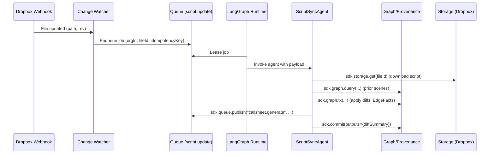

```mermaid
sequenceDiagram
  participant WB as Dropbox Webhook
  participant CW as Change Watcher
  participant Q as Queue (script.update)
  participant RT as LangGraph Runtime
  participant AG as ScriptSyncAgent
  participant G as Graph/Provenance
  participant S as Storage (Dropbox)

  WB->>CW: File updated (path, rev)
  CW->>Q: Enqueue job (orgId, fileId, idempotencyKey)
  RT->>Q: Lease job
  RT->>AG: Invoke agent with payload
  AG->>S: sdk.storage.get(fileId) (download script)
  AG->>G: sdk.graph.query(...) (prior scenes)
  AG->>G: sdk.graph.tx(...) (apply diffs, EdgeFacts)
  AG->>Q: sdk.queue.publish("callsheet.generate", ...)
  AG->>G: sdk.commit(outputs={diffSummary})


```